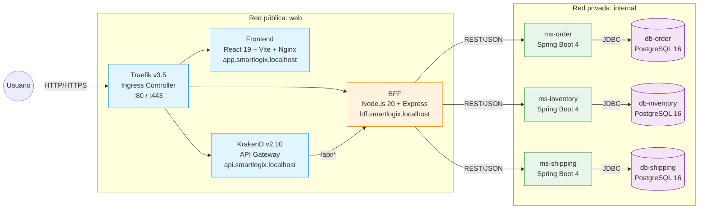
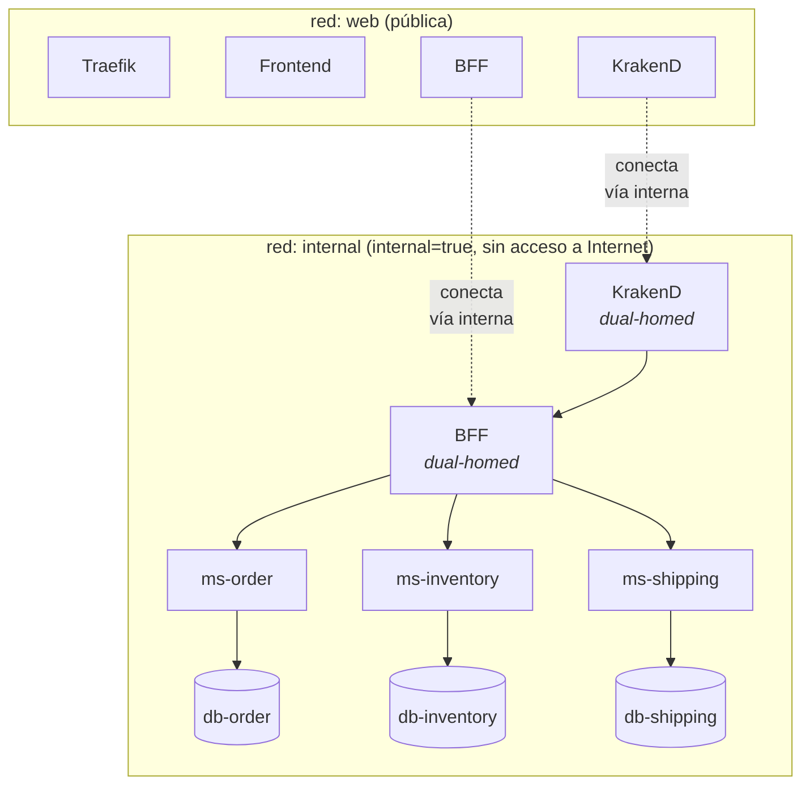
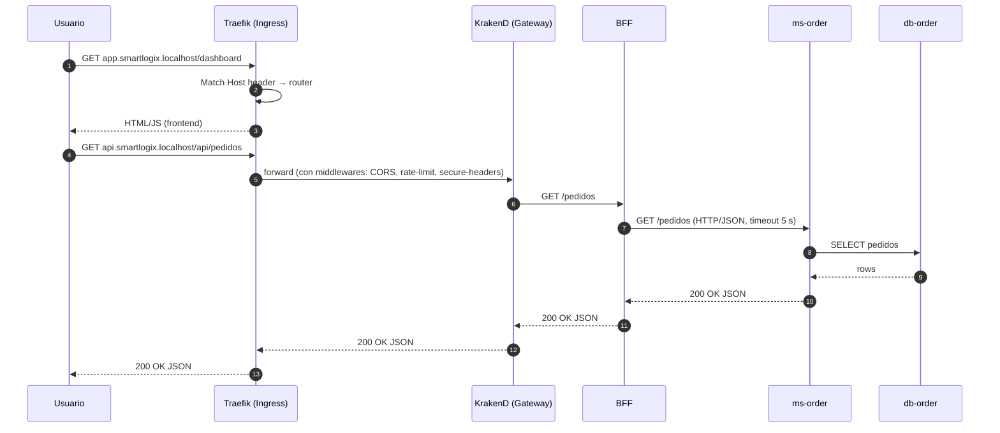
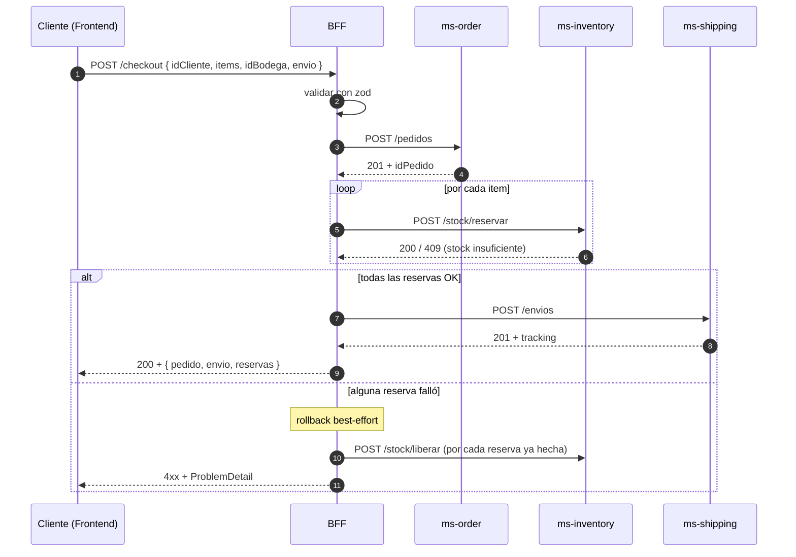
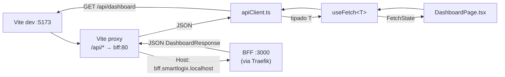
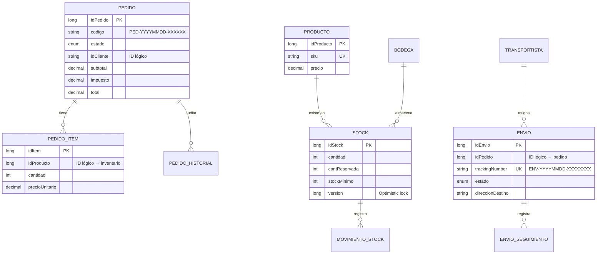
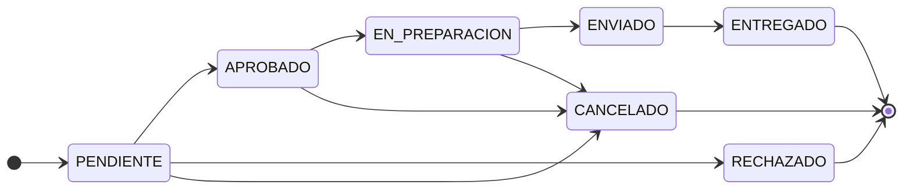
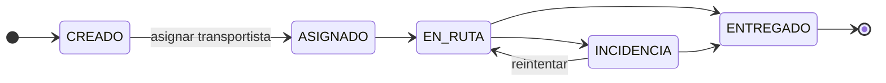
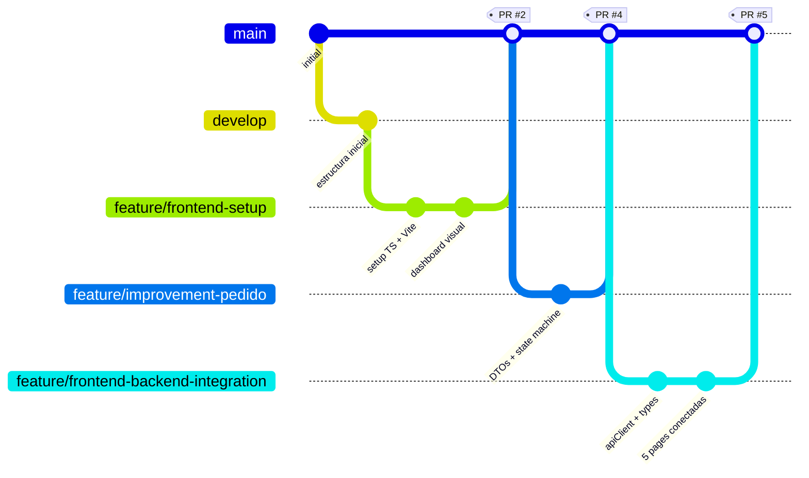

# SmartLogix

> Plataforma logística para PYMEs eCommerce. Monorepo con arquitectura de microservicios, Backend For Frontend, API Gateway, Ingress y bases de datos aisladas por servicio.

**Asignatura**: DSY1106 Desarrollo Fullstack III · Evaluación Parcial N°2

### READMEs por componente

| Componente | README |
|---|---|
| Frontend (React 19 + TS) | [`frontend/README.md`](frontend/README.md) |
| BFF (Node.js 20 + Express) | [`backend/bff/README.md`](backend/bff/README.md) |
| API Gateway (KrakenD) | [`backend/api-gateway/README.md`](backend/api-gateway/README.md) |
| ms-order | [`backend/ms-order/README.md`](backend/ms-order/README.md) |
| ms-inventory | [`backend/ms-inventory/README.md`](backend/ms-inventory/README.md) |
| ms-shipping | [`backend/ms-shipping/README.md`](backend/ms-shipping/README.md) |
| ms-user | [`backend/ms-user/README.md`](backend/ms-user/README.md) |
| ms-auth | [`backend/ms-auth/README.md`](backend/ms-auth/README.md) |


---

## Tabla de contenidos

1. [Resumen ejecutivo](#1-resumen-ejecutivo)
2. [Arquitectura](#2-arquitectura)
3. [Componentes](#3-componentes)
4. [Flujos clave](#4-flujos-clave)
5. [Modelo de datos](#5-modelo-de-datos)
6. [Patrones aplicados](#6-patrones-aplicados)
7. [Stack tecnológico](#7-stack-tecnológico)
8. [Levantar el stack](#8-levantar-el-stack)
9. [Estructura del proyecto](#9-estructura-del-proyecto)
10. [Estrategia de branching](#10-estrategia-de-branching)
11. [Sobre el arquetipo: Gradle vs Maven](#11-sobre-el-arquetipo-gradle-vs-maven)
12. [Documentación complementaria](#12-documentación-complementaria)
13. [Próximos pasos](#13-próximos-pasos)

---

## 1. Resumen ejecutivo

SmartLogix resuelve la coordinación logística de PYMEs eCommerce gestionando tres dominios desacoplados — **pedidos**, **inventario** y **envíos** — sobre una arquitectura de microservicios con consistencia eventual. El frontend (React 19 + Bootstrap) consume una API optimizada en un **BFF Node.js** que orquesta llamadas a los microservicios Spring Boot 4 y compone respuestas para cada pantalla. **KrakenD** actúa como API Gateway detrás de **Traefik** (Ingress), agregando rate limiting, JWT validation y CORS. Cada microservicio usa su propia base **PostgreSQL 16** versionada con Flyway, sin FKs cruzadas.

El proyecto demuestra **5 patrones arquitectónicos** (Microservicios, DB per Service, API Gateway, Ingress separado, BFF) y **más de 10 patrones de diseño** (Repository, Service Layer, DTO, State Machine, Optimistic Locking, Saga simplificada, Composite Service, Aggregate Root, Circuit-Breaker-lite, RFC 7807 Problem Detail).

---

## 2. Arquitectura

### 2.1 Diagrama de contenedores



### 2.2 Topología de red Docker



`web` es la red pública: ingress, frontend y los gateways. `internal` está marcada `internal: true` — Docker bloquea acceso saliente a Internet desde esa red. Las DBs **nunca** tienen puertos expuestos al host.

### 2.3 Flujo de una petición



---

## 3. Componentes

| Capa | Componente | Responsabilidad | Stack |
|---|---|---|---|
| Edge | **Traefik** | Ingress: routing por host, TLS termination (preparado), middlewares de seguridad | Traefik v3.5 |
| Gateway | **KrakenD** | API Gateway: routing `/api/*`, rate limiting, JWT validation, CORS | KrakenD v2.10 |
| Presentación | **Frontend** | SPA del operador logístico (5 pantallas) | React 19, Vite 5, Bootstrap 5, TypeScript 6 |
| Adaptación | **BFF** | Orquestación de MS para el frontend (saga checkout, dashboard agregado, proxy CRUD) | Node.js 20, Express 4, zod 3 |
| Negocio | **ms-order** | Pedidos + máquina de estados + auditoría | Spring Boot 4, Java 25, JPA, Flyway |
| Negocio | **ms-inventory** | Productos, bodegas, stock (con optimistic locking) | Spring Boot 4, Java 25, JPA, Flyway |
| Negocio | **ms-shipping** | Envíos, transportistas, seguimiento | Spring Boot 4, Java 25, JPA, Flyway |
| Negocio | **ms-user** | Usuarios y perfiles (servicio reutilizado) | Spring Boot, Java, JPA |
| Negocio | **ms-auth** | Login, register, JWT issuer + JWKS (servicio reutilizado) | Spring Boot, Java, JPA |
| Datos | **PostgreSQL × 5** | DB per service, aisladas en red privada | PostgreSQL 16-alpine |

### 3.1 Endpoints clave

| MS | Path base | Operaciones | Detalle |
|---|---|---|---|
| `ms-order` | `/pedidos` | `POST`, `GET /{id}`, `GET /codigo/{c}`, `GET /cliente/{id}`, `GET ?estado=`, `PATCH /{id}/estado` | [README](backend/ms-order/) |
| `ms-inventory` | `/productos`, `/bodegas`, `/stock` | CRUD productos/bodegas + `POST /stock/{entrada,salida,reservar,liberar}` | [README](backend/ms-inventory/) |
| `ms-shipping` | `/envios`, `/transportistas` | CRUD + `PATCH /{id}/{transportista,estado}` | [README](backend/ms-shipping/) |
| `ms-user` | `/usuarios` | CRUD usuarios (servicio reutilizado) | [README](backend/ms-user/) |
| `ms-auth` | `/auth` | Login, register, JWT/JWKS (servicio reutilizado) | [README](backend/ms-auth/) |
| `BFF` | (multiple) | `GET /dashboard`, `GET /pedidos/:id/full`, `POST /checkout`, proxy CRUD | [README](backend/bff/) |

---

## 4. Flujos clave

### 4.1 Checkout (saga simplificada)

El BFF coordina tres microservicios en una saga con compensaciones best-effort cuando algo falla en medio.



### 4.2 Frontend ↔ BFF (con proxy de Vite)



En dev se evita CORS reescribiendo `/api/*` a través del proxy de Vite. En prod, Nginx (que sirve el build) replica el mismo prefijo `/api/*` hacia el BFF dentro de la red Docker.

---

## 5. Modelo de datos

Tres agregados independientes, sin FKs cruzadas — los IDs que cruzan dominios son **identificadores lógicos** (strings o longs) que cada servicio valida vía API REST.



Detalle completo en [`docs/modelo-datos.md`](docs/modelo-datos.md).

### 5.1 Máquinas de estado



*Estados de `Pedido`*: las transiciones se validan en `OrderServiceImpl` contra un `Map<EstadoPedido, Set<EstadoPedido>>` declarado como datos. Cualquier transición ilegal devuelve **409 Conflict** vía `GlobalExceptionHandler`.



*Estados de `Envio`*: `INCIDENCIA` es una rama lateral **reintentable**. Cada transición persiste una fila en `envio_seguimiento` (audit log inmutable).

---

## 6. Patrones aplicados

### 6.1 Arquitectónicos

| Patrón | Dónde se ve | Problema que resuelve |
|---|---|---|
| **Microservicios** | 3 MS Spring Boot independientes | Despliegue y evolución por dominio, sin acoplamiento de releases |
| **Database per Service** | `db-order`, `db-inventory`, `db-shipping`, `db-user`, `db-auth` aisladas | Cada equipo evoluciona su schema sin coordinar |
| **API Gateway** | KrakenD v2.10 | Cross-cutting: rate limiting, JWT, CORS, sin contaminar los MS |
| **Ingress separado** | Traefik v3.5 + KrakenD | TLS/routing por host (edge) separado de policy de API |
| **Backend For Frontend** | Node.js + Express | Endpoint óptimo por pantalla, agregación, orquestación |

### 6.2 De diseño (selección — más detalle en cada README de componente)

- **Repository Pattern** (Spring Data JPA repositories)
- **Service Layer** (interfaz + impl, transaccional)
- **DTO** (records Java, inmutables, validables)
- **State Machine** (Pedido + Envio)
- **Optimistic Locking** (`@Version` en `Stock`)
- **Saga simplificada / Composite Service** (checkout con compensaciones)
- **Aggregate Root** (`Pedido` → items + historial; `Envio` → seguimiento; `Stock` → movimientos)
- **Circuit-Breaker-lite** (BFF: `AbortController` + tolerancia parcial en agregaciones)
- **RFC 7807 ProblemDetail** (formato unificado de errores en MS y BFF)
- **Schema-first migrations** (Flyway autoritativo, Hibernate en `ddl-auto=validate`)

Análisis completo en [`docs/analisis-patrones-arquetipos.pdf`](docs/analisis-patrones-arquetipos.pdf).

---

## 7. Stack tecnológico

| Capa | Tecnologías |
|---|---|
| Frontend | React 19, Vite 5, TypeScript 6, react-router-dom 7, react-bootstrap 5 |
| BFF | Node.js 20, Express 4, http-proxy-middleware 3, zod 3, morgan |
| Gateway | KrakenD v2.10 (declarativo via `krakend.json`) |
| Ingress | Traefik v3.5 (provider File) |
| Backend MS | Spring Boot 4.0.6, Java 25, Spring Web MVC, Spring Data JPA, Hibernate, Flyway, Bean Validation, Lombok |
| DB | PostgreSQL 16-alpine |
| Build | Gradle 9 (Groovy DSL) — ver [§11](#11-sobre-el-arquetipo-gradle-vs-maven) |
| Tests | JUnit 5, Mockito, Spring `@WebMvcTest` (en rama `feature/tests-unitarios`) |
| Contenedores | Docker + Docker Compose v2 |

---

## 8. Levantar el stack

### 8.1 Pre-requisitos

- **Docker Desktop** (Windows/Mac) o Docker Engine + Compose v2 (Linux)
- En Windows, agregar al `hosts` (`C:\Windows\System32\drivers\etc\hosts`, como administrador):

```
127.0.0.1 app.smartlogix.localhost
127.0.0.1 api.smartlogix.localhost
127.0.0.1 bff.smartlogix.localhost
127.0.0.1 traefik.smartlogix.localhost
```

> En Linux/Mac, `*.localhost` resuelve automáticamente; los browsers modernos también.

### 8.2 Build + up

```bash
cp .env.example .env       # editar passwords si lo necesitas
docker compose up --build -d
docker compose ps          # esperar 10 contenedores Up
```

### 8.3 Smoke tests

| URL | Qué deberías ver |
|---|---|
| http://app.smartlogix.localhost | Frontend React |
| http://api.smartlogix.localhost/api/pedidos | Listado vía KrakenD → BFF |
| http://bff.smartlogix.localhost/health | `{"status":"ok","service":"bff"}` |
| http://bff.smartlogix.localhost/dashboard | Agregados de estado del sistema |
| http://traefik.smartlogix.localhost | Dashboard Traefik |

### 8.4 Comandos útiles

```bash
docker compose logs -f bff               # logs en vivo de un servicio
docker compose up -d --build bff         # rebuild aislado
docker compose exec db-order psql -U pedido -d pedido   # conectarse a una DB
docker compose down                      # bajar (mantiene volúmenes)
docker compose down -v                   # bajar + borrar data
docker compose config                    # validar sintaxis
```

---

## 9. Estructura del proyecto

```
smartlogixs/
├── docker-compose.yml                # orquesta el stack completo
├── .env.example                      # variables (copiar a .env)
├── infra/
│   └── traefik/
│       ├── traefik.yml               # config estática
│       └── dynamic/                  # routers + middlewares
├── docs/
│   ├── modelo-datos.md               # ER y máquinas de estado
│   ├── analisis-patrones-arquetipos.pdf
│   ├── plan-branching.pdf
│   └── repositorios.txt
├── frontend/                         # SPA React 19 + TypeScript
│   ├── src/
│   │   ├── client/                   # apiClient.ts, useFetch.ts
│   │   ├── types/api.ts              # DTOs TS (espejo de los records Java)
│   │   ├── pages/                    # 5 páginas conectadas al BFF
│   │   └── components/               # Layout, Sidebar
│   └── vite.config.js                # proxy /api/* → BFF en dev
└── backend/
    ├── bff/                          # Node.js 20 + Express + zod
    │   └── src/{routes,services,clients,schemas,middleware}/
    ├── api-gateway/                  # KrakenD declarativo
    ├── ms-order/                     # Spring Boot 4 (pedidos)
    ├── ms-inventory/                 # Spring Boot 4 (inventario)
    ├── ms-shipping/                  # Spring Boot 4 (envíos)
    ├── ms-user/                      # Spring Boot (usuarios — reutilizado)
    └── ms-auth/                      # Spring Boot (auth/JWT — reutilizado)
```

---

## 10. Estrategia de branching

Se usa **GitFlow simplificado** con tres tipos de rama: `main` (estable, entregable), `develop` (integración) y `feature/<kebab-case>` (trabajo en curso). Cada feature se cierra con un **Pull Request** contra `develop` o `main` y se mergea preservando la historia (merge commit, no squash).



Documento completo (estrategia, evidencia, gestión de conflictos): [`docs/plan-branching.pdf`](docs/plan-branching.pdf).

---

## 11. Sobre el arquetipo: Gradle vs Maven

La rúbrica EV2 menciona "arquetipos Maven". En este monorepo los 3 microservicios y el BFF se construyeron con **Gradle 9** porque:

1. **Spring Initializr (el arquetipo oficial de Spring Boot 4) emite por defecto proyectos Gradle**. Es la herramienta recomendada por VMware/Broadcom, equivalente conceptual al `mvn archetype:generate` pero con catálogo siempre actualizado.
2. **Los `build.gradle` cumplen el rol de un arquetipo**: estructura idéntica entre los 3 MS, plantilla copy-paste para crear un nuevo servicio.
3. **Performance**: `./gradlew bootJar` toma ~30 s por MS (incremental + build cache). El equivalente Maven sería 60–90 s.
4. **DSL declarativo más legible** que el XML de Maven.

Si la rúbrica exige Maven literal, basta con `mvn archetype:create-from-project` desde un MS de referencia para generar el arquetipo a partir del código actual (operación reversible de ~1–2 h). Análisis completo en [`docs/analisis-patrones-arquetipos.pdf`](docs/analisis-patrones-arquetipos.pdf) §5.

---

## 12. Documentación complementaria

| Documento | Propósito |
|---|---|
| [`docs/modelo-datos.md`](docs/modelo-datos.md) | ER detallado y máquinas de estado |
| [`docs/analisis-patrones-arquetipos.pdf`](docs/analisis-patrones-arquetipos.pdf) | Análisis de patrones de diseño y arquitectónicos |
| [`docs/plan-branching.pdf`](docs/plan-branching.pdf) | Estrategia de branching + evidencia + resolución de conflictos |
| [`docs/repositorios.txt`](docs/repositorios.txt) | Enlaces a GitHub por componente |

---

## 13. Próximos pasos

1. **Activar JWT real**: configurar el JWT validator de KrakenD con secret/issuer real (Auth0 / Keycloak)
2. **Activar HTTPS**: descomentar la sección `certificatesResolvers` en `traefik.yml`
3. **Circuit Breaker robusto**: agregar Resilience4j a los MS (hoy el BFF tiene el equivalente lite)
4. **Healthchecks de MS**: agregar `spring-boot-starter-actuator` + `HEALTHCHECK` en los Dockerfiles (implementado en la rama `feature/tests-unitarios`, pendiente de merge)
5. **Tests unitarios** por servicio con cobertura ≥70% (implementado en la rama `feature/tests-unitarios`, pendiente de merge)
6. **Arquetipo Maven explícito** si la rúbrica lo exige literalmente
