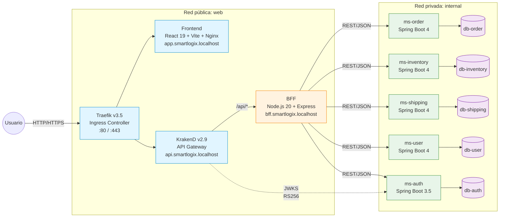
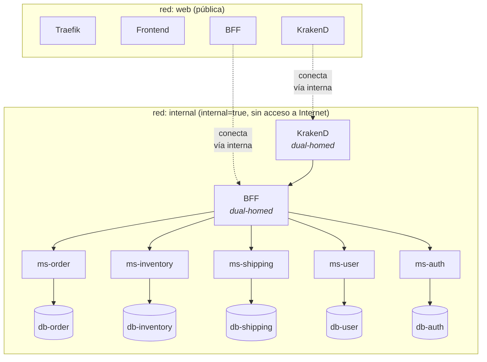
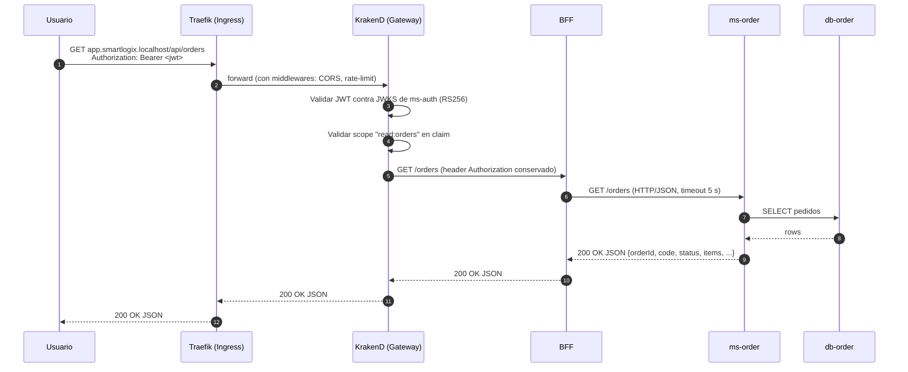
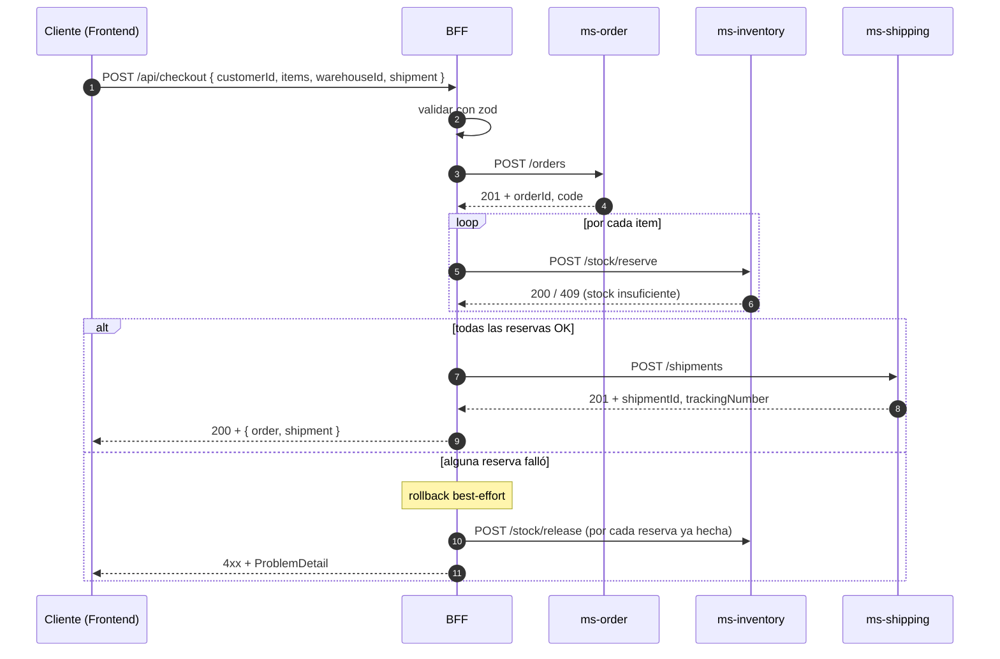
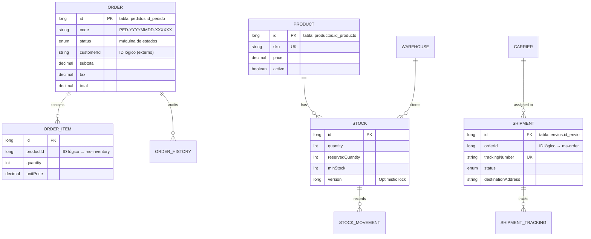
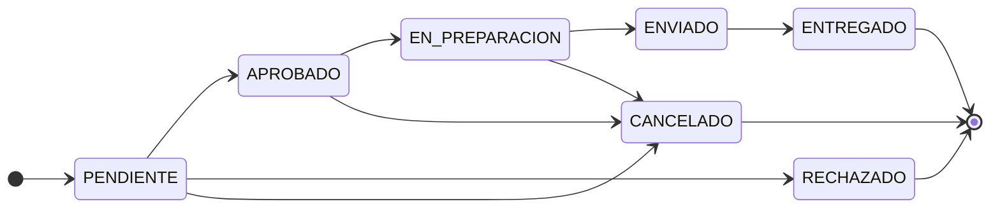
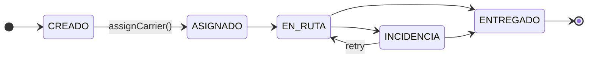

# SmartLogix

> Plataforma logística para PYMEs eCommerce. Monorepo con arquitectura de microservicios, Backend For Frontend, API Gateway, Ingress y bases de datos aisladas por servicio.

**Asignatura**: DSY1106 Desarrollo Fullstack III · Evaluación Parcial N°2

### READMEs por componente

| Componente | README |
|---|---|
| Frontend (React 19 + TS + Tailwind) | [`frontend/README.md`](frontend/README.md) *(no incluido en repo, ver Vite + Tailwind)* |
| BFF (Node.js 20 + Express) | [`backend/bff/README.md`](backend/bff/README.md) |
| API Gateway (KrakenD) | [`backend/api-gateway/README.md`](backend/api-gateway/README.md) |
| ms-order | [`backend/ms-order/README.md`](backend/ms-order/README.md) |
| ms-inventory | [`backend/ms-inventory/README.md`](backend/ms-inventory/README.md) |
| ms-shipping | [`backend/ms-shipping/README.md`](backend/ms-shipping/README.md) |
| ms-user | [`backend/ms-user/README.md`](backend/ms-user/README.md) |
| ms-auth | [`backend/ms-auth/README.md`](backend/ms-auth/README.md) |
| Infra k8s | [`infra/k8s/README.md`](infra/k8s/README.md) |

---

## Tabla de contenidos

1. [Resumen ejecutivo](#1-resumen-ejecutivo)
2. [Arquitectura](#2-arquitectura)
3. [Componentes](#3-componentes)
4. [Flujos clave](#4-flujos-clave)
5. [Modelo de datos](#5-modelo-de-datos)
6. [Patrones aplicados](#6-patrones-aplicados)
7. [Stack tecnológico](#7-stack-tecnológico)
8. [Levantar el stack](#8-levantar-el-stack)
9. [Estructura del proyecto](#9-estructura-del-proyecto)
10. [Convenciones de naming](#10-convenciones-de-naming)
11. [Estrategia de branching](#11-estrategia-de-branching)
12. [Documentación complementaria](#12-documentación-complementaria)
13. [Próximos pasos](#13-próximos-pasos)

---

## 1. Resumen ejecutivo

SmartLogix resuelve la coordinación logística de PYMEs eCommerce gestionando tres dominios desacoplados — **orders**, **inventory** y **shipments** — sobre una arquitectura de microservicios con consistencia eventual. El frontend (React 19 + Tailwind) consume una API optimizada en un **BFF Node.js** que orquesta llamadas a los microservicios Spring Boot 4 y compone respuestas para cada pantalla. **KrakenD** actúa como API Gateway detrás de **Traefik** (Ingress local) / **ingress-nginx** (k8s), agregando rate limiting, JWT RS256 validation y CORS. Cada microservicio usa su propia base **PostgreSQL 16** versionada con Flyway, sin FKs cruzadas.

El proyecto demuestra **5 patrones arquitectónicos** (Microservicios, DB per Service, API Gateway, Ingress separado, BFF) y **más de 10 patrones de diseño** (Repository, Service Layer, Factory Method, DTO, State Machine, Optimistic Locking, Saga simplificada, Composite Service, Aggregate Root, Circuit Breaker, RFC 7807 Problem Detail).

**Estado de la API pública**: contrato 100% en inglés (paths URL, campos JSON, scopes JWT). Los nombres internos de tablas y columnas DB se mantienen en español, mapeados con `@Column(name="...")` en cada entity para preservar el schema sin migraciones de renombre. Detalle en [§10](#10-convenciones-de-naming).

---

## 2. Arquitectura

### 2.1 Diagrama de contenedores



### 2.2 Topología de red Docker



`web` es la red pública: ingress, frontend y los gateways. `internal` está marcada `internal: true` — Docker bloquea acceso saliente a Internet desde esa red. Las DBs **nunca** tienen puertos expuestos al host.

### 2.3 Flujo de una petición autenticada



---

## 3. Componentes

| Capa | Componente | Responsabilidad | Stack |
|---|---|---|---|
| Edge | **Traefik** (compose) / **ingress-nginx** (k8s) | Ingress: routing por host, TLS termination, middlewares de seguridad | Traefik v3.5 / nginx-ingress |
| Gateway | **KrakenD** | API Gateway: routing `/api/*`, rate limiting, JWT validation, CORS | KrakenD v2.9 |
| Presentación | **Frontend** | SPA del operador logístico (5 pantallas) | React 19, Vite 6, TypeScript 5.8, Tailwind CSS 4, motion/react, lucide-react |
| Adaptación | **BFF** | Orquestación de MS para el frontend (saga checkout, dashboard agregado, proxy CRUD) | Node.js 20, Express 4, http-proxy-middleware, zod |
| Negocio | **ms-order** | Pedidos + máquina de estados + auditoría | Spring Boot 4.0.6, Java 25, JPA, Flyway |
| Negocio | **ms-inventory** | Productos, bodegas, stock (con optimistic locking) | Spring Boot 4.0.6, Java 25, JPA, Flyway |
| Negocio | **ms-shipping** | Envíos, transportistas, seguimiento | Spring Boot 4.0.6, Java 25, JPA, Flyway |
| Negocio | **ms-user** | Usuarios y perfiles del directorio interno | Spring Boot 4.0.6, Java 25, JPA, Flyway |
| Auth | **ms-auth** | Login, register, emisor JWT RS256 + JWKS endpoint | Spring Boot 3.5.0, Java 25, Spring Security |
| Datos | **PostgreSQL × 5** | DB per service, aisladas en red privada | PostgreSQL 16-alpine |

### 3.1 Endpoints REST principales (vía gateway)

Todos los endpoints debajo de `/api/*` requieren `Authorization: Bearer <jwt>` excepto los marcados como **(público)**.

| Recurso | Operaciones | Scope JWT requerido |
|---|---|---|
| `/api/auth/register` | `POST` **(público)** | — |
| `/api/auth/login` | `POST` **(público)** | — |
| `/api/inventory/products` | `GET`, `POST`, `PATCH /{id}` | `read:inventory` / `write:inventory` |
| `/api/inventory/products-with-stock` | `GET` *(compuesto en BFF)* | `read:inventory` |
| `/api/inventory/warehouses` | `GET`, `POST` | `read:inventory` / `write:inventory` |
| `/api/inventory/stock/in,out,reserve,release` | `POST` | `write:inventory` |
| `/api/orders` | `GET`, `POST`, `PATCH /{id}/status` | `read:orders` / `write:orders` |
| `/api/shipments` | `GET`, `POST`, `PATCH /{id}/status`, `PATCH /{id}/carrier` | `read:shipments` / `write:shipments` |
| `/api/users` | `GET`, `POST`, `PUT /{id}`, `DELETE /{id}` | `read:users` / `write:users` |
| `/api/checkout` | `POST` *(saga en BFF)* | `write:orders` |
| `/api/dashboard` | `GET` *(compuesto en BFF)* | `read:orders` |

Referencia detallada con payloads de ejemplo en cada [README de MS](#readmes-por-componente).

### 3.2 Roles y scopes

| Rol | Scopes |
|---|---|
| `USER` | `read:inventory read:orders read:shipments` |
| `ADMIN` | Todos los scopes (`read:*` + `write:*` para inventory/orders/shipments/users) |

El JWT se firma con **RS256** usando la llave privada de `ms-auth`. El gateway valida contra el JWKS público (`http://ms-auth:8081/.well-known/jwks.json`).

---

## 4. Flujos clave

### 4.1 Checkout (saga simplificada)

El BFF coordina tres microservicios en una saga con compensaciones best-effort cuando algo falla en medio.



### 4.2 Login y JWT

```mermaid
sequenceDiagram
    autonumber
    participant U as Usuario
    participant K as KrakenD
    participant B as BFF
    participant A as ms-auth
    participant DB as db-auth

    U->>K: POST /api/auth/login { email, password }
    K->>B: POST /auth/login
    B->>A: POST /auth/login
    A->>DB: SELECT * FROM users WHERE email
    DB-->>A: user row
    A->>A: bcrypt match password_hash
    A->>A: build JWT (RS256, claims: sub, role, scope, iss, exp)
    A-->>B: 200 { accessToken, tokenType: "Bearer", expiresIn: 1800 }
    B-->>K: 200
    K-->>U: 200 + token

    Note over U,K: Para requests subsecuentes:<br/>Authorization: Bearer <jwt>
    U->>K: GET /api/inventory/products + Authorization
    K->>A: GET /.well-known/jwks.json (cached)
    A-->>K: JWK Set
    K->>K: verify signature + check scope
    K->>B: GET /inventory/products
    B->>...
```

---

## 5. Modelo de datos

Cinco agregados independientes (uno por MS), sin FKs cruzadas — los IDs que cruzan dominios son **identificadores lógicos** que cada servicio valida vía API REST.

> **Nota sobre naming**: Java entities y campos están en inglés (`User`, `name`, `productId`). Tablas y columnas DB siguen en español (`usuarios`, `nombre`, `id_producto`). El mapping se preserva con `@Column(name="...")` en cada entity. Ver [§10](#10-convenciones-de-naming).



Detalle completo en [`docs/referencias/modelo-datos.md`](docs/referencias/modelo-datos.md).

### 5.1 Máquinas de estado

Los valores de los enums se mantienen en español porque son constraints CHECK en SQL (`PENDIENTE`, `APROBADO`, `ENVIADO`, etc.). Cambiarlos requeriría migración y rollback complejo.



*Estados de `Order`*: las transiciones se validan en `OrderServiceImpl` contra un `Map<OrderStatus, Set<OrderStatus>>`. Cualquier transición ilegal devuelve **409 Conflict** vía `GlobalExceptionHandler`.



*Estados de `Shipment`*: `INCIDENCIA` es una rama lateral **reintentable**. Cada transición persiste una fila en `envio_seguimiento` (audit log inmutable).

---

## 6. Patrones aplicados

### 6.1 Arquitectónicos

| Patrón | Dónde se ve | Problema que resuelve |
|---|---|---|
| **Microservicios** | 5 MS Spring Boot independientes | Despliegue y evolución por dominio, sin acoplamiento de releases |
| **Database per Service** | `db-order`, `db-inventory`, `db-shipping`, `db-user`, `db-auth` aisladas | Cada equipo evoluciona su schema sin coordinar |
| **API Gateway** | KrakenD v2.9 | Cross-cutting: rate limiting, JWT validation, CORS, sin contaminar los MS |
| **Ingress separado** | Traefik v3.5 (compose) / nginx-ingress (k8s) | TLS/routing por host (edge) separado de policy de API |
| **Backend For Frontend** | Node.js + Express | Endpoint óptimo por pantalla, agregación, orquestación |

### 6.2 De diseño (selección)

- **Repository Pattern** (Spring Data JPA repositories)
- **Service Layer** (interfaz + impl, transaccional)
- **Factory Method** (ms-order: `OrderFactory` + `StandardOrderFactory` / `ExpressOrderFactory` + `OrderFactoryProvider`; la creación del pedido varía por `OrderType`)
- **DTO** (records Java, inmutables, validables)
- **State Machine** (`Order` + `Shipment` con transiciones explícitas)
- **Optimistic Locking** (`@Version` en `Stock`)
- **Saga simplificada / Composite Service** (checkout en BFF con compensaciones)
- **Aggregate Root** (`Order` → items + history; `Shipment` → tracking; `Stock` → movements)
- **Circuit Breaker** (BFF: `clients/circuitBreaker.ts` con estados CLOSED/OPEN/HALF_OPEN y un breaker por servicio; `AbortController` + tolerancia parcial en agregaciones)
- **RFC 7807 ProblemDetail** (formato unificado de errores en `GlobalExceptionHandler` de los 5 MS)
- **Schema-first migrations** (Flyway autoritativo, Hibernate en `ddl-auto=validate`)
- **JWT RS256 con JWKS** (ms-auth firma, gateway verifica via endpoint público)

Análisis completo en [`docs/referencias/analisis-patrones-arquetipos.pdf`](docs/referencias/analisis-patrones-arquetipos.pdf).

---

## 7. Stack tecnológico

| Capa | Tecnologías |
|---|---|
| Frontend | React 19, Vite 6, TypeScript 5.8, Tailwind CSS 4, motion/react 12, lucide-react |
| BFF | Node.js 20, Express 4, http-proxy-middleware, zod, morgan, swagger-ui-express |
| Gateway | KrakenD v2.9 (declarativo via `krakend.json`) |
| Ingress | Traefik v3.5 (Docker Compose y Kubernetes) / nginx-ingress (alternativa k8s) |
| MS Spring (4 servicios) | Spring Boot 4.0.6, Java 25, Spring Web MVC, Spring Data JPA, Hibernate, Flyway, Bean Validation, Lombok, Springdoc OpenAPI |
| ms-auth | Spring Boot 3.5.0, Spring Security, OAuth2 Resource Server, Nimbus JOSE+JWT |
| DB | PostgreSQL 16-alpine |
| Build | Gradle 9 (Groovy DSL) |
| Tests | JUnit 5, Mockito, Spring `@WebMvcTest`, JaCoCo |
| Calidad | SonarQube Community (self-hosted) + cobertura JaCoCo |
| Observabilidad | GlitchTip (self-hosted, error-tracking compatible con SDK de Sentry) |
| CI/CD | GitHub Actions (build, test, cobertura, typecheck, lint, krakend check) |
| Contenedores | Docker + Docker Compose v2, Kubernetes (validado en Docker Desktop k8s) |
| Docs | Mermaid embebido en Markdown, Springdoc OpenAPI / Swagger UI por MS |

---

## 8. Levantar el stack

### 8.1 Docker Compose (desarrollo local)

**Pre-requisitos**: Docker Desktop o Docker Engine + Compose v2.

En Windows, agregar al `hosts` (`C:\Windows\System32\drivers\etc\hosts`, como administrador):

```
127.0.0.1 app.smartlogix.localhost
127.0.0.1 api.smartlogix.localhost
127.0.0.1 bff.smartlogix.localhost
127.0.0.1 traefik.smartlogix.localhost
```

> En Linux/Mac y en Chrome/Edge modernos, `*.localhost` resuelve automáticamente a 127.0.0.1.

```bash
cp .env.example .env       # editar passwords si lo necesitas
docker compose up --build -d
docker compose ps          # esperar 13 contenedores Up
```

| URL | Qué deberías ver |
|---|---|
| http://app.smartlogix.localhost | Frontend React (login + dashboard) |
| http://api.smartlogix.localhost/api/orders | Listado vía KrakenD → BFF → ms-order |
| http://bff.smartlogix.localhost/health | `{"status":"ok","service":"bff"}` |
| http://traefik.smartlogix.localhost | Dashboard Traefik |

### 8.2 Kubernetes

Ver detalle completo en [`infra/k8s/README.md`](infra/k8s/README.md). Resumen:

```bash
# 1) Build de imágenes con tag esperado por los manifests
docker build -t smartlogix/ms-inventory:latest backend/ms-inventory
# ... (8 imágenes en total — ver readme infra)

# 2) Namespace + ConfigMap
kubectl apply -k infra/k8s/base

# 3) Secrets (no committeados): credenciales DB + llaves PEM RSA
kubectl -n smartlogix create secret generic smartlogix-secret --from-env-file=.env --dry-run=client -o yaml | kubectl apply -f -
kubectl -n smartlogix create secret generic smartlogix-keys --from-file=private_key.pem --from-file=public_key.pem --dry-run=client -o yaml | kubectl apply -f -

# 4) Apply completo (ingress Traefik + ConfigMap de krakend ya resueltos)
kubectl apply -k infra/k8s

# 5) Hosts y verificación
kubectl -n smartlogix get pods   # 13 pods Running
```

> El ingress en k8s usa **Traefik** ([`infra/k8s/ingress-traefik.yaml`](infra/k8s/ingress-traefik.yaml)) con los mismos middlewares que el stack compose (secure-headers, rate-limit, cors-api); la alternativa nginx queda comentada en el `kustomization.yaml`.

### 8.3 Documentación interactiva (Swagger / OpenAPI)

Cada microservicio Spring Boot expone su propio Swagger UI. El BFF agrega su propia documentación con `swagger-ui-express`.

| Componente | Swagger UI (puerto interno) | OpenAPI spec |
|---|---|---|
| **BFF** | `:3000/docs` | `:3000/openapi.json` |
| **ms-auth** | `:8081/swagger-ui.html` | `:8081/v3/api-docs` |
| **ms-user** | `:8080/swagger-ui.html` | `:8080/v3/api-docs` |
| **ms-order** | `:8080/swagger-ui.html` | `:8080/v3/api-docs` |
| **ms-inventory** | `:8080/swagger-ui.html` | `:8080/v3/api-docs` |
| **ms-shipping** | `:8080/swagger-ui.html` | `:8080/v3/api-docs` |

En docker-compose los MS no exponen puerto al host (red `internal`). Para abrir los Swagger UI en navegador:

```bash
# Docker Compose
docker compose exec ms-order curl -s localhost:8080/v3/api-docs   # ver el JSON
# o agregar temporalmente "ports: ['8080:8080']" en docker-compose.yml

# Kubernetes
kubectl -n smartlogix port-forward svc/ms-order 8080:8080
# abrir http://localhost:8080/swagger-ui.html
```

### 8.4 Comandos útiles

```bash
docker compose logs -f bff               # logs en vivo de un servicio
docker compose up -d --build bff         # rebuild aislado
docker compose exec db-order psql -U pedido -d pedido   # conectarse a una DB
docker compose down                      # bajar (mantiene volúmenes)
docker compose down -v                   # bajar + borrar data
```

---

### 8.5 CI/CD (GitHub Actions)

El pipeline `.github/workflows/ci.yml` corre en cada push y pull request a `main` y `develop`:

- **Microservicios** (matriz ×5): `test` + `jacocoTestReport` (JDK 25 + Gradle); publica la cobertura como artefacto.
- **BFF**: `npm ci` + typecheck (`tsc --noEmit`).
- **Frontend**: `npm ci` + lint + build (Vite).
- **API Gateway**: validación de `krakend.json` (`krakend check`).

### 8.6 Análisis de calidad (SonarQube)

Stack self-hosted en `infra/sonarqube/` (SonarQube Community + PostgreSQL). Detalle en [`infra/sonarqube/README.md`](infra/sonarqube/README.md).

```bash
docker compose -f infra/sonarqube/docker-compose.yml up -d   # http://localhost:9000
cd backend/ms-user
./gradlew test jacocoTestReport sonar -Dsonar.host.url=http://localhost:9000 -Dsonar.token=TU_TOKEN
```

Cobertura de línea actual (todos sobre el 60% exigido): ms-auth 69.5%, ms-inventory 92.4%, ms-order 93.0%, ms-shipping 79.5%, ms-user 88.2% — 0 bugs, 0 vulnerabilidades.

### 8.7 Monitoreo de errores (GlitchTip)

Stack self-hosted en `infra/glitchtip/` (**GlitchTip**, error-tracking open-source compatible con el SDK de **Sentry**) que captura en runtime los errores de todas las capas. Detalle en [`infra/glitchtip/README.md`](infra/glitchtip/README.md).

```bash
docker compose -f infra/glitchtip/docker-compose.yml up -d   # http://localhost:8000
```

Tras el primer arranque: crear cuenta → organización → un proyecto por componente → copiar cada DSN al `.env`. Instrumentación por capa (el DSN se lee por env var; vacío = SDK en no-op):

| Capa | SDK | Punto de integración |
|---|---|---|
| Frontend (React) | `@sentry/react` | `frontend/src/main.tsx` (init + `ErrorBoundary`) |
| BFF (Express) | `@sentry/node` | `backend/bff/src/instrument.ts` + `setupExpressErrorHandler` |
| 5 microservicios | `io.sentry:sentry-logback` | `logback-spring.xml` (appender nivel ERROR) |

## 9. Estructura del proyecto

```
smartlogixs/
├── docker-compose.yml                # orquesta el stack completo
├── .env.example                      # variables (copiar a .env)
├── private_key.pem / public_key.pem  # llaves RSA para JWT (no committear en prod)
├── .github/workflows/ci.yml          # CI: build + test + cobertura (GitHub Actions)
├── infra/
│   ├── traefik/                      # config Traefik (compose)
│   ├── k8s/                          # manifests k8s (kustomize, ingress Traefik)
│   ├── sonarqube/                    # stack SonarQube self-hosted (compose)
│   └── glitchtip/                    # stack GlitchTip self-hosted (compose + k8s)
├── docs/
│   ├── referencias/                 # docs referenciados por los READMEs
│   └── diagramas/                   # diagramas de arquitectura (PNG)
├── frontend/                         # SPA React 19 + TypeScript + Tailwind
│   ├── src/
│   │   ├── client/                   # apiClient.ts
│   │   ├── pages/                    # Login, Dashboard, ShipmentTable, WarehouseGrid, AIHub
│   │   ├── components/               # Sidebar, ...
│   │   ├── types.ts                  # tipos compartidos
│   │   └── main.tsx
│   ├── nginx.conf                    # proxy /api → bff (k8s)
│   └── vite.config.ts                # proxy /api → :8080 (dev)
└── backend/
    ├── bff/                          # Node.js 20 + Express + zod
    │   └── src/{routes,services,clients,schemas,middleware}/
    ├── api-gateway/                  # KrakenD declarativo (krakend.json)
    ├── ms-order/                     # Spring Boot 4 (paquete cl.smartlogix.order)
    ├── ms-inventory/                 # Spring Boot 4 (paquete cl.smartlogix.inventory)
    ├── ms-shipping/                  # Spring Boot 4 (paquete cl.smartlogix.shipping)
    ├── ms-user/                      # Spring Boot 4 (paquete cl.smartlogix.user)
    └── ms-auth/                      # Spring Boot 3.5 (paquete cl.smartlogix.auth)
```

Cada MS sigue la estructura estándar de Spring:

```
ms-<name>/
├── src/main/java/cl/smartlogix/<name>/
│   ├── <Name>Application.java        # @SpringBootApplication
│   ├── config/                       # OpenApiConfig, SecurityConfig, etc.
│   ├── controller/                   # @RestController + GlobalExceptionHandler
│   ├── service/                      # interface + Impl, @Transactional
│   ├── repository/                   # @Repository extends JpaRepository
│   ├── dto/                          # records inmutables
│   └── model/                        # @Entity JPA con @Column para columnas DB en español
├── src/main/resources/
│   ├── application.properties        # config Spring + Flyway
│   └── db/migration/V*.sql           # migraciones SQL versionadas
└── build.gradle                      # plugin spring-boot + dependencias
```

---

## 10. Convenciones de naming

| Lugar | Idioma | Razón |
|---|---|---|
| Paths URL (`/api/orders`, `/api/inventory`) | **Inglés** | API pública |
| Campos JSON (`productId`, `quantity`, `carrierName`) | **Inglés** | Contrato consumido por el frontend |
| Scopes JWT (`read:inventory`, `write:orders`) | **Inglés** | Tokens estándar |
| Variables Java, métodos, clases | **Inglés** | Requisito del proyecto |
| Packages Java | `cl.smartlogix.<artifact>` | Convención del scaffolding |
| Tablas y columnas DB | **Español** (`pedidos`, `id_producto`, `cantidad`) | Schema histórico; renombrarlo requiere migraciones con downtime |
| Enums de estado (`PENDIENTE`, `EN_RUTA`) | **Español** | Persistidos como `CHECK` constraint en SQL |
| Comentarios y mensajes de error | **Español** | Equipo y stakeholders locales |
| READMEs y docs | **Español** | Lectura interna |

**Cómo se preserva el mapping inglés↔español:**
- Entities Java usan `@Column(name="nombre")` cuando la columna DB está en español
- JPA `@Table(name="pedidos")` para nombres de tabla
- Los DTOs son records con campos en inglés, mapeados desde la entity vía factory `from(entity)`
- Cuando un MS rebuildea, Hibernate valida (`ddl-auto=validate`) que el mapping cuadra con la DB existente

---

## 11. Estrategia de branching

GitFlow simplificado con tres tipos de rama: `main` (estable, entregable), `develop` (integración) y `refacto/<kebab-case>` o `feature/<kebab-case>` (trabajo en curso). Cada feature se cierra con un **Pull Request** preservando la historia (merge commit, no squash).

Documento completo (estrategia, evidencia, gestión de conflictos): [`docs/referencias/plan-branching.pdf`](docs/referencias/plan-branching.pdf).

---

## 12. Documentación complementaria

| Documento | Propósito |
|---|---|
| [`docs/referencias/modelo-datos.md`](docs/referencias/modelo-datos.md) | ER detallado y máquinas de estado |
| [`docs/referencias/analisis-patrones-arquetipos.pdf`](docs/referencias/analisis-patrones-arquetipos.pdf) | Análisis de patrones de diseño y arquitectónicos |
| [`docs/referencias/login-jwt-sequence.md`](docs/referencias/login-jwt-sequence.md) | Secuencia detallada del login y emisión JWT RS256 |
| [`docs/referencias/plan-branching.pdf`](docs/referencias/plan-branching.pdf) | Estrategia de branching + evidencia + resolución de conflictos |

---

## 13. Próximos pasos

1. **Packages `com.[empresa].[artefacto]`**: la rúbrica pide convención `com.smartlogix.<artifact>`; el monorepo usa `cl.smartlogix.<artifact>`. Renombre pendiente.
2. **Cobertura de tests ≥60% — ✅ logrado**: los 5 MS superan el umbral (línea: ms-auth 69.5%, ms-inventory 92.4%, ms-order 93.0%, ms-shipping 79.5%, ms-user 88.2%), validado con SonarQube y ejecutado automáticamente en CI (ver §8.5 y §8.6).
3. **Activar HTTPS en producción**: descomentar la sección `certificatesResolvers` en `infra/traefik/traefik.yml` (Let's Encrypt) o agregar TLS al ingress k8s.
4. **Circuit Breaker en los MS**: el BFF ya implementa un Circuit Breaker real (CLOSED/OPEN/HALF_OPEN en `clients/circuitBreaker.ts`); queda como mejora llevar el patrón a las llamadas entre MS con Resilience4j.
5. **Bug del Krakend `{path}`**: el wildcard de gin captura solo 1 segmento, por lo que endpoints multi-segmento como `/api/inventory/stock/low` requieren entrada específica en `krakend.json`.
6. **Spring Boot 4 + Flyway**: con `ddl-auto=validate` Flyway no corre automáticamente antes de Hibernate en Boot 4 (sí funciona en ms-auth que usa 3.5). Workaround: aplicar migrations vía `psql` manualmente, o downgrade a 3.5.
