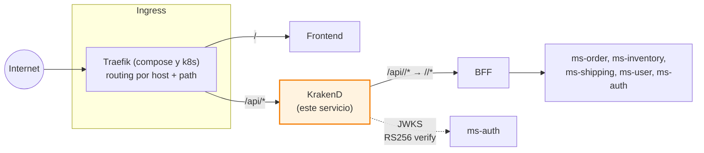
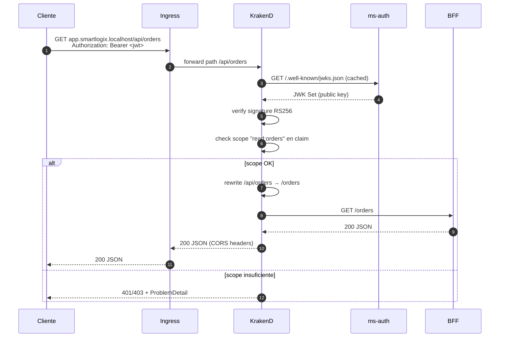

# API Gateway — KrakenD

> Gateway declarativo que enruta `/api/*` hacia el BFF, valida JWT RS256 por endpoint con scopes, y aplica CORS. Vive **detrás** del Ingress (Traefik en compose y k8s).

← Volver a [README raíz del monorepo](../../README.md) · Otros componentes: [BFF](../bff/README.md) · [ms-order](../ms-order/README.md) · [ms-inventory](../ms-inventory/README.md) · [ms-shipping](../ms-shipping/README.md) · [ms-user](../ms-user/README.md) · [ms-auth](../ms-auth/README.md)

---

## Tabla técnica

| Aspecto | Detalle |
|---|---|
| Imagen | `devopsfaith/krakend:2.9.4` |
| Configuración | `krakend.json` declarativo (sin código compilado) |
| Auth | JWT RS256, verificado contra JWKS de `ms-auth` |
| Tests | n/a (configuración validable con `krakend check`) |
| Patrones | API Gateway, Declarative Configuration, JWT validation con JWKS, CORS, Ingress + Gateway separados |

---

## Tabla de contenidos

1. [Resumen](#1-resumen)
2. [Posición en la arquitectura](#2-posición-en-la-arquitectura)
3. [Responsabilidad](#3-responsabilidad)
4. [Configuración (`krakend.json`)](#4-configuración-krakendjson)
5. [Endpoints expuestos](#5-endpoints-expuestos)
6. [Cómo ejecutar](#6-cómo-ejecutar)
7. [Cómo probar](#7-cómo-probar)
8. [Limitaciones conocidas](#8-limitaciones-conocidas)
9. [Patrones aplicados](#9-patrones-aplicados)

---

## 1. Resumen

KrakenD es un **API Gateway declarativo** (toda la lógica vive en `krakend.json`, sin código compilado) que centraliza policies del tráfico `/api/*`. Aplica JWT validation con scopes por endpoint, CORS y rewrite del path antes de pasar al BFF.

**Stack**: KrakenD v2.9.4 (imagen `devopsfaith/krakend`).

## 2. Posición en la arquitectura

El **punto único de entrada** es el Ingress, no este componente. KrakenD especializa exclusivamente las rutas que comienzan con `/api/*`:



### ¿Por qué Ingress + API Gateway separados?

| Capa | Ingress (Traefik) | KrakenD (API Gateway) |
|---|---|---|
| Granularidad | Plataforma completa | Solo `/api/*` |
| Responsabilidad | TLS termination, routing por host/path, frontend estático | Policies de API: JWT con scopes, CORS específico, transformación |
| Configuración | YAML / annotations | JSON declarativo |
| Equivalencia K8s | Ingress Controller | API Gateway resource |

## 3. Responsabilidad



Sobre el tráfico, KrakenD aplica:

- **Routing**: `/api/inventory/*`, `/api/orders/*`, `/api/shipments/*`, `/api/users/*`, `/api/auth/*` → BFF (rewrite quita el prefijo `/api`)
- **JWT validation** con verificación de scope claim (`read:inventory`, `write:orders`, etc.)
- **CORS** configurado para `http://localhost:5173` (frontend dev) y same-origin en producción
- **Rate limiting** y throttling configurables por endpoint (no activado actualmente)

## 4. Configuración (`krakend.json`)

```json
{
  "endpoints": [
    {
      "endpoint": "/api/orders",
      "method": "GET",
      "extra_config": {
        "auth/validator": {
          "alg": "RS256",
          "jwk_url": "http://ms-auth:8081/.well-known/jwks.json",
          "disable_jwk_security": true,
          "roles_key": "scope",
          "roles": ["read:orders"]
        }
      },
      "backend": [{ "url_pattern": "/orders", "host": ["http://bff:3000"] }]
    }
  ],
  "extra_config": {
    "security/cors": {
      "allow_origins": ["http://localhost:5173"],
      "allow_methods": ["GET", "POST", "PUT", "PATCH", "DELETE", "OPTIONS"],
      "allow_headers": ["Origin", "Authorization", "Content-Type", "Accept"]
    },
    "router": { "return_error_msg": true },
    "telemetry/logging": { "level": "INFO", "prefix": "[KRAKEND]" }
  }
}
```

- `endpoints[]` — cada uno con `endpoint` (path expuesto) y `backend[]` (host destino en la red Docker `internal`)
- `extra_config.security/cors` — CORS global
- `auth/validator` por endpoint — JWT RS256 contra el JWKS de `ms-auth` con scope requerido

### 4.1 Seguridad del JWK (dev vs prod)

Cada validador JWT declara:

```json
"disable_jwk_security": true
```

Esto desactiva la **validación TLS del endpoint JWKS**, necesario en dev porque `ms-auth` expone JWKS por HTTP plano dentro de la red interna.

**En producción** el JWKS debe servirse por **HTTPS** y este flag debe quedar `false`. Buscar/reemplazar global cuando se prepare el entorno productivo.

## 5. Endpoints expuestos

| Endpoint público | Método | Scope requerido | Backend |
|---|---|---|---|
| `/api/auth/{path}` | POST | público | `/auth/{path}` |
| `/api/auth/login`, `/api/auth/register` *(matches arriba)* | POST | público | `/auth/...` |
| `/api/inventory/{path}` | GET/POST/PATCH | `read:inventory` / `write:inventory` | `/inventory/{path}` |
| `/api/orders` | GET | `read:orders` | `/orders` |
| `/api/orders` | POST | `write:orders` | `/orders` |
| `/api/orders/{path}` | GET/POST/PATCH | `read:orders` / `write:orders` | `/orders/{path}` |
| `/api/shipments` | GET | `read:shipments` | `/shipments` |
| `/api/shipments` | POST | `write:shipments` | `/shipments` |
| `/api/shipments/{path}` | GET/POST/PATCH | `read:shipments` / `write:shipments` | `/shipments/{path}` |
| `/api/users` | GET | `read:users` | `/users` |
| `/api/users` | POST | `write:users` | `/users` |
| `/api/users/{path}` | GET/POST/PUT/DELETE | `read:users` / `write:users` | `/users/{path}` |
| `/api/checkout` | POST | `write:orders` | `/checkout` (BFF saga) |
| `/api/dashboard` | GET | `read:orders` | `/dashboard` (BFF composed) |

## 6. Cómo ejecutar

### Vía Docker (recomendado)

```bash
docker compose up -d api-gateway
```

### Local (sin Docker)

```bash
docker run -p 8080:8080 -v $(pwd)/krakend.json:/etc/krakend/krakend.json \
  devopsfaith/krakend:2.9.4 run -c /etc/krakend/krakend.json
```

### Validar la config sin levantar el servicio

```bash
docker run --rm -v $(pwd)/krakend.json:/etc/krakend/krakend.json \
  devopsfaith/krakend:2.9.4 check -c /etc/krakend/krakend.json
```

### Kubernetes

En k8s el `krakend.json` se inyecta como ConfigMap a través de `configMapGenerator` en `backend/api-gateway/k8s/kustomization.yaml`. Cualquier cambio al JSON dispara un nuevo hash y rolling update del Deployment.

## 7. Cómo probar

```bash
# Login para obtener token
TOKEN=$(curl -sS -X POST http://app.smartlogix.localhost/api/auth/login \
  -H 'Content-Type: application/json' \
  -d '{"email":"admin@smartlogix.cl","password":"..."}' | jq -r .accessToken)

# Llamada autenticada
curl -H "Authorization: Bearer $TOKEN" http://app.smartlogix.localhost/api/inventory/products
curl -H "Authorization: Bearer $TOKEN" http://app.smartlogix.localhost/api/orders
curl -H "Authorization: Bearer $TOKEN" http://app.smartlogix.localhost/api/shipments

# Sin token → 401
curl -i http://app.smartlogix.localhost/api/inventory/products
```

## 8. Limitaciones conocidas

| Limitación | Detalle | Workaround |
|---|---|---|
| `{path}` wildcard único | El parámetro `{path}` en gin (motor de Krakend) captura **un solo segmento**. Endpoints como `/api/inventory/stock/low` (2 segmentos) no matchean `/api/inventory/{path}` | Agregar entrada específica al `krakend.json` |
| Conflicto de wildcards | Dos endpoints con wildcards de nombres distintos (ej. `:id` y `:path`) bajo el mismo prefijo causan **panic** al startup de gin | Usar el mismo nombre de variable en todos los endpoints bajo el mismo prefijo |
| Routing flat | KrakenD no soporta `regex` ni `glob` en `endpoint` paths | Listar cada endpoint explícitamente |

## 9. Patrones aplicados

- **API Gateway** (Fowler) — agrega cross-cutting concerns sobre `/api/*`
- **Ingress + API Gateway separados** — TLS/host routing (Ingress) vs policies de API (KrakenD)
- **JWT validation con JWKS** — verificación asimétrica RS256 sin compartir secret
- **Scope-based authorization** — cada endpoint declara su scope mínimo
- **Backend-for-frontend isolation** — KrakenD enruta al BFF, **nunca** a los MS directamente
- **Declarative configuration** — sin código compilado; toda la lógica vive en `krakend.json` versionado
- **Same-origin via path-based routing** (k8s) — el ingress envía `/` al frontend y `/api/*` al gateway en el mismo host, eliminando CORS para el SPA en producción
