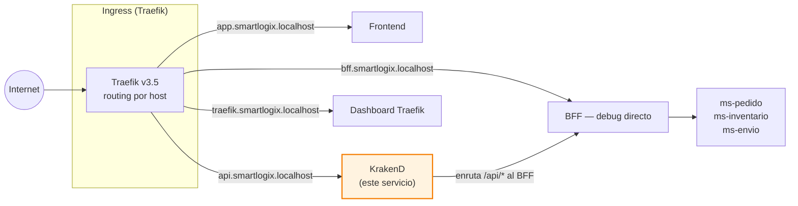
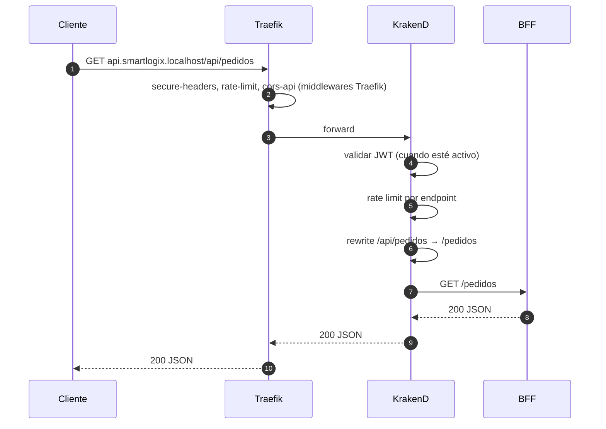

# API Gateway — KrakenD

> Gateway declarativo que enruta `/api/*` hacia el BFF, agrega rate limiting, JWT validation (preparado) y CORS. Vive **detrás** de Traefik (Ingress).

← Volver a [README raíz del monorepo](../../../README.md) · Otros componentes: [Frontend](../../../frontend/README.md) · [BFF](../../bff/README.md) · [ms-pedido](../ms-pedido/README.md) · [ms-inventario](../ms-inventario/README.md) · [ms-envio](../ms-envio/README.md)

---

## Tabla de contenidos

1. [Resumen](#1-resumen)
2. [Posición en la arquitectura](#2-posición-en-la-arquitectura)
3. [Responsabilidad](#3-responsabilidad)
4. [Configuración (`krakend.json`)](#4-configuración-krakendjson)
5. [Cómo ejecutar](#5-cómo-ejecutar)
6. [Cómo probar](#6-cómo-probar)
7. [Patrones aplicados](#7-patrones-aplicados)

---

## 1. Resumen

KrakenD es un **API Gateway declarativo** (toda la lógica vive en `krakend.json`, sin código compilado) que centraliza policies de la rama de tráfico **`api.smartlogix.localhost/*`**. Aplica rate limiting, JWT validation (placeholder hasta tener emisor), CORS y reescribe el path antes de pasar al BFF.

**Stack**: KrakenD v2.10 (imagen `devopsfaith/krakend`).

## 2. Posición en la arquitectura

El **punto único de entrada** al sistema es **Traefik** (Ingress), no este componente. KrakenD especializa exclusivamente las rutas del host `api.smartlogix.localhost`:



### ¿Por qué Ingress + API Gateway separados?

| Capa | Traefik (Ingress) | KrakenD (API Gateway) |
|---|---|---|
| Granularidad | Plataforma completa | Solo `/api/*` |
| Responsabilidad | TLS termination, routing por host, redirects, frontend estático | Policies de API: rate limit, JWT, CORS específico de API, transformación |
| Configuración | YAML (provider File) | JSON declarativo |
| Equivalencia K8s | Ingress Controller | API Gateway resource |

Esta separación es el patrón estándar en deployments Kubernetes y deja la migración a K8s directa.

## 3. Responsabilidad



Sobre el tráfico que Traefik le entrega, KrakenD aplica:

- **Routing**: `/api/inventario/*`, `/api/pedidos/*`, `/api/envios/*` → BFF (rewrite quita el prefijo `/api`)
- **Rate limiting** y throttling configurables por endpoint
- **JWT validation** (placeholder, se activa cuando exista emisor real Auth0/Keycloak)
- **CORS**, headers, compresión

## 4. Configuración (`krakend.json`)

```json
{
  "endpoints": [
    { "endpoint": "/api/pedidos/{path}", "method": "GET",
      "backend": [{ "url_pattern": "/pedidos/{path}", "host": ["http://bff:3000"] }] },
    ...
  ],
  "extra_config": {
    "router": { "return_error_msg": true },
    "telemetry/logging": { "level": "INFO", "prefix": "[KRAKEND]" }
  }
}
```

- `endpoints[]` — cada uno con `endpoint` (path expuesto) y `backend[]` (host destino dentro de la red Docker `internal`)
- `extra_config` — middlewares globales (CORS, JWT, logging)
- JWT validator preparado, hoy pasa todo sin autenticación para facilitar desarrollo

## 5. Cómo ejecutar

### Vía Docker (recomendado)

```bash
docker compose up -d apigateway
```

### Local (sin Docker)

```bash
docker run -p 8080:8080 -v $(pwd)/krakend.json:/etc/krakend/krakend.json \
  devopsfaith/krakend:2.10 run -c /etc/krakend/krakend.json
```

### Validar la config sin levantar el servicio

```bash
docker run --rm -v $(pwd)/krakend.json:/etc/krakend/krakend.json \
  devopsfaith/krakend:2.10 check -c /etc/krakend/krakend.json
```

## 6. Cómo probar

Con Traefik corriendo + `hosts` configurado:

```bash
curl http://api.smartlogix.localhost/api/inventario/productos
curl http://api.smartlogix.localhost/api/pedidos
curl http://api.smartlogix.localhost/api/envios
```

## 7. Patrones aplicados

- **API Gateway** (Fowler) — agrega cross-cutting concerns sobre la rama de tráfico que le delega el Ingress
- **Ingress + API Gateway separados** — TLS/host routing (Traefik) vs policies de API (KrakenD)
- **Backend-for-frontend isolation** — KrakenD enruta al BFF, **nunca** a los MS directamente
- **Declarative configuration** — sin código compilado; toda la lógica vive en `krakend.json` versionado
