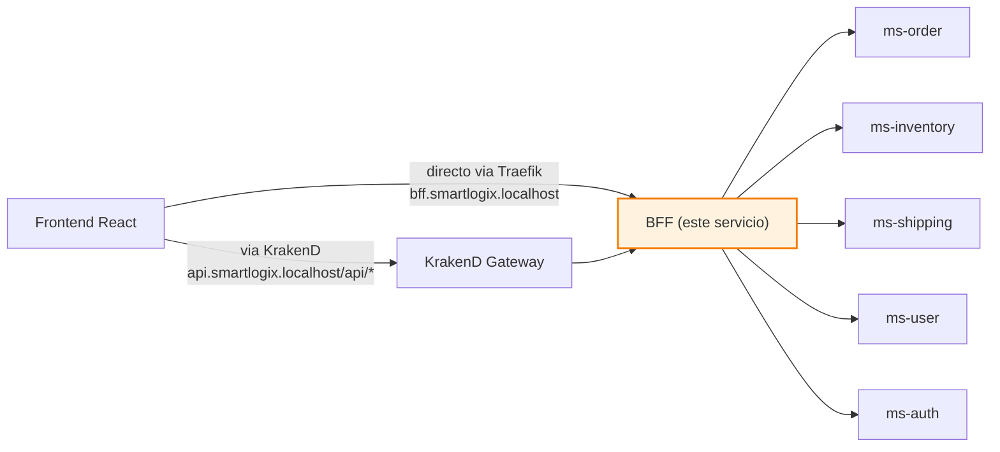
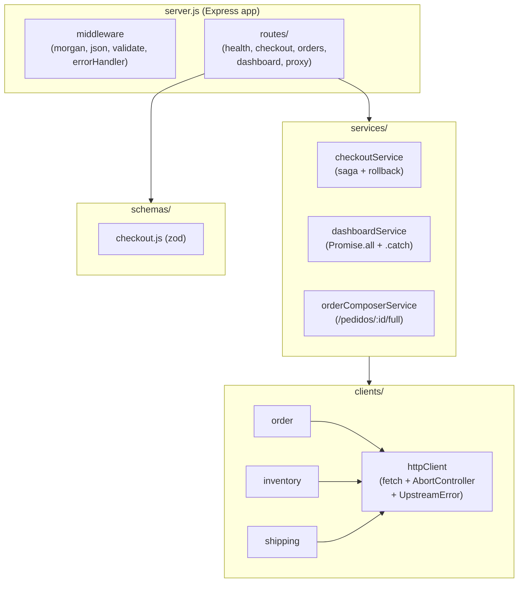
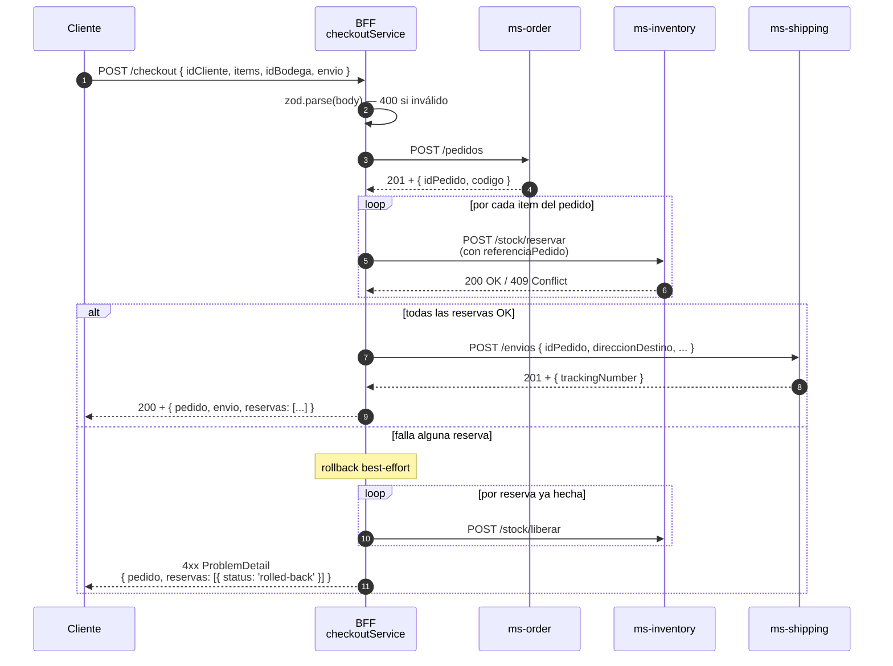

# SmartLogix BFF

> **Backend For Frontend** del sistema SmartLogix. Orquesta los microservicios, compone respuestas para el frontend y expone una API simétrica al cliente.

← Volver a [README raíz del monorepo](../../README.md) · Otros componentes: [Frontend](../../frontend/README.md) · [API Gateway](../api-gateway/README.md) · [ms-order](../ms-order/README.md) · [ms-inventory](../ms-inventory/README.md) · [ms-shipping](../ms-shipping/README.md) · [ms-user](../ms-user/README.md) · [ms-auth](../ms-auth/README.md)

---

## Tabla de contenidos

1. [Resumen](#1-resumen)
2. [Posición en la arquitectura](#2-posición-en-la-arquitectura)
3. [Estructura interna](#3-estructura-interna)
4. [API](#4-api)
5. [Flujo del checkout (saga)](#5-flujo-del-checkout-saga)
6. [Manejo de errores (RFC 7807)](#6-manejo-de-errores-rfc-7807)
7. [Variables de entorno](#7-variables-de-entorno)
8. [Cómo ejecutar](#8-cómo-ejecutar)
9. [Patrones aplicados](#9-patrones-aplicados)

---

## 1. Resumen

El BFF es la **capa de adaptación** entre el frontend y la malla de microservicios. Implementa dos tipos de endpoints:

1. **Proxy passthrough** — CRUD simple a cada MS (`/inventario/*`, `/pedidos/*`, `/envios/*`, `/usuarios/*`, `/auth/*`).
2. **Compuestos / orquestados** — agregan o coordinan llamadas a varios MS:
   - `GET /dashboard` — pedidos por estado, top stock bajo, envíos en ruta
   - `GET /pedidos/:id/full` — pedido + envíos + disponibilidad por producto (con `Promise.all`)
   - `POST /checkout` — saga: crear pedido → reservar stock → crear envío (con rollback best-effort)

**Stack**: Node.js 20 · Express 4 · http-proxy-middleware 3 · zod 3 · morgan.

> **Convención de nombres**: internamente los módulos, variables y hostnames upstream están en inglés (`inventory`, `order`, `shipping`, `user`, `auth`). Las **rutas HTTP públicas** se mantienen en español (`/inventario`, `/pedidos`, `/envios`, `/usuarios`) para no romper el contrato con el frontend. `/auth/*` es la única nueva en inglés.

## 2. Posición en la arquitectura



El BFF es alcanzable por **dos caminos** desde Traefik: directo (`bff.smartlogix.localhost`, útil para debug) y vía KrakenD (`api.smartlogix.localhost/api/*`, ruta productiva con rate limiting y JWT).

## 3. Estructura interna



## 4. API

| Método | Path | Descripción |
|---|---|---|
| GET | `/health` | Health check: `{ status: "ok", service: "bff" }` |
| GET | `/` | Manifiesto: lista de endpoints disponibles |
| **Compuestos** | | |
| GET | `/dashboard` | Cuentas de pedidos por estado, top stock bajo, envíos en ruta |
| GET | `/pedidos/:id/full` | Pedido + envíos asociados + disponibilidad agregada por producto |
| POST | `/checkout` | Orquesta crear pedido → reservar stock por ítem → crear envío |
| **Proxy passthrough** | | |
| ANY | `/inventario/*` | → `ms-inventory` |
| ANY | `/pedidos/*` | → `ms-order` |
| ANY | `/envios/*` | → `ms-shipping` |
| ANY | `/usuarios/*` | → `ms-user` |
| ANY | `/auth/*` | → `ms-auth` |

## 5. Flujo del checkout (saga)

`POST /checkout` es el endpoint más interesante: orquesta 3 servicios en una **saga** con compensaciones best-effort si algo falla a mitad de camino.



> Los rollbacks son **compensaciones lógicas**, no aborts de DB (los MS no comparten transacción). Si el rollback también falla, se loggea y queda como inconsistencia para intervención manual.

## 6. Manejo de errores (RFC 7807)

Centralizado en `middleware/errorHandler.js`. Convierte cualquier excepción en JSON `application/problem+json`:

| Excepción | Status devuelto | Body |
|---|---|---|
| `ZodError` | 400 | `{ title, detail, errors: { campo: mensaje } }` |
| `UpstreamError` timeout | 504 | `{ detail: "<service> timeout (5000ms)" }` |
| `UpstreamError` red | 502 | `{ detail: "<service> inalcanzable: ..." }` |
| `UpstreamError` status upstream | igual al upstream | propaga `body` del MS |
| `Error` genérico | 500 | `{ detail: "Internal Server Error" }` (log completo en stderr) |

## 7. Variables de entorno

| Variable | Default | Función |
|---|---|---|
| `PORT` | `3000` | Puerto HTTP del BFF |
| `MS_INVENTORY_URL` | `http://ms-inventory:8080` | URL base del MS de inventario |
| `MS_ORDER_URL` | `http://ms-order:8080` | URL base del MS de pedido |
| `MS_SHIPPING_URL` | `http://ms-shipping:8080` | URL base del MS de envío |
| `MS_USER_URL` | `http://ms-user:8080` | URL base del MS de usuario |
| `MS_AUTH_URL` | `http://ms-auth:8081` | URL base del MS de autenticación |
| `HTTP_TIMEOUT_MS` | `5000` | Timeout (AbortController) para cada llamada a MS |

## 8. Cómo ejecutar

### Vía Docker (recomendado)

Desde la raíz del monorepo:

```bash
docker compose up -d bff   # levanta bff + dependencias
```

### Local (sin Docker)

```bash
cd backend/bff
npm install
npm run dev    # node --watch
# o
npm start
```

### Smoke test

```bash
curl http://bff.smartlogix.localhost/health
curl http://bff.smartlogix.localhost/dashboard
curl -X POST http://bff.smartlogix.localhost/checkout \
  -H "Content-Type: application/json" \
  -d '{
    "idCliente": "CL-001",
    "idBodega": 1,
    "envio": { "direccionDestino": "Av. Providencia 1234", "comuna": "Providencia", "region": "RM" },
    "items": [ {"idProducto": 1, "sku": "SKU-001", "cantidad": 2, "precioUnitario": 5000} ]
  }'
```

## 9. Patrones aplicados

- **BFF (Backend For Frontend)** — API tallada a la medida de las pantallas del operador
- **Composite Service** — `dashboardService` y `orderComposerService` agregan varios MS en paralelo con `Promise.all`
- **Saga simplificada** — `checkoutService` con compensaciones best-effort
- **Circuit-Breaker-lite** — cada llamada va envuelta en `AbortController` con timeout; agregaciones toleran fallos parciales con `.catch()`
- **Schema Validation (zod)** — entrada validada antes de tocar los MS
- **RFC 7807 ProblemDetail** — formato unificado de errores entre BFF y MS
