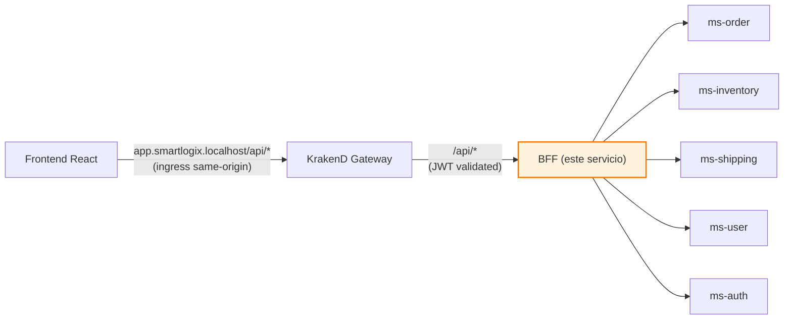
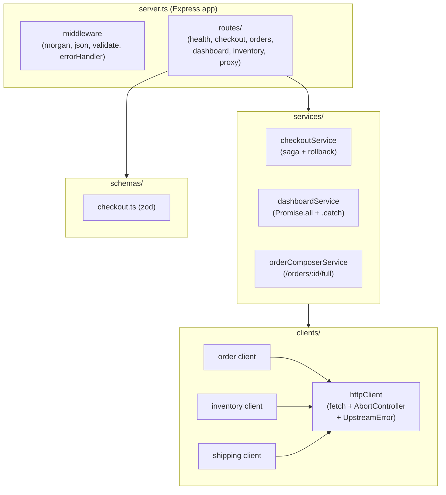
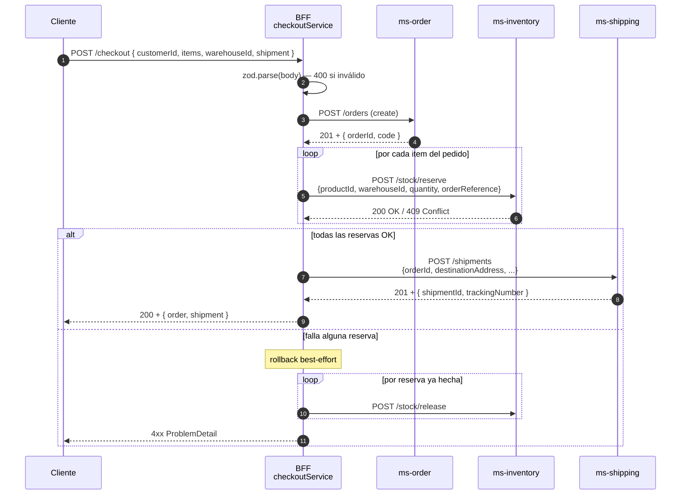

# SmartLogix BFF

> **Backend For Frontend** del sistema SmartLogix. Orquesta los microservicios, compone respuestas para el frontend y expone una API tallada al cliente.

← Volver a [README raíz del monorepo](../../README.md) · Otros componentes: [API Gateway](../api-gateway/README.md) · [ms-order](../ms-order/README.md) · [ms-inventory](../ms-inventory/README.md) · [ms-shipping](../ms-shipping/README.md) · [ms-user](../ms-user/README.md) · [ms-auth](../ms-auth/README.md)

---

## Tabla técnica

| Aspecto | Detalle |
|---|---|
| Lenguaje | TypeScript 5 (ESM, Node 20) |
| Framework | Express 4 |
| Librerías clave | http-proxy-middleware, zod, morgan, swagger-ui-express, dotenv |
| Build | `tsc` (compilación a `dist/`) |
| Tests | Vitest *(pendiente — el dominio del BFF es orquestación, los tests viven en los MS)* |
| Patrones | Backend For Frontend, Composite Service, Saga simplificada, Circuit-Breaker-lite, Schema Validation (zod), RFC 7807 ProblemDetail |

---

## Tabla de contenidos

1. [Resumen](#1-resumen)
2. [Posición en la arquitectura](#2-posición-en-la-arquitectura)
3. [Estructura interna](#3-estructura-interna)
4. [API](#4-api)
5. [Flujo del checkout (saga)](#5-flujo-del-checkout-saga)
6. [Manejo de errores (RFC 7807)](#6-manejo-de-errores-rfc-7807)
7. [Variables de entorno](#7-variables-de-entorno)
8. [Cómo ejecutar](#8-cómo-ejecutar)
9. [Swagger / OpenAPI](#9-swagger--openapi)
10. [Patrones aplicados](#10-patrones-aplicados)

---

## 1. Resumen

El BFF es la **capa de adaptación** entre el frontend y la malla de microservicios. Implementa dos tipos de endpoints:

1. **Proxy passthrough** — CRUD simple a cada MS (`/inventory/*`, `/orders/*`, `/shipments/*`, `/users/*`, `/auth/*`).
2. **Compuestos / orquestados** — agregan o coordinan llamadas a varios MS:
   - `GET /dashboard` — orders por status, top low stock, shipments in transit
   - `GET /orders/:id/full` — order + shipments + disponibilidad por producto (con `Promise.all`)
   - `POST /checkout` — saga: crear order → reservar stock → crear shipment (con rollback best-effort)
   - `GET /inventory/products-with-stock` — productos enriquecidos con stock agregado

**Stack**: Node.js 20 · Express 4 · http-proxy-middleware · zod · morgan · TypeScript 5.

> **Convención de nombres**: paths URL, JSON fields y variables internas están en inglés tras el refactor de junio 2026. Los nombres del dominio interno de los MS (entidades, columnas DB) siguen en español pero no se exponen aquí.

## 2. Posición en la arquitectura



En k8s el frontend y el gateway están en el mismo host (`app.smartlogix.localhost`) gracias al path-based routing del ingress. Esto elimina CORS y simplifica el flujo.

## 3. Estructura interna



## 4. API

| Método | Path | Descripción |
|---|---|---|
| GET | `/health` | Health check: `{ status: "ok", service: "bff" }` |
| GET | `/` | Manifiesto: lista de endpoints disponibles |
| **Compuestos** | | |
| GET | `/dashboard` | Cuentas de orders por status, top low stock, shipments in transit |
| GET | `/orders/:id/full` | Order + shipments asociados + disponibilidad agregada por producto |
| POST | `/checkout` | Orquesta crear order → reservar stock por ítem → crear shipment |
| GET | `/inventory/products-with-stock` | Productos enriquecidos con stock agregado de todas las bodegas |
| POST | `/inventory/products` | Crea producto + asigna stock inicial en bodega derivada de `location` |
| **Proxy passthrough** | | |
| ANY | `/inventory/*` | → `ms-inventory` (path rewrite `^/inventory` → `''`) |
| ANY | `/orders/*` | → `ms-order` (path preservado vía `req.originalUrl`) |
| ANY | `/shipments/*` | → `ms-shipping` |
| ANY | `/users/*` | → `ms-user` |
| ANY | `/auth/*` | → `ms-auth` |

## 5. Flujo del checkout (saga)

`POST /checkout` es el endpoint más interesante: orquesta 3 servicios en una **saga** con compensaciones best-effort si algo falla a mitad de camino.



> Los rollbacks son **compensaciones lógicas**, no aborts de DB (los MS no comparten transacción). Si el rollback también falla, se loggea (`[bff] rollback release failed: ...`) y queda como inconsistencia para intervención manual.

### 5.1 Ejemplo de payload checkout

```json
{
  "type": "ESTANDAR",
  "customerId": "CLI-001",
  "marketplaceId": "MKT-MELI",
  "warehouseId": 1,
  "items": [
    { "productId": 1, "sku": "ELE-4821-SL", "quantity": 2, "unitPrice": 150000 }
  ],
  "shipment": {
    "destinationAddress": "Av. Providencia 1234",
    "district": "Providencia",
    "region": "Metropolitana",
    "estimatedDate": "2026-06-25"
  }
}
```

## 6. Manejo de errores (RFC 7807)

Centralizado en `middleware/errorHandler.ts`. Convierte cualquier excepción en JSON `application/problem+json`:

| Excepción | Status devuelto | Body |
|---|---|---|
| `ZodError` | 400 | `{ title, detail, errors: { campo: mensaje } }` |
| `UpstreamError` timeout | 504 | `{ detail: "<service> timeout (5000ms)" }` |
| `UpstreamError` red | 502 | `{ detail: "<service> inalcanzable: ..." }` |
| `UpstreamError` status upstream | igual al upstream | propaga `body` del MS |
| `Error` genérico | 500 | `{ detail: "Internal Server Error" }` (log completo en stderr) |

## 7. Variables de entorno

| Variable | Default | Función |
|---|---|---|
| `PORT` | `3000` | Puerto HTTP del BFF |
| `MS_INVENTORY_URL` | `http://ms-inventory:8080` | URL base del MS de inventario |
| `MS_ORDER_URL` | `http://ms-order:8080` | URL base del MS de order |
| `MS_SHIPPING_URL` | `http://ms-shipping:8080` | URL base del MS de shipping |
| `MS_USER_URL` | `http://ms-user:8080` | URL base del MS de user |
| `MS_AUTH_URL` | `http://ms-auth:8081` | URL base del MS de auth |
| `HTTP_TIMEOUT_MS` | `5000` | Timeout (AbortController) para cada llamada a MS |

## 8. Cómo ejecutar

### Vía Docker (recomendado)

```bash
docker compose up -d bff   # levanta bff + dependencias
```

### Local (sin Docker)

```bash
cd backend/bff
npm install
npm run dev    # node --watch + ts-node loader
# o
npm run build && npm start
```

### Smoke test

```bash
curl http://bff.smartlogix.localhost/health

# Compose con gateway:
TOKEN=$(curl -sS -X POST http://app.smartlogix.localhost/api/auth/login \
  -H 'Content-Type: application/json' \
  -d '{"email":"admin@smartlogix.cl","password":"..."}' | jq -r .accessToken)

curl -H "Authorization: Bearer $TOKEN" http://app.smartlogix.localhost/api/dashboard
```

## 9. Swagger / OpenAPI

El BFF expone su propia documentación con `swagger-ui-express`:

| URL | Contenido |
|---|---|
| `http://bff.smartlogix.localhost/docs` | Swagger UI interactivo |
| `http://bff.smartlogix.localhost/openapi.json` | Spec OpenAPI en JSON |

La spec se mantiene en `src/openapi.yaml` y se sirve mediante el router `routes/docs.ts`.

## 10. Patrones aplicados

- **BFF (Backend For Frontend)** — API tallada a la medida de las pantallas del operador
- **Composite Service** — `dashboardService` y `orderComposerService` agregan varios MS en paralelo con `Promise.all`
- **Saga simplificada** — `checkoutService` con compensaciones best-effort
- **Circuit-Breaker-lite** — cada llamada va envuelta en `AbortController` con timeout; las agregaciones toleran fallos parciales con `.catch()`
- **Schema Validation (zod)** — entrada validada antes de tocar los MS
- **RFC 7807 ProblemDetail** — formato unificado de errores entre BFF y MS
- **Proxy with body restream** — `restreamBody` re-serializa `req.body` después de `express.json()` para que `http-proxy-middleware` no quede esperando un stream vacío
