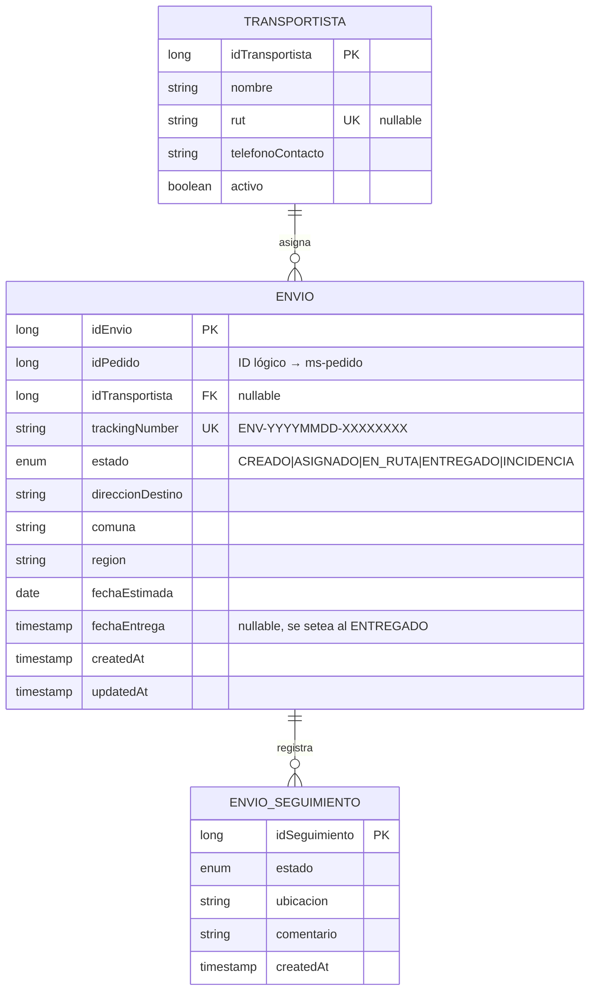
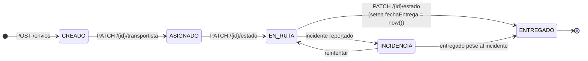
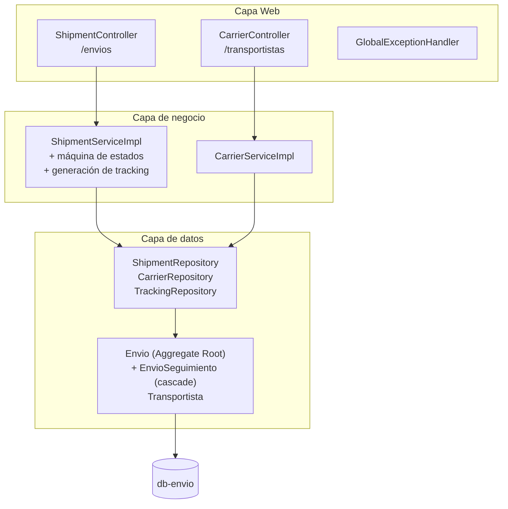

# ms-envio

> Microservicio dueño del agregado **Envío**. Genera envíos a partir de un pedido, asigna transportista y mantiene la trazabilidad punto a punto.

← Volver a [README raíz del monorepo](../../../README.md) · Otros componentes: [Frontend](../../../frontend/README.md) · [BFF](../../bff/README.md) · [API Gateway](../apigateway/README.md) · [ms-pedido](../ms-pedido/README.md) · [ms-inventario](../ms-inventario/README.md)

---

## Tabla de contenidos

1. [Resumen](#1-resumen)
2. [Modelo de dominio](#2-modelo-de-dominio)
3. [Máquina de estados](#3-máquina-de-estados)
4. [Arquitectura interna](#4-arquitectura-interna)
5. [API REST](#5-api-rest)
6. [Cómo ejecutar](#6-cómo-ejecutar)
7. [Cómo probar](#7-cómo-probar)
8. [Patrones aplicados](#8-patrones-aplicados)

---

## 1. Resumen

`ms-envio` genera envíos a partir de un `idPedido` (ID lógico de `ms-pedido`), permite asignar un transportista y registra cada cambio de estado en un audit log inmutable (`envio_seguimiento`). Implementa una máquina de estados con `INCIDENCIA` como rama lateral **reintentable**.

**Stack**: Spring Boot 4.0.6 · Java 25 · PostgreSQL 16 · Flyway · JPA/Hibernate · Gradle 9.

## 2. Modelo de dominio



| Tabla | Función |
|---|---|
| `transportistas` | Catálogo de couriers / empresas (nombre, RUT, contacto, activo) |
| `envios` | Envío con tracking único `ENV-YYYYMMDD-XXXXXXXX`, estado, dirección destino |
| `envio_seguimiento` | Audit log inmutable: cada transición de estado deja una fila con ubicación y comentario |

Detalle ER completo en [`docs/modelo-datos.md`](../../../docs/modelo-datos.md).

## 3. Máquina de estados



- `CREADO → ASIGNADO`: sólo se puede asignar transportista cuando el envío está en `CREADO` **y** el transportista está `activo`.
- `EN_RUTA ↔ INCIDENCIA`: rama lateral **reintentable**. El envío puede volver a ruta tras resolver el incidente.
- `→ ENTREGADO`: setea automáticamente `fechaEntrega = now()`.
- Cada transición persiste un `EnvioSeguimiento` con ubicación y comentario (audit log inmutable).

Las transiciones se validan en `ShipmentServiceImpl` contra un `Map<EstadoEnvio, Set<EstadoEnvio>>`. Transición ilegal → **HTTP 409** + `ProblemDetail`.

## 4. Arquitectura interna



## 5. API REST

| Método | Path | Descripción |
|---|---|---|
| **Envíos** | | |
| POST | `/envios` | Crear envío para un pedido (genera tracking, estado inicial `CREADO`) |
| GET | `/envios/{id}` | Obtener por ID |
| GET | `/envios/tracking/{trackingNumber}` | Obtener por número de tracking (público) |
| GET | `/envios/pedido/{idPedido}` | Envíos asociados a un pedido |
| GET | `/envios?estado=EN_RUTA` | Listar con filtro opcional por estado |
| GET | `/envios/{id}/seguimiento` | Historial de tracking |
| PATCH | `/envios/{id}/transportista` | Asignar transportista (sólo en estado `CREADO`) |
| PATCH | `/envios/{id}/estado` | Cambiar estado (valida transición permitida) |
| **Transportistas** | | |
| POST | `/transportistas` | Crear (RUT único si se provee) |
| GET | `/transportistas/{id}` | Obtener por ID |
| GET | `/transportistas?activo=true` | Listar (filtro opcional por activos) |

Errores devueltos como **RFC 7807** `application/problem+json` por `GlobalExceptionHandler`.

## 6. Cómo ejecutar

### Vía Docker (recomendado)

```bash
docker compose up -d db-envio ms-envio
```

### Local (sin Docker)

Requiere PostgreSQL 16 corriendo con DB/user `envio`:

```bash
./gradlew bootRun
```

### Build de la imagen

```bash
docker build -t smartlogix-ms-envio .
```

## 7. Cómo probar

```bash
# Crear transportista
curl -X POST http://bff.smartlogix.localhost/envios/transportistas \
  -H "Content-Type: application/json" \
  -d '{"nombre": "Chilexpress", "rut": "96.756.430-3"}'

# Crear envío (necesita un idPedido lógico de ms-pedido)
curl -X POST http://bff.smartlogix.localhost/envios \
  -H "Content-Type: application/json" \
  -d '{
    "idPedido": 1,
    "direccionDestino": "Av. Providencia 1234",
    "comuna": "Providencia",
    "region": "RM"
  }'

# Asignar transportista (sólo si estado=CREADO)
curl -X PATCH http://bff.smartlogix.localhost/envios/1/transportista \
  -H "Content-Type: application/json" \
  -d '{"idTransportista": 1}'

# Cambiar estado con ubicación
curl -X PATCH http://bff.smartlogix.localhost/envios/1/estado \
  -H "Content-Type: application/json" \
  -d '{"estado": "EN_RUTA", "ubicacion": "Centro de distribución", "comentario": "Salió del depósito"}'

# Tracking público (por número)
curl http://bff.smartlogix.localhost/envios/tracking/ENV-20260513-ABCDEF12
```

## 8. Estructura del proyecto

```
src/main/java/cl/smartlogix/envio/
├── EnvioApplication.java
├── controller/
│   ├── ShipmentController.java       # /envios
│   ├── CarrierController.java        # /transportistas
│   └── GlobalExceptionHandler.java
├── service/
│   ├── ShipmentService(Impl).java    # máquina de estados, generación de tracking
│   └── CarrierService(Impl).java
├── repository/
├── dto/
└── model/

src/main/resources/
├── application.properties
└── db/migration/V1__init_schema.sql
```

## 9. Patrones aplicados

- **Repository / Service Layer / DTO** (mismo trío que el resto de MS)
- **State Machine** con `INCIDENCIA` como rama lateral reintentable
- **Aggregate Root** — `Envio` cascade-persiste `EnvioSeguimiento`; reglas de transición sobre la raíz
- **Audit Log inmutable** — cada transición deja una fila en `envio_seguimiento`; no se modifican filas existentes
- **Unique Identifier Generation** — tracking `ENV-YYYYMMDD-XXXXXXXX` con sufijo random + chequeo de unicidad
- **RFC 7807 ProblemDetail** — formato unificado de errores
