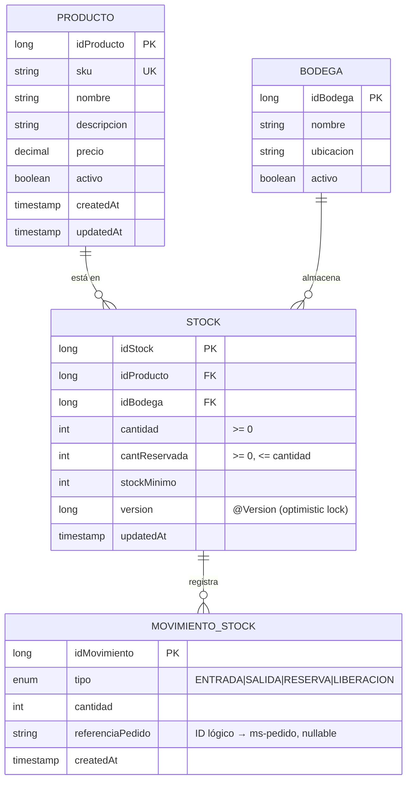
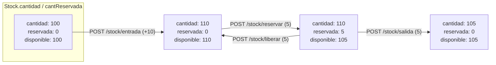
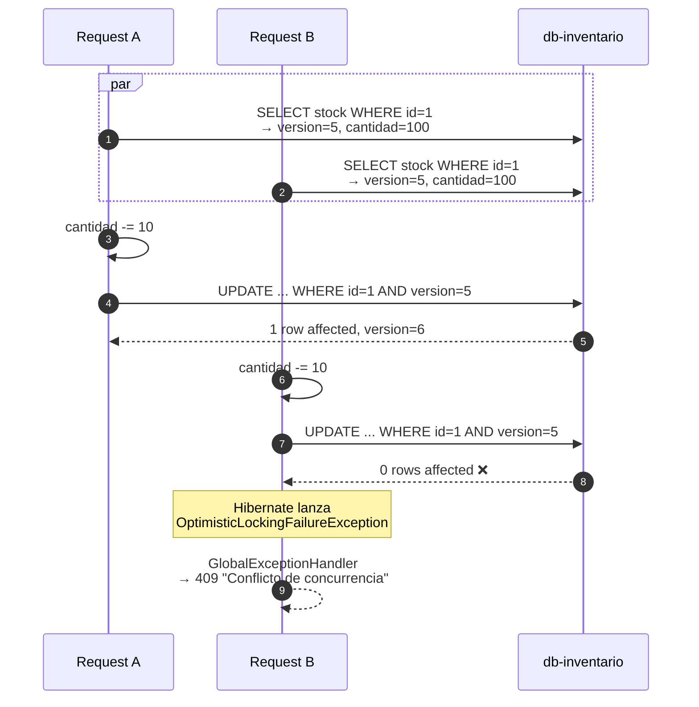
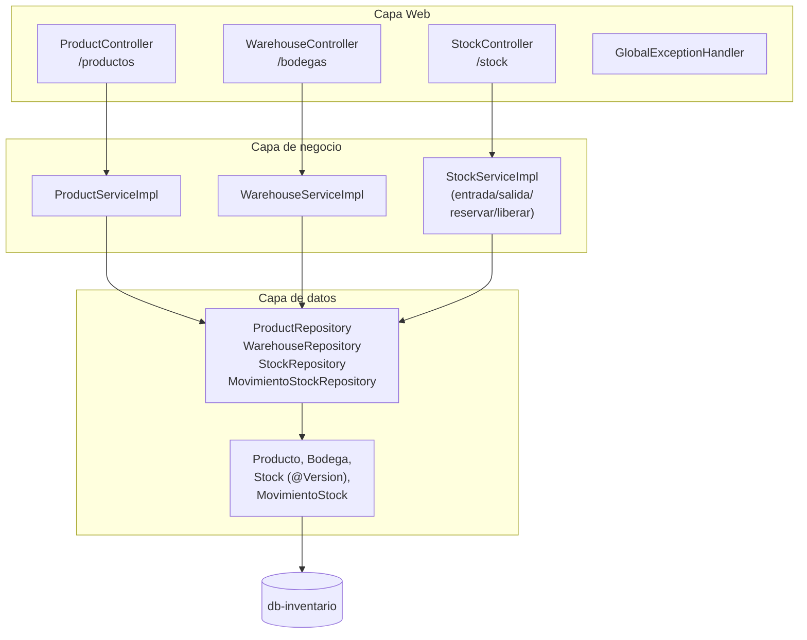

# ms-inventario

> Microservicio dueño de productos, bodegas y stock. Único MS autorizado para mutar existencias. Implementa **optimistic locking** con `@Version` para concurrencia segura.

← Volver a [README raíz del monorepo](../../../README.md) · Otros componentes: [Frontend](../../../frontend/README.md) · [BFF](../../bff/README.md) · [API Gateway](../apigateway/README.md) · [ms-pedido](../ms-pedido/README.md) · [ms-envio](../ms-envio/README.md)

---

## Tabla de contenidos

1. [Resumen](#1-resumen)
2. [Modelo de dominio](#2-modelo-de-dominio)
3. [Operaciones sobre stock](#3-operaciones-sobre-stock)
4. [Optimistic Locking en acción](#4-optimistic-locking-en-acción)
5. [Arquitectura interna](#5-arquitectura-interna)
6. [API REST](#6-api-rest)
7. [Cómo ejecutar](#7-cómo-ejecutar)
8. [Cómo probar](#8-cómo-probar)
9. [Patrones aplicados](#9-patrones-aplicados)

---

## 1. Resumen

`ms-inventario` es el **único servicio autorizado para mutar existencias**. Otros MS (ej. `ms-pedido` durante un checkout) deben llamar su API REST para reservar/liberar/mover stock — no acceden a su DB directamente. Cada operación deja una fila inmutable en `movimientos_stock` (event-sourcing simplificado).

**Stack**: Spring Boot 4.0.6 · Java 25 · PostgreSQL 16 · Flyway · JPA/Hibernate · Gradle 9.

## 2. Modelo de dominio



| Tabla | Función |
|---|---|
| `productos` | Catálogo: SKU único, precio, activo |
| `bodegas` | Ubicaciones físicas |
| `stock` | Existencia por `(producto, bodega)` — con `@Version` para optimistic locking |
| `movimientos_stock` | Bitácora inmutable de ENTRADA / SALIDA / RESERVA / LIBERACION |

**Invariantes a nivel DB**:

- `cantidad >= 0`
- `cant_reservada >= 0`
- `cant_reservada <= cantidad`
- Único por `(id_producto, id_bodega)`

Detalle ER completo en [`docs/modelo-datos.md`](../../../docs/modelo-datos.md).

## 3. Operaciones sobre stock

Cuatro operaciones que ajustan los contadores y dejan un `MovimientoStock`:



- **ENTRADA**: `cantidad += n` (nueva mercadería recibida)
- **SALIDA**: `cantidad -= n` y `cantReservada -= n` (mercadería físicamente despachada). Requiere `cantReservada >= n` o `disponible >= n` según el flujo.
- **RESERVA**: `cantReservada += n` (apartada para un pedido). 409 si `disponible < n`.
- **LIBERACION**: `cantReservada -= n` (libera reserva por cancelación o rollback)

`disponible = cantidad - cantReservada` (campo calculado, no persistido).

## 4. Optimistic Locking en acción

Bajo concurrencia, dos peticiones simultáneas de `POST /stock/salida` sobre el mismo `(producto, bodega)` corromperían la cantidad. Usamos `@Version` en lugar de `SELECT FOR UPDATE`:



El cliente recibe 409 y **reintenta**. Throughput alto sin lockear lectores. Documentado en `GlobalExceptionHandler`.

## 5. Arquitectura interna



## 6. API REST

| Método | Path | Descripción |
|---|---|---|
| **Productos** | | |
| POST | `/productos` | Crear (SKU único; 409 si existe) |
| GET | `/productos/{id}` | Obtener por ID |
| GET | `/productos/sku/{sku}` | Obtener por SKU |
| GET | `/productos` | Listar |
| PATCH | `/productos/{id}` | Actualizar parcial (nombre, descripción, precio, activo) |
| **Bodegas** | | |
| POST | `/bodegas` | Crear |
| GET | `/bodegas/{id}` | Obtener por ID |
| GET | `/bodegas` | Listar |
| **Stock** | | |
| GET | `/stock/{idProducto}/{idBodega}` | Obtener stock en una bodega |
| GET | `/stock/producto/{idProducto}` | Listar stocks del producto en todas las bodegas |
| GET | `/stock/producto/{idProducto}/disponible` | Total disponible agregado |
| GET | `/stock/bajo` | Stocks bajo el `stock_minimo` |
| GET | `/stock/{idStock}/historial` | Movimientos del stock |
| POST | `/stock/entrada` | Suma cantidad (crea el stock si no existe) |
| POST | `/stock/salida` | Resta cantidad (409 si `disponible < cantidad`) |
| POST | `/stock/reservar` | Aumenta `cantReservada` (409 si insuficiente o concurrencia) |
| POST | `/stock/liberar` | Disminuye `cantReservada` |

Errores devueltos como **RFC 7807** `application/problem+json` por `GlobalExceptionHandler`.

## 7. Cómo ejecutar

### Vía Docker (recomendado)

```bash
docker compose up -d db-inventario ms-inventario
```

### Local (sin Docker)

Requiere PostgreSQL 16 corriendo con DB/user `inventario`:

```bash
./gradlew bootRun
```

### Build de la imagen

```bash
docker build -t smartlogix-ms-inventario .
```

## 8. Cómo probar

```bash
# Crear producto
curl -X POST http://bff.smartlogix.localhost/inventario/productos \
  -H "Content-Type: application/json" \
  -d '{"sku": "SKU-001", "nombre": "Caja 30x20", "precio": 2500}'

# Crear bodega
curl -X POST http://bff.smartlogix.localhost/inventario/bodegas \
  -H "Content-Type: application/json" \
  -d '{"nombre": "Bodega Central", "ubicacion": "Santiago"}'

# Entrada de stock (crea el registro si es la primera)
curl -X POST http://bff.smartlogix.localhost/inventario/stock/entrada \
  -H "Content-Type: application/json" \
  -d '{"idProducto": 1, "idBodega": 1, "cantidad": 100}'

# Reservar (durante checkout)
curl -X POST http://bff.smartlogix.localhost/inventario/stock/reservar \
  -H "Content-Type: application/json" \
  -d '{"idProducto": 1, "idBodega": 1, "cantidad": 5, "referenciaPedido": "PED-20260513-AB12CD"}'

# Stock bajo
curl http://bff.smartlogix.localhost/inventario/stock/bajo
```

## 9. Estructura del proyecto

```
src/main/java/cl/smartlogix/inventario/
├── InventarioApplication.java
├── controller/
│   ├── ProductController.java        # /productos
│   ├── WarehouseController.java      # /bodegas
│   ├── StockController.java          # /stock
│   └── GlobalExceptionHandler.java
├── service/
│   ├── ProductService(Impl).java
│   ├── WarehouseService(Impl).java
│   └── StockService(Impl).java       # entrada/salida/reservar/liberar
├── repository/
├── dto/
└── model/

src/main/resources/
├── application.properties
└── db/migration/V1__init_schema.sql
```

## Healthcheck

Expone `/actuator/health` (Spring Boot Actuator):

```bash
docker compose exec ms-inventario curl -sS http://localhost:8080/actuator/health
# {"groups":["liveness","readiness"],"status":"UP"}
```

- `management.endpoint.health.show-details=never` — no filtra info interna a clientes anónimos
- `probes.enabled=true` — habilita `/actuator/health/liveness` y `/readiness` (útil para K8s a futuro)
- El `HEALTHCHECK` del Dockerfile hace `curl ... | grep '"status":"UP"'` cada 30 s
- El `docker-compose.yml` usa `depends_on: condition: service_healthy` para que BFF solo arranque cuando este MS reporte `UP`

## Patrones aplicados

- **Repository / Service Layer / DTO** (mismo trío que el resto de MS)
- **Optimistic Locking** — `@Version` en `Stock` para concurrencia sin lockear lectores
- **Aggregate Root** — `Stock` es la raíz; sus movimientos se crean en transacción atómica con el cambio de cantidades
- **Event Sourcing simplificado** — cada operación deja un `MovimientoStock` con `referenciaPedido` (ID lógico cruzado con `ms-pedido`)
- **Database Invariants** — constraints en SQL (`cantidad >= 0`, etc.) como red de seguridad además de la validación en código
- **RFC 7807 ProblemDetail** — formato unificado de errores
