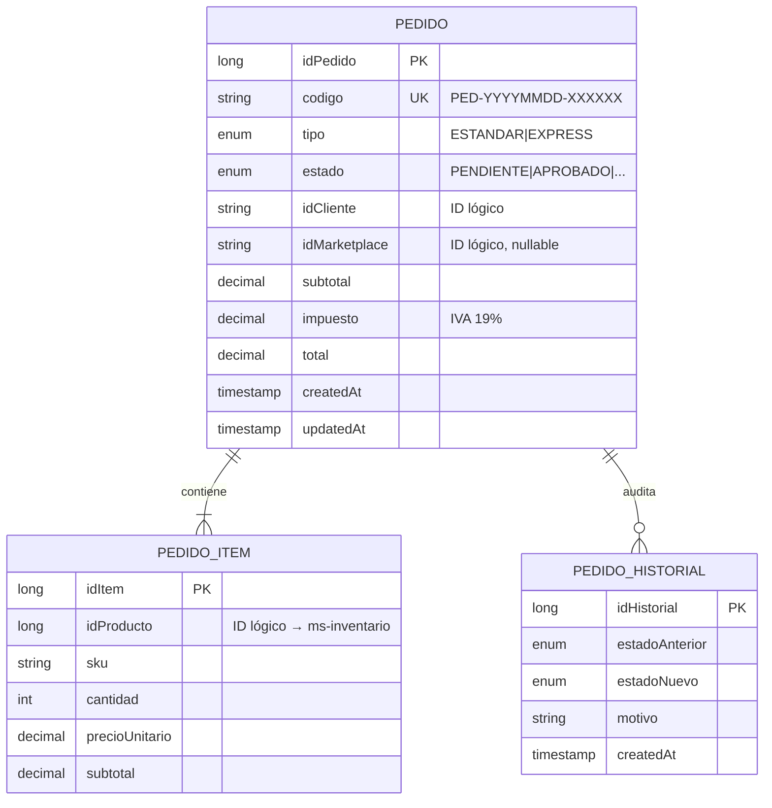
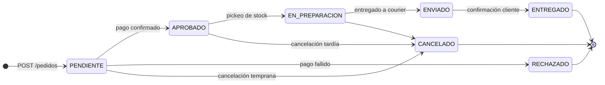
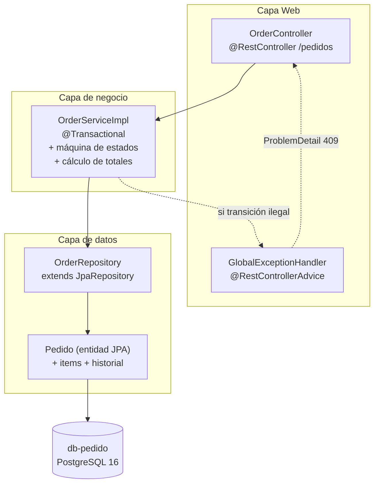

# ms-pedido

> Microservicio dueño del agregado **Pedido**. Implementa la máquina de estados completa del ciclo de vida de un pedido y registra la auditoría de transiciones.

← Volver a [README raíz del monorepo](../../../README.md) · Otros componentes: [Frontend](../../../frontend/README.md) · [BFF](../../bff/README.md) · [API Gateway](../apigateway/README.md) · [ms-inventario](../ms-inventario/README.md) · [ms-envio](../ms-envio/README.md)

---

## Tabla de contenidos

1. [Resumen](#1-resumen)
2. [Modelo de dominio](#2-modelo-de-dominio)
3. [Máquina de estados](#3-máquina-de-estados)
4. [Arquitectura interna](#4-arquitectura-interna)
5. [API REST](#5-api-rest)
6. [Cómo ejecutar](#6-cómo-ejecutar)
7. [Cómo probar](#7-cómo-probar)
8. [Patrones aplicados](#8-patrones-aplicados)

---

## 1. Resumen

`ms-pedido` es responsable de:

- Crear pedidos validando ítems y calculando totales con IVA 19 %.
- Mantener la máquina de estados (`PENDIENTE → APROBADO → ... → ENTREGADO`) con transiciones validadas.
- Persistir cada cambio de estado en `pedido_historial` (audit log inmutable).
- Generar códigos `PED-YYYYMMDD-XXXXXX` únicos por pedido.

**Stack**: Spring Boot 4.0.6 · Java 25 · PostgreSQL 16 · Flyway · JPA/Hibernate · Gradle 9.

No comparte tablas con otros MS (**Database per Service**). Los IDs de cliente / producto / marketplace son **identificadores lógicos** — no hay FK cruzadas con `ms-inventario` o `ms-envio`.

## 2. Modelo de dominio



| Tabla | Función |
|---|---|
| `pedidos` | Cabecera del pedido: código, estado, totales |
| `pedido_items` | Líneas del pedido (relación N:1) |
| `pedido_historial` | Bitácora de transiciones de estado (relación N:1) |

Detalle ER completo en [`docs/modelo-datos.md`](../../../docs/modelo-datos.md).

## 3. Máquina de estados



Las transiciones se validan en `OrderServiceImpl` contra un `Map<EstadoPedido, Set<EstadoPedido>>` declarado como **datos**, no código procedural disperso. Cualquier transición ilegal devuelve **HTTP 409 Conflict** con `ProblemDetail` vía `GlobalExceptionHandler`.

## 4. Arquitectura interna



## 5. API REST

| Método | Path | Descripción |
|---|---|---|
| POST | `/pedidos` | Crear pedido (valida items, calcula totales con IVA 19 %) → 201 |
| GET | `/pedidos/{id}` | Obtener por ID (404 si no existe) |
| GET | `/pedidos/codigo/{codigo}` | Obtener por código `PED-...` |
| GET | `/pedidos/cliente/{idCliente}` | Listar pedidos de un cliente |
| GET | `/pedidos?estado=APROBADO` | Listar con filtro opcional por estado |
| PATCH | `/pedidos/{id}/estado` | Cambiar estado (valida transición → 409 si ilegal) |

Validación de entrada con **Bean Validation** (`@NotBlank`, `@NotEmpty`, `@DecimalMin`, etc. en los records DTO). Errores devueltos como **RFC 7807** `application/problem+json` por `GlobalExceptionHandler`.

## 6. Cómo ejecutar

### Vía Docker (recomendado)

Desde la raíz del monorepo:

```bash
docker compose up -d db-pedido ms-pedido
```

Variables que toma del compose:
- `SERVER_PORT` (default 8080)
- `SPRING_DATASOURCE_URL`, `SPRING_DATASOURCE_USERNAME`, `SPRING_DATASOURCE_PASSWORD`

### Local (sin Docker)

Requiere PostgreSQL 16 corriendo en `localhost:5432` con DB/user `pedido`:

```bash
./gradlew bootRun
```

### Build de la imagen

```bash
docker build -t smartlogix-ms-pedido .
```

## 7. Cómo probar

A través del BFF (con Traefik corriendo):

```bash
# Crear un pedido
curl -X POST http://bff.smartlogix.localhost/pedidos \
  -H "Content-Type: application/json" \
  -d '{
    "idCliente": "CL-001",
    "tipo": "ESTANDAR",
    "items": [
      {"idProducto": 1, "sku": "SKU-001", "cantidad": 2, "precioUnitario": 5000}
    ]
  }'

# Listar
curl http://bff.smartlogix.localhost/pedidos

# Filtrar por estado
curl 'http://bff.smartlogix.localhost/pedidos?estado=PENDIENTE'

# Cambiar estado
curl -X PATCH http://bff.smartlogix.localhost/pedidos/1/estado \
  -H "Content-Type: application/json" \
  -d '{"estado": "APROBADO", "motivo": "Pago confirmado"}'
```

## 8. Estructura del proyecto

```
src/main/java/cl/smartlogix/pedido/
├── PedidoApplication.java
├── controller/
│   ├── OrderController.java          # /pedidos
│   └── GlobalExceptionHandler.java   # @RestControllerAdvice
├── service/
│   ├── OrderService.java             # interfaz
│   └── OrderServiceImpl.java         # máquina de estados, totales, generación de código
├── repository/                       # Spring Data JPA
├── dto/                              # records de I/O + Bean Validation
└── model/                            # entidades JPA (Pedido, PedidoItem, PedidoHistorial)

src/main/resources/
├── application.properties            # ddl-auto=validate, flyway enabled
└── db/migration/V1__init_schema.sql  # schema autoritativo
```

## 9. Patrones aplicados

- **Repository Pattern** — Spring Data JPA repositories
- **Service Layer** — interfaz + impl, anotaciones `@Transactional`
- **DTO** — records inmutables con factory `from(Entity)`
- **State Machine** — transiciones validadas como datos (`Map<EstadoPedido, Set<EstadoPedido>>`)
- **Aggregate Root** — `Pedido` es la raíz; cascade a `items` y `historial`
- **Audit Log** — cada cambio de estado deja una fila inmutable en `pedido_historial`
- **RFC 7807 ProblemDetail** — formato unificado de errores (`@RestControllerAdvice`)
