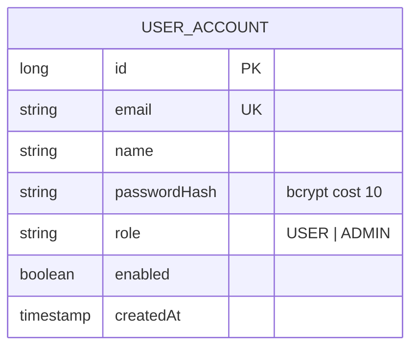
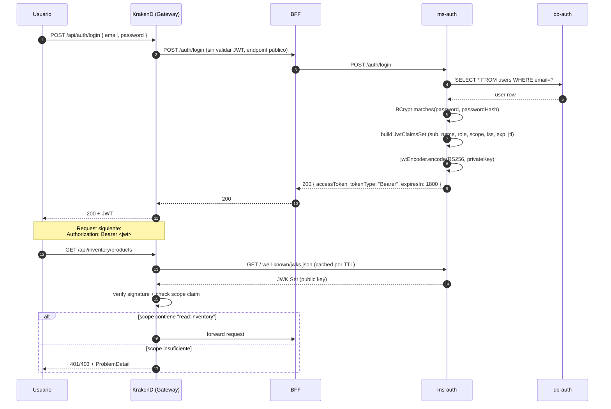

# ms-auth

> Microservicio de autenticación. Emite JWTs firmados con **RS256** y expone el JWKS público para que el API Gateway verifique tokens.

← Volver a [README raíz del monorepo](../../README.md) · Otros componentes: [BFF](../bff/README.md) · [API Gateway](../api-gateway/README.md) · [ms-order](../ms-order/README.md) · [ms-inventory](../ms-inventory/README.md) · [ms-shipping](../ms-shipping/README.md) · [ms-user](../ms-user/README.md)

---

## Tabla técnica

| Aspecto | Detalle |
|---|---|
| Lenguaje | Java 25 |
| Framework | Spring Boot 3.5.0 |
| Librerías clave | Spring Web, Spring Data JPA, Spring Security, Spring OAuth2 Resource Server, Nimbus JOSE+JWT, BCrypt, Flyway, Lombok |
| Persistencia | PostgreSQL 16 (db-auth, tabla `users`) |
| Build | Gradle 9 |
| Criptografía | RSA 2048 bits, algoritmo **RS256** |
| Tests | JUnit 5, Spring Boot Test, JaCoCo |
| Patrones | Repository, Service Layer, DTO (records), Strategy (PasswordEncoder), RFC 7807 ProblemDetail, JWT/JWKS |
| Package raíz | `cl.smartlogix.auth` |

---

## Tabla de contenidos

1. [Resumen](#1-resumen)
2. [Modelo de dominio](#2-modelo-de-dominio)
3. [Flujo de autenticación](#3-flujo-de-autenticación)
4. [Scopes y roles](#4-scopes-y-roles)
5. [API REST](#5-api-rest)
6. [Llaves RSA](#6-llaves-rsa)
7. [Cómo ejecutar](#7-cómo-ejecutar)
8. [Cómo probar](#8-cómo-probar)
9. [Estructura del proyecto](#9-estructura-del-proyecto)
10. [Patrones aplicados](#10-patrones-aplicados)

---

## 1. Resumen

`ms-auth` es el único servicio que emite y firma JWTs. Responsabilidades:

- **Registro** de usuarios con email único + password hash BCrypt
- **Login**: verifica password, genera JWT firmado RS256 con claims `sub`, `name`, `role`, `scope`, `iss`, `exp`, `jti`
- **JWKS endpoint** (`/.well-known/jwks.json`): expone la llave pública para que el gateway verifique tokens sin necesidad de un secret compartido
- **Persistencia separada** de `ms-user`: aquí viven solo las credenciales (`users` table), no los perfiles completos

**Stack**: Spring Boot 3.5.0 · Java 25 · Spring Security 6 · PostgreSQL 16 · Flyway · BCrypt · Nimbus JOSE+JWT.

> ms-auth corre Spring Boot **3.5.0** (no 4.0.6 como los otros MS) porque Spring Security tiene compatibilidad estable con 3.5 y la auto-config de Flyway funciona sin el bug del orden de inicialización de Boot 4.

## 2. Modelo de dominio



| Tabla SQL | Entity Java | Función |
|---|---|---|
| `users` | `UserAccount` | Credenciales y rol; el password se almacena como hash BCrypt |

> El nombre de tabla es `users` (en inglés, decisión del scaffolding original de ms-auth). Otros MS Spring del proyecto usan tablas en español.

## 3. Flujo de autenticación



## 4. Scopes y roles

El JWT incluye un claim `scope` (string separado por espacios). El gateway valida que el scope requerido por el endpoint esté presente.

| Rol | Scopes generados |
|---|---|
| `USER` | `read:inventory read:orders read:shipments` |
| `ADMIN` | `read:inventory write:inventory read:orders write:orders read:shipments write:shipments read:users write:users` |

La asignación se hace en `JwtService.generateAccessToken()` según el `role` del `UserAccount`.

### 4.1 Estructura del JWT emitido

Header:
```json
{ "kid": "auth-key-1", "alg": "RS256" }
```

Payload (claims):
```json
{
  "sub": "user@example.com",
  "name": "Nombre del usuario",
  "role": "USER",
  "scope": "read:inventory read:orders read:shipments",
  "aud": "bff",
  "iss": "http://ms-auth:8081",
  "iat": 1719345678,
  "exp": 1719347478,
  "jti": "uuid-único-por-token"
}
```

`expiresIn = 30 minutos` (configurable vía `JWT_ACCESS_TOKEN_MINUTES`).

## 5. API REST

| Método | Path interno (MS) | Path público (gateway) | Auth | Descripción |
|---|---|---|---|---|
| POST | `/auth/register` | `/api/auth/register` | público | Crear usuario (email único, password ≥8 chars) → 201 |
| POST | `/auth/login` | `/api/auth/login` | público | Login → 200 con JWT |
| GET | `/.well-known/jwks.json` | *(directo al MS)* | público | JWK Set para verificar tokens (consumido por gateway) |

**Swagger UI**: `http://localhost:8081/swagger-ui.html` *(requiere port-forward o exposición temporal del puerto)*.

Errores como **RFC 7807** `application/problem+json` vía `GlobalExceptionHandler`:
- 400 `Validación fallida` con field errors
- 400 `Solicitud inválida` (ej. email duplicado al registrar)
- 401 `Credenciales inválidas` (login fallido)
- 500 catch-all para no filtrar stack traces

### 5.1 Ejemplos de payload

`POST /api/auth/register`:
```json
{ "name": "Juan Perez", "email": "juan@example.cl", "password": "secreto1234" }
```
Respuesta `201 Created` (body vacío).

`POST /api/auth/login`:
```json
{ "email": "juan@example.cl", "password": "secreto1234" }
```
Respuesta `200 OK`:
```json
{
  "accessToken": "eyJraWQiOiJhdXRoLWtleS0xIiwiYWxnIjoiUlMyNTYifQ...",
  "tokenType": "Bearer",
  "expiresIn": 1800
}
```

## 6. Llaves RSA

ms-auth necesita un par de llaves RSA 2048 bits en `private_key.pem` (PKCS#8) y `public_key.pem` (X.509 SPKI).

### 6.1 Generación local (dev)

```bash
openssl genpkey -algorithm RSA -pkeyopt rsa_keygen_bits:2048 -out private_key.pem
openssl rsa -in private_key.pem -pubout -out public_key.pem
```

### 6.2 Configuración del path

| Entorno | Variables |
|---|---|
| Local (dev) | Por default busca `../private_key.pem` y `../public_key.pem` relativo al working dir |
| Docker Compose | Volúmenes: `./private_key.pem:/keys/private_key.pem:ro` + `JWT_PRIVATE_KEY_PATH=/keys/private_key.pem` |
| Kubernetes | Secret `smartlogix-keys` montado en `/app/keys` (ver `infra/k8s/`) |

**⚠️ Producción**: nunca commitear llaves al repo. Usar SealedSecrets, External Secrets Operator o Vault.

## 7. Cómo ejecutar

### Vía Docker Compose

```bash
docker compose up -d db-auth ms-auth
```

### Local (sin Docker)

```bash
./gradlew bootRun
```

Variables relevantes (defaults en `application.yml`):
- `DB_URL` (default `jdbc:postgresql://localhost:5444/auth_db`)
- `DB_USERNAME`, `DB_PASSWORD`
- `JWT_ISSUER` (default `http://localhost:8081`)
- `JWT_ACCESS_TOKEN_MINUTES` (default `30`)
- `JWT_PRIVATE_KEY_PATH`, `JWT_PUBLIC_KEY_PATH`

### Build de la imagen

```bash
docker build -t smartlogix/ms-auth:latest .
```

### Kubernetes

Ver [`infra/k8s/README.md`](../../infra/k8s/README.md). El deployment monta un Secret con las llaves PEM (no las hornea en la imagen).

## 8. Cómo probar

```bash
# Registrar
curl -X POST http://app.smartlogix.localhost/api/auth/register \
  -H 'Content-Type: application/json' \
  -d '{"name":"Test","email":"test@smartlogix.cl","password":"test12345"}'
# → 201 Created

# Login
TOKEN=$(curl -sS -X POST http://app.smartlogix.localhost/api/auth/login \
  -H 'Content-Type: application/json' \
  -d '{"email":"test@smartlogix.cl","password":"test12345"}' | jq -r .accessToken)
echo "Token len: ${#TOKEN}"

# Decodificar payload (sin verificación)
echo "$TOKEN" | cut -d. -f2 | base64 -d 2>/dev/null

# Verificar JWKS endpoint (cómo el gateway obtiene la llave pública)
kubectl -n smartlogix port-forward svc/ms-auth 18081:8081 &
curl http://localhost:18081/.well-known/jwks.json
```

### 8.1 Casos de error verificables

```bash
# Login con credenciales malas → 401
curl -i -X POST http://app.smartlogix.localhost/api/auth/login \
  -H 'Content-Type: application/json' \
  -d '{"email":"test@smartlogix.cl","password":"wrong"}'
# → 401 application/problem+json
#    {"title":"Credenciales inválidas","detail":"Email o contraseña incorrectos",...}

# Registrar email duplicado → 400
curl -i -X POST http://app.smartlogix.localhost/api/auth/register \
  -H 'Content-Type: application/json' \
  -d '{"name":"Dup","email":"test@smartlogix.cl","password":"test12345"}'
# → 400 application/problem+json {"detail":"Email already in use"}
```

## 9. Estructura del proyecto

```
src/main/java/cl/smartlogix/auth/
├── AuthApplication.java
├── config/
│   ├── JwtKeyConfig.java          # carga llaves RSA, crea JwtEncoder + RSAKey + JWKSource
│   └── SecurityConfig.java         # http permitAll (validación en gateway)
├── controller/
│   ├── AuthController.java         # /auth/register, /auth/login
│   ├── JwksController.java         # /.well-known/jwks.json
│   └── GlobalExceptionHandler.java
├── service/
│   ├── AuthService.java            # register, login (BCrypt + emisión JWT)
│   └── JwtService.java             # construcción de claims, encoding RS256
├── repository/
│   └── UserAccountRepository.java
├── domain/
│   └── UserAccount.java
└── dto/
    ├── RegisterRequest.java, LoginRequest.java
    └── AuthResponse.java

src/main/resources/
├── application.yml                 # config Spring + Flyway + JWT paths
└── db/migration/
    ├── V1__create_users_table.sql
    └── V2__seed_initial_users.sql  # admin + user con BCrypt placeholder hashes
```

## 10. Patrones aplicados

- **Repository / Service Layer / DTO** — separación estricta de capas
- **Strategy** — `PasswordEncoder` interface; usamos `BCryptPasswordEncoder` (intercambiable)
- **JWT con asymmetric signing (RS256)** — privada para emitir, pública via JWKS para verificar
- **JWK Set endpoint** — permite que el gateway valide sin compartir secret
- **Database per Service** — `db-auth` aislada de `db-user` (separation of concerns: credentials vs profile)
- **RFC 7807 ProblemDetail** — formato unificado de errores
- **Defense in depth** — gateway valida JWT antes; ms-auth además expone solo lo necesario
