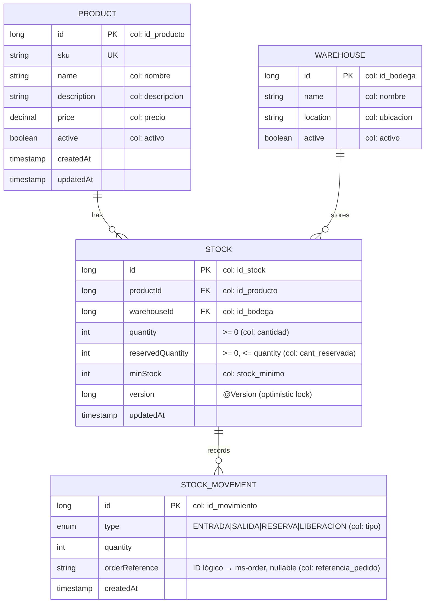
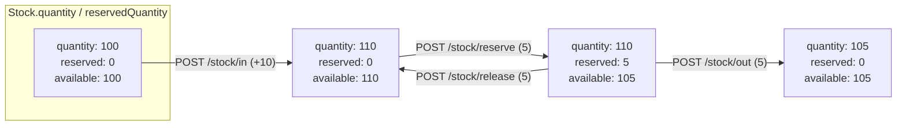
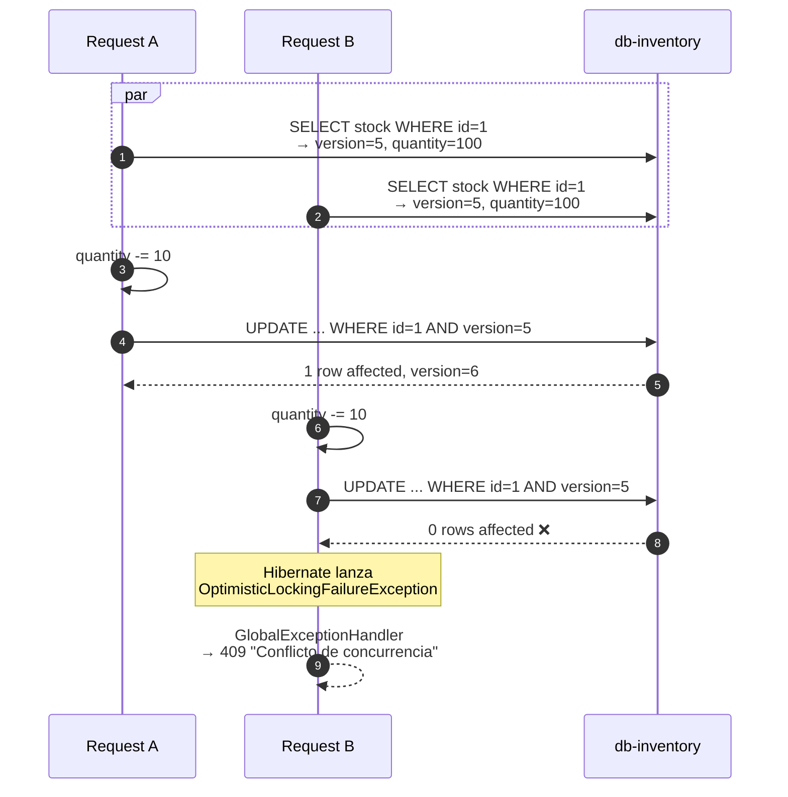
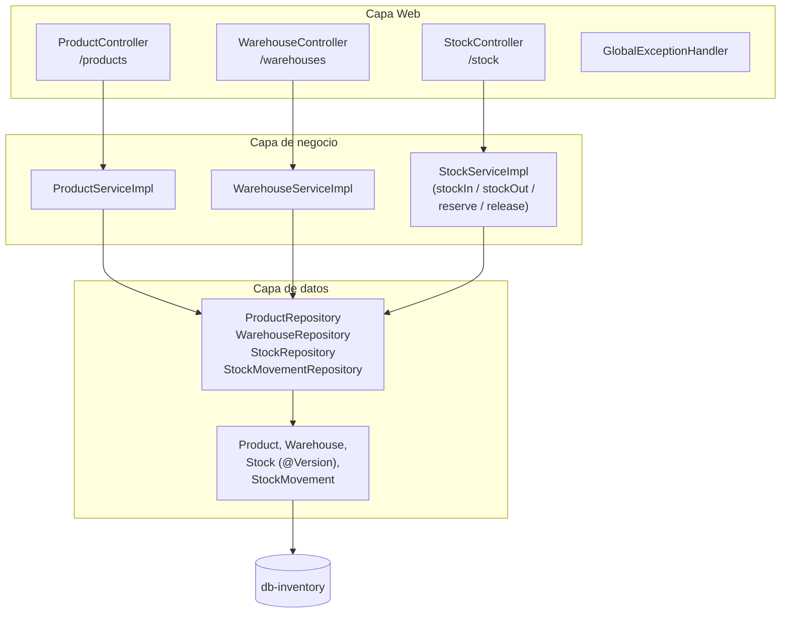

# ms-inventory

> Microservicio dueño de productos, bodegas y stock. Único MS autorizado para mutar existencias. Implementa **optimistic locking** con `@Version` para concurrencia segura.

← Volver a [README raíz del monorepo](../../README.md) · Otros componentes: [BFF](../bff/README.md) · [API Gateway](../api-gateway/README.md) · [ms-order](../ms-order/README.md) · [ms-shipping](../ms-shipping/README.md) · [ms-user](../ms-user/README.md) · [ms-auth](../ms-auth/README.md)

---

## Tabla técnica

| Aspecto | Detalle |
|---|---|
| Lenguaje | Java 25 |
| Framework | Spring Boot 4.0.6 |
| Librerías clave | Spring Web MVC, Spring Data JPA, Hibernate, Flyway, Bean Validation, Lombok, Springdoc OpenAPI 2.6 |
| Persistencia | PostgreSQL 16 (DB-per-service, sin FKs a otros MS) |
| Build | Gradle 9 |
| Tests | JUnit 5, Mockito, Spring `@WebMvcTest`, JaCoCo |
| Patrones | Repository, Service Layer (interface + impl), DTO (records), Aggregate Root, Optimistic Locking, Event Sourcing simplificado, RFC 7807 ProblemDetail |
| Package raíz | `cl.smartlogix.inventory` |

---

## Tabla de contenidos

1. [Resumen](#1-resumen)
2. [Modelo de dominio](#2-modelo-de-dominio)
3. [Operaciones sobre stock](#3-operaciones-sobre-stock)
4. [Optimistic Locking en acción](#4-optimistic-locking-en-acción)
5. [Arquitectura interna](#5-arquitectura-interna)
6. [API REST](#6-api-rest)
7. [Cómo ejecutar](#7-cómo-ejecutar)
8. [Cómo probar](#8-cómo-probar)
9. [Estructura del proyecto](#9-estructura-del-proyecto)
10. [Patrones aplicados](#10-patrones-aplicados)

---

## 1. Resumen

`ms-inventory` es el **único servicio autorizado para mutar existencias**. Otros MS (ej. `ms-order` durante un checkout) deben llamar su API REST para reservar/liberar/mover stock — no acceden a su DB directamente. Cada operación deja una fila inmutable en `movimientos_stock` (event-sourcing simplificado).

**Stack**: Spring Boot 4.0.6 · Java 25 · PostgreSQL 16 · Flyway · JPA/Hibernate · Gradle 9 · Springdoc OpenAPI.

## 2. Modelo de dominio

> Los nombres Java están en inglés; las columnas SQL siguen en español (mapping preservado con `@Column(name="...")`).



| Tabla SQL | Entity Java | Función |
|---|---|---|
| `productos` | `Product` | Catálogo: SKU único, precio, activo |
| `bodegas` | `Warehouse` | Ubicaciones físicas |
| `stock` | `Stock` | Existencia por `(product, warehouse)` — con `@Version` para optimistic locking |
| `movimientos_stock` | `StockMovement` | Bitácora inmutable de ENTRADA / SALIDA / RESERVA / LIBERACION |

**Invariantes a nivel DB**:

- `cantidad >= 0`
- `cant_reservada >= 0`
- `cant_reservada <= cantidad`
- Único por `(id_producto, id_bodega)`

Detalle ER completo en [`docs/referencias/modelo-datos.md`](../../docs/referencias/modelo-datos.md).

## 3. Operaciones sobre stock

Cuatro operaciones que ajustan los contadores y dejan un `StockMovement`:



- **`/stock/in`** (`MovementType.ENTRADA`): `quantity += n` (nueva mercadería recibida)
- **`/stock/out`** (`SALIDA`): `quantity -= n` (mercadería físicamente despachada). 409 si `available < n`.
- **`/stock/reserve`** (`RESERVA`): `reservedQuantity += n` (apartada para un pedido). 409 si `available < n`.
- **`/stock/release`** (`LIBERACION`): `reservedQuantity -= n` (libera reserva por cancelación o rollback).

`available = quantity - reservedQuantity` (campo calculado, no persistido).

## 4. Optimistic Locking en acción

Bajo concurrencia, dos peticiones simultáneas de `POST /stock/out` sobre el mismo `(product, warehouse)` corromperían la cantidad. Usamos `@Version` en lugar de `SELECT FOR UPDATE`:



El cliente recibe 409 y **reintenta**. Throughput alto sin lockear lectores. Manejado en `GlobalExceptionHandler`.

## 5. Arquitectura interna



## 6. API REST

| Método | Path interno (MS) | Path público (gateway) | Descripción |
|---|---|---|---|
| **Productos** | | | |
| POST | `/products` | `/api/inventory/products` | Crear (SKU único; 409 si existe) |
| GET | `/products/{id}` | `/api/inventory/products/{id}` | Obtener por ID |
| GET | `/products/sku/{sku}` | `/api/inventory/products/sku/{sku}` | Obtener por SKU |
| GET | `/products` | `/api/inventory/products` | Listar |
| PATCH | `/products/{id}` | `/api/inventory/products/{id}` | Actualizar parcial (name, description, price, active) |
| **Bodegas** | | | |
| POST | `/warehouses` | `/api/inventory/warehouses` | Crear |
| GET | `/warehouses/{id}` | `/api/inventory/warehouses/{id}` | Obtener por ID |
| GET | `/warehouses` | `/api/inventory/warehouses` | Listar |
| **Stock** | | | |
| GET | `/stock/{productId}/{warehouseId}` | — *(multi-segmento)* | Stock en una bodega |
| GET | `/stock/product/{productId}` | — | Stocks del producto en todas las bodegas |
| GET | `/stock/product/{productId}/available` | — | Total disponible agregado |
| GET | `/stock/low` | — | Stocks bajo `minStock` |
| GET | `/stock/{stockId}/history` | — | Movimientos del stock |
| POST | `/stock/in` | `/api/inventory/stock/in` | Suma quantity (crea el stock si no existe) |
| POST | `/stock/out` | `/api/inventory/stock/out` | Resta quantity (409 si `available < n`) |
| POST | `/stock/reserve` | `/api/inventory/stock/reserve` | Aumenta `reservedQuantity` |
| POST | `/stock/release` | `/api/inventory/stock/release` | Disminuye `reservedQuantity` |

> Endpoints multi-segmento (ej. `/stock/product/{id}`) requieren entrada específica en `krakend.json` — el wildcard `{path}` de gin solo captura 1 segmento. Por ahora se acceden directo al MS o vía port-forward k8s.

**Swagger UI**: `http://localhost:8080/swagger-ui.html` *(requiere port-forward o exposición temporal del puerto del MS)*.

Errores devueltos como **RFC 7807** `application/problem+json` por `GlobalExceptionHandler`.

### 6.1 Ejemplo de payload

`POST /products`:
```json
{ "sku": "SKU-001", "name": "Caja 30x20", "description": "...", "price": 2500 }
```
Respuesta `201`:
```json
{
  "productId": 7, "sku": "SKU-001", "name": "Caja 30x20",
  "description": "...", "price": 2500.00, "active": true,
  "createdAt": "2026-06-19T...", "updatedAt": "2026-06-19T..."
}
```

`POST /stock/in`:
```json
{ "productId": 1, "warehouseId": 1, "quantity": 100, "orderReference": "COMPRA-PROV-001" }
```

## 7. Cómo ejecutar

### Vía Docker (recomendado)

```bash
docker compose up -d db-inventory ms-inventory
```

### Local (sin Docker)

Requiere PostgreSQL 16 corriendo con DB/user `inventario`:

```bash
./gradlew bootRun
```

### Build de la imagen

```bash
docker build -t smartlogix/ms-inventory:latest .
```

### Kubernetes

Ver [`infra/k8s/README.md`](../../infra/k8s/README.md). Manifests específicos en [`k8s/`](./k8s/).

## 8. Cómo probar

```bash
# Obtener token (registrar o login en ms-auth primero)
TOKEN=$(curl -sS -X POST http://app.smartlogix.localhost/api/auth/login \
  -H 'Content-Type: application/json' \
  -d '{"email":"admin@smartlogix.cl","password":"..."}' | jq -r .accessToken)

# Listar productos
curl -H "Authorization: Bearer $TOKEN" http://app.smartlogix.localhost/api/inventory/products

# Crear producto
curl -X POST http://app.smartlogix.localhost/api/inventory/products \
  -H "Content-Type: application/json" -H "Authorization: Bearer $TOKEN" \
  -d '{"sku": "SKU-001", "name": "Caja 30x20", "price": 2500}'

# Crear bodega
curl -X POST http://app.smartlogix.localhost/api/inventory/warehouses \
  -H "Content-Type: application/json" -H "Authorization: Bearer $TOKEN" \
  -d '{"name": "Bodega Central", "location": "Santiago"}'

# Entrada de stock (crea el registro si es la primera)
curl -X POST http://app.smartlogix.localhost/api/inventory/stock/in \
  -H "Content-Type: application/json" -H "Authorization: Bearer $TOKEN" \
  -d '{"productId": 1, "warehouseId": 1, "quantity": 100}'

# Reservar (durante checkout)
curl -X POST http://app.smartlogix.localhost/api/inventory/stock/reserve \
  -H "Content-Type: application/json" -H "Authorization: Bearer $TOKEN" \
  -d '{"productId": 1, "warehouseId": 1, "quantity": 5, "orderReference": "PED-20260513-AB12CD"}'
```

## 9. Estructura del proyecto

```
src/main/java/cl/smartlogix/inventory/
├── InventoryApplication.java
├── config/
│   └── OpenApiConfig.java
├── controller/
│   ├── ProductController.java          # /products
│   ├── WarehouseController.java        # /warehouses
│   ├── StockController.java            # /stock
│   └── GlobalExceptionHandler.java
├── service/
│   ├── ProductService(Impl).java
│   ├── WarehouseService(Impl).java
│   └── StockService(Impl).java         # stockIn/stockOut/reserve/release
├── repository/
│   ├── ProductRepository
│   ├── WarehouseRepository
│   ├── StockRepository
│   └── StockMovementRepository
├── dto/                                # records inmutables
│   ├── ProductDto, StockDto, WarehouseDto, StockMovementDto
│   └── CreateProductRequest, CreateWarehouseRequest,
│       UpdateProductRequest, StockMovementRequest
└── model/                              # @Entity con @Column para columnas DB en español
    ├── Product, Warehouse, Stock (@Version), StockMovement
    └── MovementType (enum)

src/main/resources/
├── application.properties
└── db/migration/
    ├── V1__init_schema.sql
    ├── V2__seed_inventory_data.sql      # 6 productos, 4 bodegas, stock inicial
    └── V3__seed_stock_movements.sql     # historial de movimientos reflejando pedidos seed
```

## 10. Patrones aplicados

- **Repository / Service Layer / DTO** (mismo trío que el resto de MS)
- **Optimistic Locking** — `@Version` en `Stock` para concurrencia sin lockear lectores
- **Aggregate Root** — `Stock` es la raíz; sus movimientos se crean en transacción atómica con el cambio de cantidades
- **Event Sourcing simplificado** — cada operación deja un `StockMovement` con `orderReference` (ID lógico cruzado con `ms-order`)
- **Database Invariants** — constraints en SQL (`cantidad >= 0`, etc.) como red de seguridad además de la validación en código
- **RFC 7807 ProblemDetail** — formato unificado de errores vía `GlobalExceptionHandler`
- **Schema preserved through rename** — entities Java en inglés (`Product.name`), columnas DB en español (`productos.nombre`), mapeadas con `@Column`
