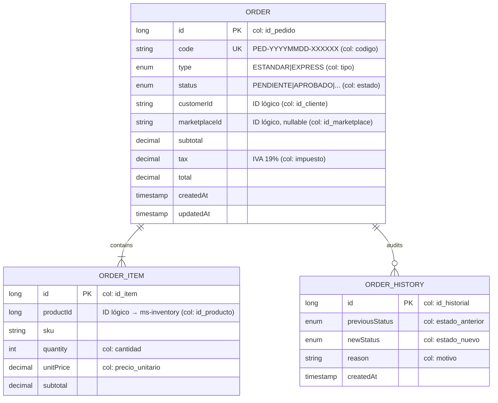
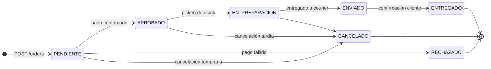
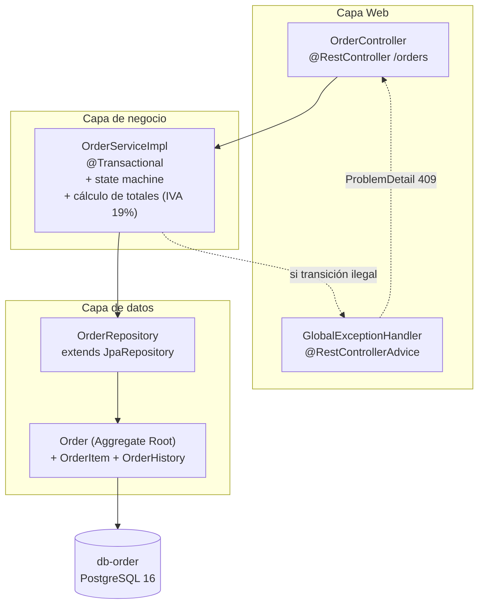

# ms-order

> Microservicio dueño del agregado **Order** (pedido). Implementa la máquina de estados completa del ciclo de vida de un pedido y registra la auditoría de transiciones.

← Volver a [README raíz del monorepo](../../README.md) · Otros componentes: [BFF](../bff/README.md) · [API Gateway](../api-gateway/README.md) · [ms-inventory](../ms-inventory/README.md) · [ms-shipping](../ms-shipping/README.md) · [ms-user](../ms-user/README.md) · [ms-auth](../ms-auth/README.md)

---

## Tabla técnica

| Aspecto | Detalle |
|---|---|
| Lenguaje | Java 25 |
| Framework | Spring Boot 4.0.6 |
| Librerías clave | Spring Web MVC, Spring Data JPA, Hibernate, Flyway, Bean Validation, Lombok, Springdoc OpenAPI |
| Persistencia | PostgreSQL 16 (DB-per-service, sin FKs cross-MS) |
| Build | Gradle 9 |
| Tests | JUnit 5, Mockito, Spring `@WebMvcTest`, JaCoCo |
| Patrones | Repository, Service Layer, DTO (records), Aggregate Root, State Machine declarativa, Audit Log, RFC 7807 ProblemDetail |
| Package raíz | `cl.smartlogix.order` |

---

## Tabla de contenidos

1. [Resumen](#1-resumen)
2. [Modelo de dominio](#2-modelo-de-dominio)
3. [Máquina de estados](#3-máquina-de-estados)
4. [Arquitectura interna](#4-arquitectura-interna)
5. [API REST](#5-api-rest)
6. [Cómo ejecutar](#6-cómo-ejecutar)
7. [Cómo probar](#7-cómo-probar)
8. [Estructura del proyecto](#8-estructura-del-proyecto)
9. [Patrones aplicados](#9-patrones-aplicados)

---

## 1. Resumen

`ms-order` es responsable de:

- Crear pedidos validando ítems y calculando totales con IVA 19 %.
- Mantener la máquina de estados (`PENDIENTE → APROBADO → ... → ENTREGADO`) con transiciones validadas.
- Persistir cada cambio de estado en `pedido_historial` (audit log inmutable).
- Generar códigos `PED-YYYYMMDD-XXXXXX` únicos por pedido.

**Stack**: Spring Boot 4.0.6 · Java 25 · PostgreSQL 16 · Flyway · JPA/Hibernate · Gradle 9 · Springdoc OpenAPI.

No comparte tablas con otros MS (**Database per Service**). Los IDs de cliente, producto y marketplace son **identificadores lógicos** — no hay FK cruzadas con `ms-inventory` o `ms-shipping`.

## 2. Modelo de dominio

> Java identifiers están en inglés; columnas SQL en español preservadas con `@Column(name="...")`.



| Tabla SQL | Entity Java | Función |
|---|---|---|
| `pedidos` | `Order` | Cabecera del pedido: código, status, totales |
| `pedido_items` | `OrderItem` | Líneas del pedido (relación N:1) |
| `pedido_historial` | `OrderHistory` | Bitácora de transiciones de status (relación N:1) |

Los valores de enum (`PENDIENTE`, `APROBADO`, etc.) se mantienen en español porque son `CHECK` constraints en SQL.

Detalle ER completo en [`docs/modelo-datos.md`](../../docs/modelo-datos.md).

## 3. Máquina de estados



Las transiciones se validan en `OrderServiceImpl` contra un `Map<OrderStatus, Set<OrderStatus>>` declarado como **datos**, no código procedural disperso. Cualquier transición ilegal devuelve **HTTP 409 Conflict** con `ProblemDetail` vía `GlobalExceptionHandler`.

## 4. Arquitectura interna



## 5. API REST

| Método | Path interno (MS) | Path público (gateway) | Descripción |
|---|---|---|---|
| POST | `/orders` | `/api/orders` | Crear pedido (calcula totales con IVA 19 %) → 201 |
| GET | `/orders/{id}` | `/api/orders/{id}` | Obtener por ID (404 si no existe) |
| GET | `/orders/code/{code}` | `/api/orders/code/{code}` *(multi-seg)* | Obtener por código `PED-...` |
| GET | `/orders/customer/{customerId}` | `/api/orders/customer/{customerId}` *(multi-seg)* | Listar pedidos de un cliente |
| GET | `/orders?status=APROBADO` | `/api/orders?status=APROBADO` | Listar con filtro opcional por status |
| PATCH | `/orders/{id}/status` | `/api/orders/{id}/status` *(multi-seg)* | Cambiar status (valida transición → 409 si ilegal) |

> Los paths multi-segmento requieren entrada específica en `krakend.json` (wildcard `{path}` solo captura 1 segmento).

**Swagger UI**: `http://localhost:8080/swagger-ui.html` *(requiere port-forward o exposición temporal del puerto)*.

Validación de entrada con **Bean Validation** (`@NotBlank`, `@NotEmpty`, `@DecimalMin`, etc. en los records DTO). Errores devueltos como **RFC 7807** `application/problem+json`.

### 5.1 Ejemplo de payload

`POST /orders`:
```json
{
  "type": "ESTANDAR",
  "customerId": "CLI-001",
  "marketplaceId": "MKT-MELI",
  "items": [
    { "productId": 1, "sku": "ELE-4821-SL", "quantity": 2, "unitPrice": 150000 }
  ]
}
```

Respuesta `201`:
```json
{
  "orderId": 5, "code": "PED-20260619-A7F3B2",
  "type": "ESTANDAR", "status": "PENDIENTE",
  "customerId": "CLI-001", "marketplaceId": "MKT-MELI",
  "subtotal": 300000.00, "tax": 57000.00, "total": 357000.00,
  "items": [
    { "itemId": 7, "productId": 1, "sku": "ELE-4821-SL",
      "quantity": 2, "unitPrice": 150000.00, "subtotal": 300000.00 }
  ],
  "createdAt": "2026-06-19T...", "updatedAt": "2026-06-19T..."
}
```

`PATCH /orders/{id}/status`:
```json
{ "status": "APROBADO", "reason": "Pago confirmado" }
```

## 6. Cómo ejecutar

### Vía Docker (recomendado)

Desde la raíz del monorepo:

```bash
docker compose up -d db-order ms-order
```

Variables que toma del compose:
- `SERVER_PORT` (default 8080)
- `SPRING_DATASOURCE_URL`, `SPRING_DATASOURCE_USERNAME`, `SPRING_DATASOURCE_PASSWORD`
- `POSTGRES_PEDIDO_DB` (declarado primero para expansión `$()`)

### Local (sin Docker)

Requiere PostgreSQL 16 corriendo en `localhost:5432` con DB/user `pedido`:

```bash
./gradlew bootRun
```

### Build de la imagen

```bash
docker build -t smartlogix/ms-order:latest .
```

### Kubernetes

Ver [`infra/k8s/README.md`](../../infra/k8s/README.md). Manifests específicos en [`k8s/`](./k8s/).

## 7. Cómo probar

```bash
# Obtener token de admin
TOKEN=$(curl -sS -X POST http://app.smartlogix.localhost/api/auth/login \
  -H 'Content-Type: application/json' \
  -d '{"email":"admin@smartlogix.cl","password":"..."}' | jq -r .accessToken)

# Listar pedidos seed
curl -H "Authorization: Bearer $TOKEN" http://app.smartlogix.localhost/api/orders

# Crear pedido
curl -X POST http://app.smartlogix.localhost/api/orders \
  -H "Content-Type: application/json" -H "Authorization: Bearer $TOKEN" \
  -d '{
    "type": "ESTANDAR",
    "customerId": "CLI-001",
    "items": [
      {"productId": 1, "sku": "ELE-4821-SL", "quantity": 2, "unitPrice": 150000}
    ]
  }'

# Filtrar por status
curl -H "Authorization: Bearer $TOKEN" \
  'http://app.smartlogix.localhost/api/orders?status=PENDIENTE'
```

## 8. Estructura del proyecto

```
src/main/java/cl/smartlogix/order/
├── OrderApplication.java
├── config/
│   └── OpenApiConfig.java
├── controller/
│   ├── OrderController.java          # /orders
│   └── GlobalExceptionHandler.java
├── service/
│   ├── OrderService.java             # interfaz
│   └── OrderServiceImpl.java         # state machine, cálculo IVA, generación de código
├── repository/
│   ├── OrderRepository
│   ├── OrderItemRepository
│   └── OrderHistoryRepository
├── dto/                              # records con Bean Validation
│   ├── OrderDto, OrderItemDto
│   ├── CreateOrderRequest, UpdateOrderState
└── model/                            # @Entity con @Column para columnas DB en español
    ├── Order, OrderItem, OrderHistory
    └── OrderStatus, OrderType (enums)

src/main/resources/
├── application.properties            # ddl-auto=validate, flyway enabled
└── db/migration/
    ├── V1__init_schema.sql
    └── V2__seed_order_data.sql       # 4 pedidos seed con items + historial
```

## 9. Patrones aplicados

- **Repository Pattern** — Spring Data JPA repositories
- **Service Layer** — interfaz + impl, anotaciones `@Transactional`
- **DTO** — records inmutables con factory `from(Entity)`
- **State Machine declarativa** — transiciones como datos (`Map<OrderStatus, Set<OrderStatus>>`)
- **Aggregate Root** — `Order` es la raíz; cascade a `items` y `history`
- **Audit Log** — cada cambio de status deja una fila inmutable en `pedido_historial`
- **RFC 7807 ProblemDetail** — formato unificado de errores (`@RestControllerAdvice`)
- **Schema preserved through rename** — `Order.code` Java ↔ `pedidos.codigo` SQL, mapeado con `@Column`
