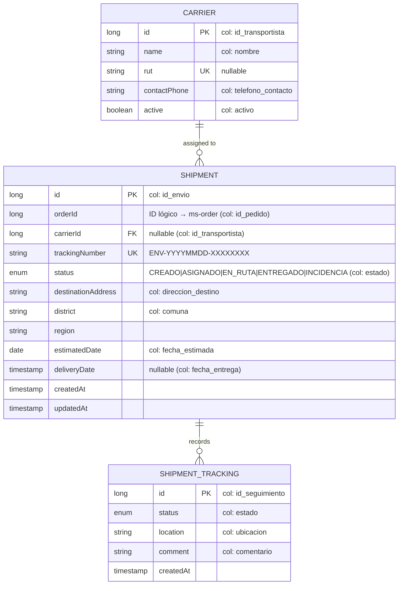
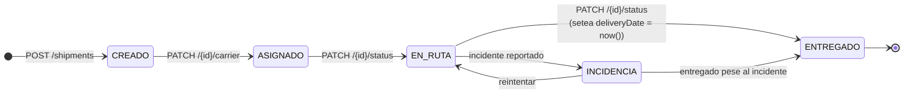
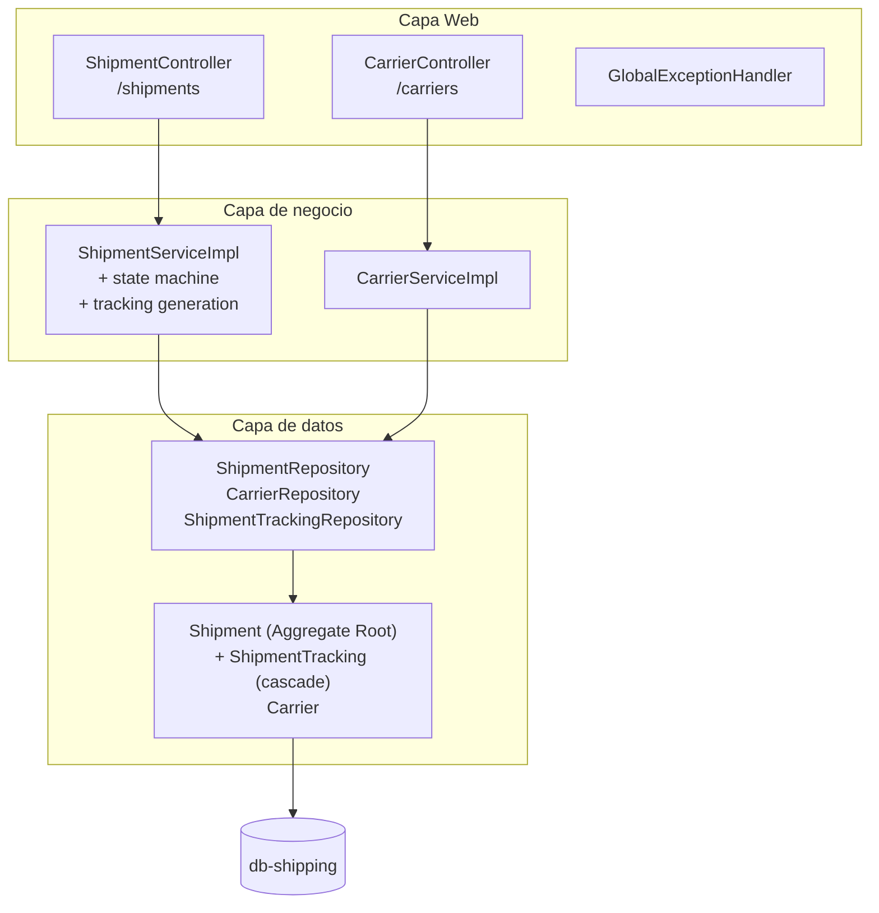

# ms-shipping

> Microservicio dueño del agregado **Shipment** (envío). Genera envíos a partir de un pedido, asigna transportista (carrier) y mantiene la trazabilidad punto a punto.

← Volver a [README raíz del monorepo](../../README.md) · Otros componentes: [BFF](../bff/README.md) · [API Gateway](../api-gateway/README.md) · [ms-order](../ms-order/README.md) · [ms-inventory](../ms-inventory/README.md) · [ms-user](../ms-user/README.md) · [ms-auth](../ms-auth/README.md)

---

## Tabla técnica

| Aspecto | Detalle |
|---|---|
| Lenguaje | Java 25 |
| Framework | Spring Boot 4.0.6 |
| Librerías clave | Spring Web MVC, Spring Data JPA, Hibernate, Flyway, Bean Validation, Lombok, Springdoc OpenAPI |
| Persistencia | PostgreSQL 16 (DB-per-service) |
| Build | Gradle 9 |
| Tests | JUnit 5, Mockito, Spring `@WebMvcTest`, JaCoCo |
| Patrones | Repository, Service Layer, DTO (records), Aggregate Root, State Machine, Audit Log inmutable, Unique Identifier Generation, RFC 7807 ProblemDetail |
| Package raíz | `cl.smartlogix.shipping` |

---

## Tabla de contenidos

1. [Resumen](#1-resumen)
2. [Modelo de dominio](#2-modelo-de-dominio)
3. [Máquina de estados](#3-máquina-de-estados)
4. [Arquitectura interna](#4-arquitectura-interna)
5. [API REST](#5-api-rest)
6. [Cómo ejecutar](#6-cómo-ejecutar)
7. [Cómo probar](#7-cómo-probar)
8. [Estructura del proyecto](#8-estructura-del-proyecto)
9. [Patrones aplicados](#9-patrones-aplicados)

---

## 1. Resumen

`ms-shipping` genera envíos a partir de un `orderId` (ID lógico de `ms-order`), permite asignar un transportista (carrier) y registra cada cambio de estado en un audit log inmutable (`envio_seguimiento`). Implementa una máquina de estados con `INCIDENCIA` como rama lateral **reintentable**.

**Stack**: Spring Boot 4.0.6 · Java 25 · PostgreSQL 16 · Flyway · JPA/Hibernate · Gradle 9 · Springdoc OpenAPI.

## 2. Modelo de dominio

> Java identifiers en inglés; columnas SQL en español mapeadas con `@Column`.



| Tabla SQL | Entity Java | Función |
|---|---|---|
| `transportistas` | `Carrier` | Catálogo de couriers (nombre, RUT, contacto, active) |
| `envios` | `Shipment` | Envío con tracking único, status, dirección destino |
| `envio_seguimiento` | `ShipmentTracking` | Audit log inmutable: cada transición de status deja una fila |

Los valores de `ShipmentState` se mantienen en español (`CREADO`, `EN_RUTA`, etc.) porque son `CHECK` constraints en SQL.

Detalle ER completo en [`docs/modelo-datos.md`](../../docs/modelo-datos.md).

## 3. Máquina de estados



- `CREADO → ASIGNADO`: sólo se puede asignar carrier cuando el shipment está en `CREADO` **y** el carrier está `active`.
- `EN_RUTA ↔ INCIDENCIA`: rama lateral **reintentable**. El shipment puede volver a ruta tras resolver el incidente.
- `→ ENTREGADO`: setea automáticamente `deliveryDate = now()`.
- Cada transición persiste un `ShipmentTracking` con `location` y `comment` (audit log inmutable).

Las transiciones se validan en `ShipmentServiceImpl` contra un `Map<ShipmentState, Set<ShipmentState>>`. Transición ilegal → **HTTP 409** + `ProblemDetail`.

## 4. Arquitectura interna



## 5. API REST

| Método | Path interno (MS) | Path público (gateway) | Descripción |
|---|---|---|---|
| **Shipments** | | | |
| POST | `/shipments` | `/api/shipments` | Crear envío para un pedido (genera tracking, status inicial `CREADO`) |
| GET | `/shipments/{id}` | `/api/shipments/{id}` | Obtener por ID |
| GET | `/shipments/tracking/{trackingNumber}` | *(multi-seg)* | Obtener por número de tracking |
| GET | `/shipments/order/{orderId}` | *(multi-seg)* | Envíos asociados a un pedido |
| GET | `/shipments?status=EN_RUTA` | `/api/shipments?status=EN_RUTA` | Listar con filtro opcional |
| GET | `/shipments/{id}/tracking-history` | *(multi-seg)* | Historial de tracking |
| PATCH | `/shipments/{id}/carrier` | *(multi-seg)* | Asignar carrier (sólo en status `CREADO`) |
| PATCH | `/shipments/{id}/status` | `/api/shipments/{path}/estado` *(legacy)* | Cambiar status (valida transición) |
| **Carriers** | | | |
| POST | `/carriers` | *(no expuesto)* | Crear (RUT único si se provee) |
| GET | `/carriers/{id}` | *(no expuesto)* | Obtener por ID |
| GET | `/carriers?active=true` | *(no expuesto)* | Listar (filtro opcional por activos) |

> Los paths multi-segmento (`/shipments/tracking/...`, `/shipments/order/...`, etc.) actualmente acceden directo al MS o vía port-forward k8s. Para exponerlos por el gateway hay que agregar entradas específicas en `krakend.json`.

**Swagger UI**: `http://localhost:8080/swagger-ui.html` *(requiere port-forward o exposición temporal del puerto)*.

Errores devueltos como **RFC 7807** `application/problem+json` por `GlobalExceptionHandler`.

### 5.1 Ejemplo de payload

`POST /shipments`:
```json
{
  "orderId": 1,
  "destinationAddress": "Av. Providencia 1234",
  "district": "Providencia",
  "region": "Metropolitana",
  "estimatedDate": "2026-06-25"
}
```

Respuesta `201`:
```json
{
  "shipmentId": 5, "orderId": 1,
  "carrierId": null, "carrierName": null,
  "trackingNumber": "ENV-20260619-AB12CD34",
  "status": "CREADO",
  "destinationAddress": "Av. Providencia 1234",
  "district": "Providencia", "region": "Metropolitana",
  "estimatedDate": "2026-06-25", "deliveryDate": null,
  "tracking": [
    { "trackingId": 9, "status": "CREADO",
      "location": null, "comment": "Envío creado",
      "createdAt": "2026-06-19T..." }
  ],
  "createdAt": "...", "updatedAt": "..."
}
```

`PATCH /shipments/{id}/status`:
```json
{ "status": "EN_RUTA", "location": "Centro de distribución", "comment": "Salió del depósito" }
```

## 6. Cómo ejecutar

### Vía Docker (recomendado)

```bash
docker compose up -d db-shipping ms-shipping
```

### Local (sin Docker)

Requiere PostgreSQL 16 corriendo con DB/user `envio`:

```bash
./gradlew bootRun
```

### Build de la imagen

```bash
docker build -t smartlogix/ms-shipping:latest .
```

### Kubernetes

Ver [`infra/k8s/README.md`](../../infra/k8s/README.md). Manifests específicos en [`k8s/`](./k8s/).

## 7. Cómo probar

```bash
TOKEN=$(curl -sS -X POST http://app.smartlogix.localhost/api/auth/login \
  -H 'Content-Type: application/json' \
  -d '{"email":"admin@smartlogix.cl","password":"..."}' | jq -r .accessToken)

# Listar shipments (con seed: 4)
curl -H "Authorization: Bearer $TOKEN" http://app.smartlogix.localhost/api/shipments

# Crear shipment
curl -X POST http://app.smartlogix.localhost/api/shipments \
  -H "Content-Type: application/json" -H "Authorization: Bearer $TOKEN" \
  -d '{
    "orderId": 1,
    "destinationAddress": "Av. Providencia 1234",
    "district": "Providencia",
    "region": "Metropolitana"
  }'

# Cambiar status (acceso directo a ms-shipping por path multi-segmento)
kubectl -n smartlogix port-forward svc/ms-shipping 18080:8080 &
curl -X PATCH http://localhost:18080/shipments/1/status \
  -H "Content-Type: application/json" \
  -d '{"status": "EN_RUTA", "location": "Centro distribución", "comment": "Salió del depósito"}'
```

## 8. Estructura del proyecto

```
src/main/java/cl/smartlogix/shipping/
├── ShipmentApplication.java
├── config/
│   └── OpenApiConfig.java
├── controller/
│   ├── ShipmentController.java       # /shipments
│   ├── CarrierController.java        # /carriers
│   └── GlobalExceptionHandler.java
├── service/
│   ├── ShipmentService(Impl).java    # state machine, tracking generation
│   └── CarrierService(Impl).java
├── repository/
│   ├── ShipmentRepository
│   ├── CarrierRepository
│   └── ShipmentTrackingRepository
├── dto/                              # records con Bean Validation
│   ├── ShipmentDto, CarrierDto, ShipmentTrackingDto
│   ├── CreateShipmentRequest, CreateCarrierRequest
│   └── AssingCarierRequest, UpdateShipmentRStatusRequest
└── model/                            # @Entity con @Column para columnas DB en español
    ├── Shipment, Carrier, ShipmentTracking
    └── ShipmentState (enum)

src/main/resources/
├── application.properties
└── db/migration/
    ├── V1__init_schema.sql
    └── V2__seed_shipping_data.sql    # 4 carriers, 4 shipments con tracking history
```

## 9. Patrones aplicados

- **Repository / Service Layer / DTO** (mismo trío que el resto de MS)
- **State Machine** con `INCIDENCIA` como rama lateral reintentable
- **Aggregate Root** — `Shipment` cascade-persiste `ShipmentTracking`; reglas de transición sobre la raíz
- **Audit Log inmutable** — cada transición deja una fila en `envio_seguimiento`; no se modifican filas existentes
- **Unique Identifier Generation** — tracking `ENV-YYYYMMDD-XXXXXXXX` con sufijo random + UK constraint
- **RFC 7807 ProblemDetail** — formato unificado de errores
- **Schema preserved through rename** — `Shipment.destinationAddress` Java ↔ `envios.direccion_destino` SQL, mapeado con `@Column`
