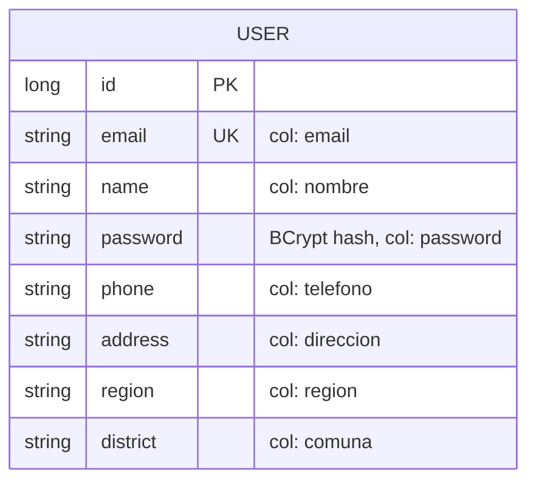
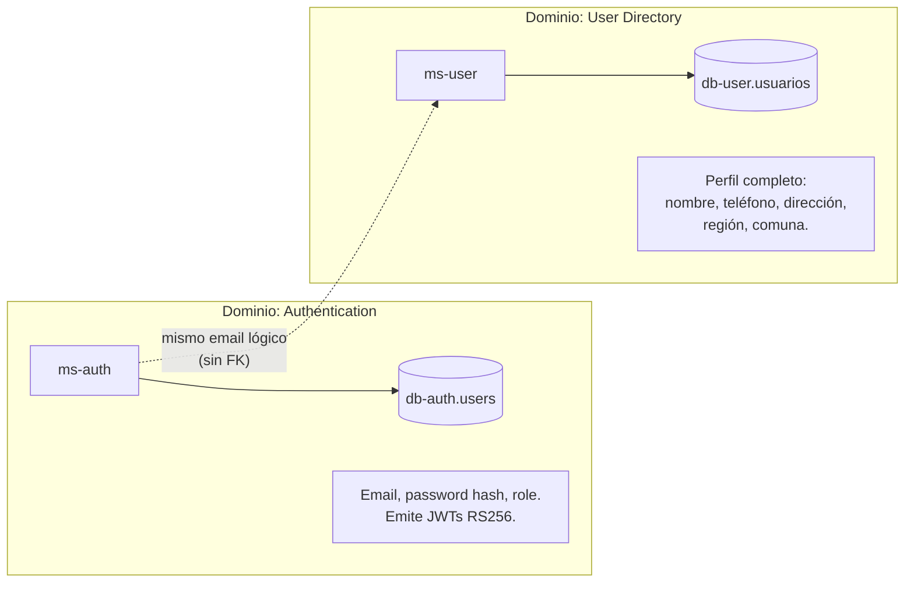

# ms-user

> Microservicio dueño del agregado **User** (perfiles de clientes y operadores logísticos). Separado de `ms-auth`: aquí viven los datos del directorio, no las credenciales de login.

← Volver a [README raíz del monorepo](../../README.md) · Otros componentes: [BFF](../bff/README.md) · [API Gateway](../api-gateway/README.md) · [ms-order](../ms-order/README.md) · [ms-inventory](../ms-inventory/README.md) · [ms-shipping](../ms-shipping/README.md) · [ms-auth](../ms-auth/README.md)

---

## Tabla técnica

| Aspecto | Detalle |
|---|---|
| Lenguaje | Java 25 |
| Framework | Spring Boot 4.0.6 |
| Librerías clave | Spring Web MVC, Spring Data JPA, Hibernate, Flyway, Spring Security Crypto (BCrypt), Lombok, Springdoc OpenAPI |
| Persistencia | PostgreSQL 16 (db-user, tabla `usuarios`) |
| Build | Gradle 9 |
| Tests | JUnit 5, Spring Boot Test, JaCoCo |
| Patrones | Repository, Service Layer, DTO (records), RFC 7807 ProblemDetail con heurística por mensaje |
| Package raíz | `cl.smartlogix.user` |

---

## Tabla de contenidos

1. [Resumen](#1-resumen)
2. [Modelo de dominio](#2-modelo-de-dominio)
3. [Relación con ms-auth](#3-relación-con-ms-auth)
4. [Arquitectura interna](#4-arquitectura-interna)
5. [API REST](#5-api-rest)
6. [Cómo ejecutar](#6-cómo-ejecutar)
7. [Cómo probar](#7-cómo-probar)
8. [Estructura del proyecto](#8-estructura-del-proyecto)
9. [Patrones aplicados](#9-patrones-aplicados)

---

## 1. Resumen

`ms-user` gestiona el directorio interno: clientes B2B, operadores logísticos y administradores. Cada usuario tiene perfil extendido (teléfono, dirección, región, comuna) y una contraseña hasheada con BCrypt para login local del MS (separado del JWT que emite `ms-auth`).

**Stack**: Spring Boot 4.0.6 · Java 25 · PostgreSQL 16 · Flyway · BCrypt · Springdoc OpenAPI.

> Existen **dos servicios separados** para usuarios:
> - **`ms-auth`** (tabla `users` en `db-auth`): credenciales mínimas (email, password hash, role). Único emisor de JWTs.
> - **`ms-user`** (tabla `usuarios` en `db-user`): directorio extendido con perfil completo. Tiene su propio login interno para validar credenciales pero no emite JWTs.

## 2. Modelo de dominio

> Java identifiers en inglés; columnas SQL en español preservadas con `@Column(name="...")`.



| Tabla SQL | Entity Java | Función |
|---|---|---|
| `usuarios` | `User` | Directorio interno: perfil + credenciales BCrypt |

## 3. Relación con ms-auth



- No hay FK entre `db-auth.users.email` y `db-user.usuarios.email` (Database per Service).
- Sincronización por convención: un usuario que se registra vía `/api/auth/register` queda únicamente en `db-auth`. Para que aparezca en el directorio extendido (con dirección, teléfono...) se debe crear vía `POST /api/users` o por un flujo de admin.

## 4. Arquitectura interna

```mermaid
flowchart TB
    subgraph Web["Capa Web"]
        UC["UserController<br/>/users"]
        GEH["GlobalExceptionHandler"]
    end

    subgraph Bus["Capa de negocio"]
        US["UserService<br/>create / findById / findByEmail /<br/>update / delete / login"]
    end

    subgraph Data["Capa de datos"]
        UR["UserRepository<br/>extends JpaRepository"]
        Ent["User (entity)"]
    end

    DB[(db-user)]

    UC --> US
    US --> UR
    UR --> Ent
    Ent --> DB
    US -.->|RuntimeException<br/>"no encontrado"/"ya registrado"| GEH
    GEH -.->|404 / 409 / 400<br/>ProblemDetail| UC
```

## 5. API REST

| Método | Path interno (MS) | Path público (gateway) | Auth | Descripción |
|---|---|---|---|---|
| POST | `/users` | `/api/users` | `write:users` | Crear usuario (email único; 409 si duplicado) |
| GET | `/users` | `/api/users` | `read:users` | Listar usuarios |
| GET | `/users/{id}` | *(multi-seg)* | `read:users` | Obtener por ID (404 si no existe) |
| PUT | `/users/{id}` | *(multi-seg)* | `write:users` | Actualizar (puede incluir password nuevo) |
| DELETE | `/users/{id}` | *(multi-seg)* | `write:users` | Eliminar |
| POST | `/users/login` | `/api/users/login` | público (legacy) | Login local del MS (NO emite JWT; sólo valida credenciales) |

**Swagger UI**: `http://localhost:8080/swagger-ui.html` *(requiere port-forward o exposición temporal del puerto)*.

Errores como **RFC 7807** `application/problem+json` vía `GlobalExceptionHandler` con heurística por mensaje:
- "no encontrado" / "no existe" → 404 `Recurso no encontrado`
- "ya está registrado" / "duplicado" → 409 `Conflicto`
- Cualquier otro `RuntimeException` → 400 `Error en la solicitud`

### 5.1 Ejemplos de payload

`POST /api/users` (request):
```json
{
  "name": "Eduardo Silva", "email": "eduardo@logixcorp.cl",
  "password": "secret123", "phone": "+56 9 5555 0102",
  "address": "Calle Toesca 2890", "region": "Metropolitana",
  "district": "Santiago"
}
```

Response `201` (sin exponer el password):
```json
{
  "id": 7,
  "name": "Eduardo Silva", "email": "eduardo@logixcorp.cl",
  "phone": "+56 9 5555 0102",
  "address": "Calle Toesca 2890", "region": "Metropolitana",
  "district": "Santiago"
}
```

`POST /users/login`:
```json
{ "email": "eduardo@logixcorp.cl", "password": "secret123" }
```
Respuesta:
```json
{ "success": true, "message": "Login exitoso" }
```

## 6. Cómo ejecutar

### Vía Docker Compose

```bash
docker compose up -d db-user ms-user
```

### Local (sin Docker)

```bash
./gradlew bootRun
```

### Build de la imagen

```bash
docker build -t smartlogix/ms-user:latest .
```

### Kubernetes

Ver [`infra/k8s/README.md`](../../infra/k8s/README.md). Manifests específicos en [`k8s/`](./k8s/).

## 7. Cómo probar

```bash
# Login como admin para obtener token con write:users
TOKEN=$(curl -sS -X POST http://app.smartlogix.localhost/api/auth/login \
  -H 'Content-Type: application/json' \
  -d '{"email":"admin@smartlogix.cl","password":"..."}' | jq -r .accessToken)

# Listar usuarios (6 seed)
curl -H "Authorization: Bearer $TOKEN" http://app.smartlogix.localhost/api/users

# Crear usuario
curl -X POST http://app.smartlogix.localhost/api/users \
  -H "Content-Type: application/json" -H "Authorization: Bearer $TOKEN" \
  -d '{
    "name": "Nuevo Cliente",
    "email": "nuevo@example.cl",
    "password": "pwd123",
    "phone": "+56 9 1234 5678",
    "address": "Av Test 100",
    "region": "Metropolitana",
    "district": "Santiago"
  }'

# Email duplicado → 409
curl -i -X POST http://app.smartlogix.localhost/api/users \
  -H "Content-Type: application/json" -H "Authorization: Bearer $TOKEN" \
  -d '{"email":"nuevo@example.cl","name":"dup","password":"x","phone":"","address":"","region":"","district":""}'
```

## 8. Estructura del proyecto

```
src/main/java/cl/smartlogix/user/
├── UserApplication.java
├── config/
│   ├── SecurityConfig.java        # http permitAll (validación en gateway)
│   └── SwaggerConfig.java         # OpenAPI metadata
├── controller/
│   ├── UserController.java        # /users (CRUD + login)
│   └── GlobalExceptionHandler.java
├── service/
│   └── UserService.java           # CRUD + BCrypt + login local
├── repository/
│   └── UserRepository.java        # existsByEmail, findByEmail
├── dto/
│   ├── UserDto.java               # request/response, with factory from(User)
│   ├── LoginRequest.java
│   └── LoginResponse.java
└── model/
    └── User.java                  # @Entity con @Column para columnas DB en español

src/main/resources/
├── application.properties
└── db/migration/
    ├── V1__init.sql
    └── V2__seed_user_data.sql     # 6 usuarios seed (admin + clientes + operadores)
```

## 9. Patrones aplicados

- **Repository Pattern** — Spring Data JPA con métodos derivados (`existsByEmail`, `findByEmail`)
- **Service Layer** — `UserService` con responsabilidades agrupadas; sin interface separada por simplicidad del dominio
- **DTO** — record `UserDto` con factory `from(User)` que omite el password en responses
- **Strategy** — `BCryptPasswordEncoder` para hash; intercambiable con otros `PasswordEncoder`
- **RFC 7807 ProblemDetail con heurística** — `GlobalExceptionHandler` mapea `RuntimeException` a 404/409/400 según el mensaje, evitando excepciones tipadas custom
- **Database per Service** — `db-user` aislada de `db-auth` (perfil ≠ credenciales)
- **Schema preserved through rename** — `User.name` Java ↔ `usuarios.nombre` SQL; columnas en español mapeadas con `@Column`
