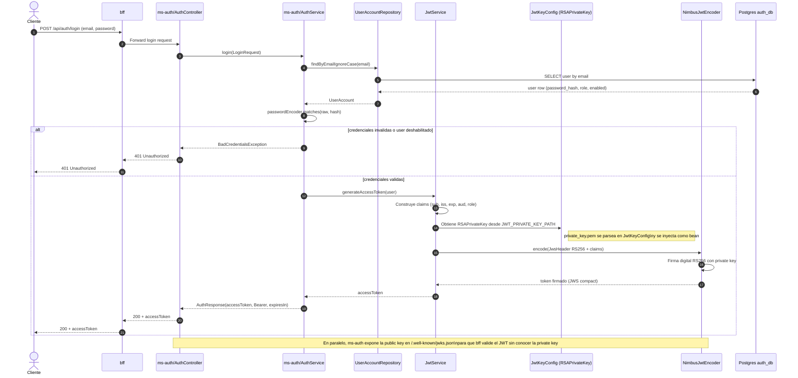

# Login JWT Flow (ms-auth -> bff)

```mermaid
sequenceDiagram
    autonumber
    actor Cliente
    participant BFF as bff
    participant AuthC as ms-auth/AuthController
    participant AuthS as ms-auth/AuthService
    participant Repo as UserAccountRepository
    participant JWT as JwtService
    participant Key as JwtKeyConfig (RSAPrivateKey)
    participant Enc as NimbusJwtEncoder
    participant PG as Postgres auth_db

    Cliente->>BFF: POST /api/auth/login (email, password)
    BFF->>AuthC: Forward login request

    AuthC->>AuthS: login(LoginRequest)
    AuthS->>Repo: findByEmailIgnoreCase(email)
    Repo->>PG: SELECT user by email
    PG-->>Repo: user row (password_hash, role, enabled)
    Repo-->>AuthS: UserAccount

    AuthS->>AuthS: passwordEncoder.matches(raw, hash)
    alt credenciales invalidas o user deshabilitado
        AuthS-->>AuthC: BadCredentialsException
        AuthC-->>BFF: 401 Unauthorized
        BFF-->>Cliente: 401 Unauthorized
    else credenciales validas
        AuthS->>JWT: generateAccessToken(user)
        JWT->>JWT: Construye claims (sub, iss, exp, aud, role)
        JWT->>Key: Obtiene RSAPrivateKey desde JWT_PRIVATE_KEY_PATH
        Note right of Key: private_key.pem se parsea en JwtKeyConfig\ny se inyecta como bean
        JWT->>Enc: encode(JwsHeader RS256 + claims)
        Enc->>Enc: Firma digital RS256 con private key
        Enc-->>JWT: token firmado (JWS compact)
        JWT-->>AuthS: accessToken
        AuthS-->>AuthC: AuthResponse(accessToken, Bearer, expiresIn)
        AuthC-->>BFF: 200 + accessToken
        BFF-->>Cliente: 200 + accessToken
    end

    Note over AuthC,Enc: En paralelo, ms-auth expone la public key en /.well-known/jwks.json\npara que bff valide el JWT sin conocer la private key
```
