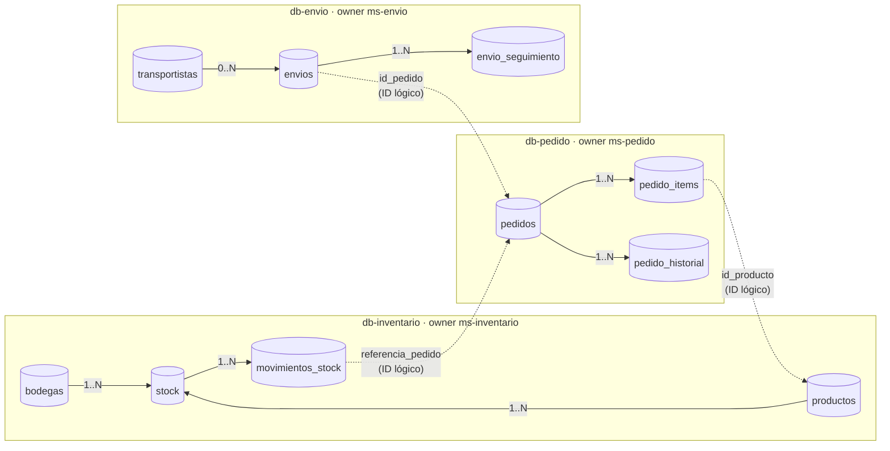
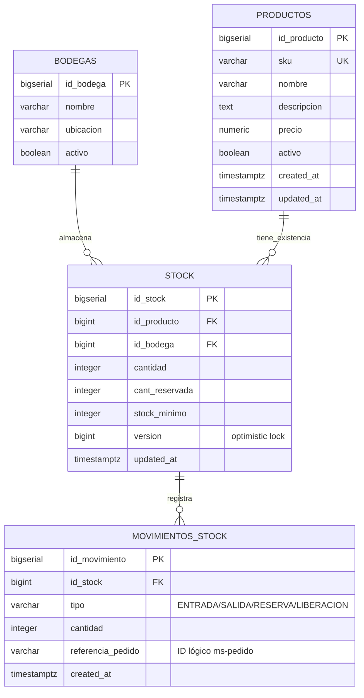
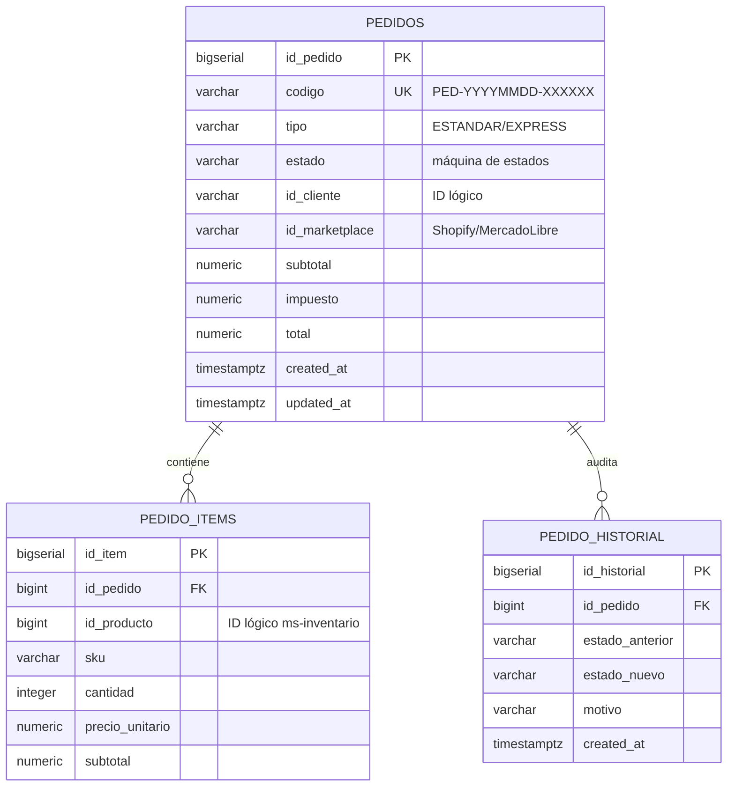
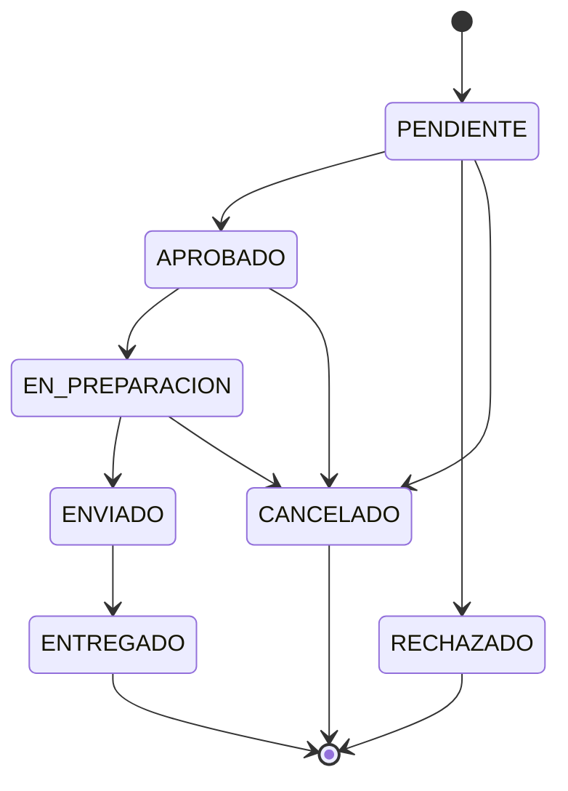
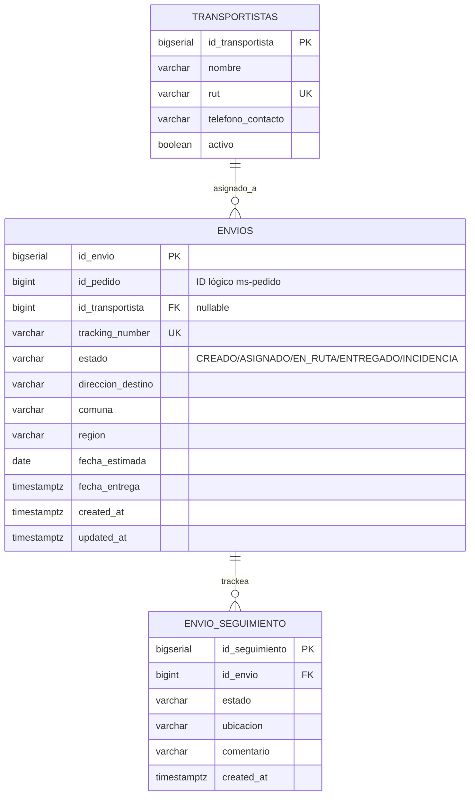
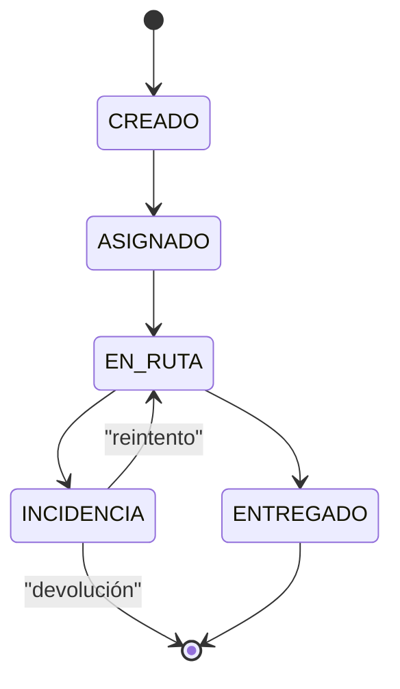

# SmartLogix — Modelo de Datos

Documenta el esquema persistido por cada microservicio bajo el patrón **Database per Service**: cada MS es dueño de su propia base de datos PostgreSQL 16 y no comparte tablas ni FKs físicas con los demás.

- Owners: `ms-inventario` (db-inventario), `ms-pedido` (db-pedido), `ms-envio` (db-envio).
- Aislamiento: las 3 DBs viven en la red Docker `internal` sin puertos expuestos al host.
- Versionado del schema: **Flyway** (`src/main/resources/db/migration/V1__init_schema.sql` en cada MS). Hibernate corre con `ddl-auto=validate`.
- Acoplamiento entre dominios: **IDs lógicos**, NO foreign keys físicas. La consistencia se garantiza con orquestación (BFF/Saga) y Circuit Breaker, no con `JOIN` ni constraints cruzadas.

---

## 1. Vista global — Database per Service y enlaces lógicos

> **Líneas continuas** = FKs físicas (`REFERENCES`) dentro de la misma DB.
> **Líneas punteadas** = IDs lógicos que cruzan dominios. Se resuelven por API/eventos, nunca por `JOIN`.

---

## 2. ER detallado — `db-inventario`

**Invariantes (check constraints):**
- `cantidad >= 0`, `cant_reservada >= 0`, `stock_minimo >= 0`
- `cant_reservada <= cantidad` (no se puede reservar más de lo que hay)
- Unicidad: `(id_producto, id_bodega)` → un solo registro de stock por SKU/bodega
- `tipo` ∈ {ENTRADA, SALIDA, RESERVA, LIBERACION}

---

## 3. ER detallado — `db-pedido`

**Máquina de estados** (implementada en `OrderServiceImpl`):

**Invariantes:**
- `cantidad > 0`, `precio_unitario >= 0`, `subtotal >= 0`
- Toda transición de estado escribe una fila en `pedido_historial` con `estado_anterior` / `estado_nuevo` / `motivo`
- `ON DELETE CASCADE` desde `pedidos` hacia `pedido_items` y `pedido_historial`

---

## 4. ER detallado — `db-envio`

**Máquina de estados del envío:**

**Invariantes:**
- `id_pedido` siempre presente, pero NO referencia `pedidos` (cross-DB)
- `id_transportista` es nullable: el envío puede crearse antes de asignar
- `ON DELETE CASCADE` desde `envios` hacia `envio_seguimiento`

---

## 5. Diccionario de IDs lógicos (cruces entre dominios)

Estos campos identifican entidades de OTRO microservicio. No hay constraint que los valide a nivel DB — la consistencia se gestiona en la capa de aplicación.

| Origen | Campo | Apunta a | Cuándo se materializa |
|---|---|---|---|
| `db-pedido.pedido_items.id_producto` | bigint | `db-inventario.productos.id_producto` | Al crear el pedido, el BFF resuelve el producto contra ms-inventario y guarda su `id_producto` |
| `db-pedido.pedidos.id_cliente` | varchar(64) | sistema externo (ERP/CRM de la PYME) | Provisto por el marketplace o el cliente al crear el pedido |
| `db-pedido.pedidos.id_marketplace` | varchar(64) | sistema externo (Shopify, MercadoLibre) | ID nativo del marketplace de origen |
| `db-inventario.movimientos_stock.referencia_pedido` | varchar(64) | `db-pedido.pedidos.codigo` | Cuando ms-pedido reserva stock, ms-inventario registra el movimiento con el código del pedido |
| `db-envio.envios.id_pedido` | bigint | `db-pedido.pedidos.id_pedido` | Al crear el envío, el BFF lo genera desde un pedido ya APROBADO |

**Regla de oro:** si necesitas datos de otro dominio (ej. el nombre del producto en una vista de pedido), los pide el BFF al MS dueño y los **agrega en respuesta**, nunca por JOIN entre DBs.

---

## 6. Trazabilidad código ↔ schema

| Entidad JPA | Tabla SQL | Script Flyway |
|---|---|---|
| `cl.smartlogix.inventory.model.Bodega` | `bodegas` | `ms-inventario/.../V1__init_schema.sql` |
| `cl.smartlogix.inventory.model.Producto` | `productos` | idem |
| `cl.smartlogix.inventory.model.Stock` | `stock` | idem |
| `cl.smartlogix.inventory.model.MovimientoStock` | `movimientos_stock` | idem |
| `cl.smartlogix.order.model.Pedido` | `pedidos` | `ms-pedido/.../V1__init_schema.sql` |
| `cl.smartlogix.order.model.PedidoItem` | `pedido_items` | idem |
| `cl.smartlogix.order.model.PedidoHistorial` | `pedido_historial` | idem |
| `cl.smartlogix.shipping.model.Transportista` | `transportistas` | `ms-envio/envio/.../V1__init_schema.sql` |
| `cl.smartlogix.shipping.model.Envio` | `envios` | idem |
| `cl.smartlogix.shipping.model.EnvioSeguimiento` | `envio_seguimiento` | idem |

---

## 7. Cómo regenerar este documento

Los diagramas son Mermaid embebido y se renderizan nativamente en:
- GitHub (vista preview del repo)
- VS Code con extensión `bierner.markdown-mermaid`
- IntelliJ IDEA con el plugin Mermaid

Para exportar a PNG/SVG: usar la CLI `@mermaid-js/mermaid-cli` o pegarlos en https://mermaid.live.
