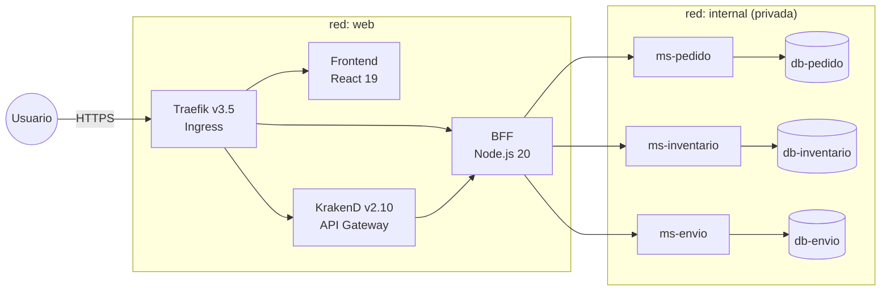
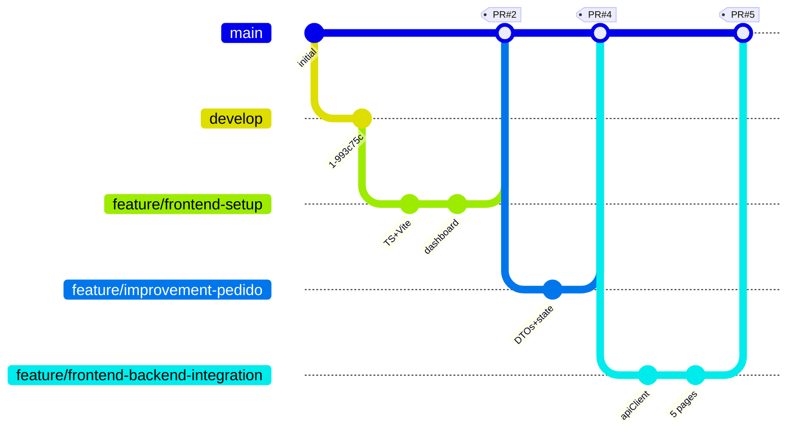

<!-- _class: title -->

# SmartLogix

## Plataforma logística para PYMEs eCommerce

**Evaluación Parcial N°2 — DSY1106 Desarrollo Fullstack III**

Implementación de componentes Frontend y Backend

<br/>

*Equipo SmartLogix · Mayo 2026*

---

# Agenda

1. **Contexto del proyecto** — qué resolvemos y para quién
2. **Arquitectura** — diagrama de contenedores, topología, flujos
3. **Patrones arquitectónicos** — los 5 patrones que sostienen el sistema
4. **Patrones de diseño** — 10+ patrones de código, qué problema resuelven
5. **Arquetipo: Gradle como template reutilizable**
6. **Estrategia de branching** — GitFlow simplificado + evidencia
7. **Pruebas y cobertura** — JUnit + Mockito + WebMvcTest + JaCoCo
8. **Conclusiones y próximos pasos**

⏱ 15 minutos · turno individual de preguntas al final

<span class="rubric">Mapea a ítems 1–8 de la rúbrica</span>

---

# 1. Contexto del proyecto

**Problema**: PYMEs eCommerce coordinan pedidos, inventario y envíos en hojas de cálculo o monolitos rígidos. Cualquier cambio (nuevo marketplace, nueva bodega, nuevo courier) implica downtime y refactor.

**Solución SmartLogix**:

- **Tres dominios desacoplados** — pedidos, inventario, envíos — cada uno con su propia DB
- **API optimizada por pantalla** vía BFF
- **Gateway con políticas declarativas** (rate limit, JWT, CORS) separado del Ingress
- **Frontend SPA** que solo conoce al BFF

**Stack**: React 19 · Node.js 20 · Spring Boot 4 / Java 25 · PostgreSQL 16 · KrakenD · Traefik · Docker

<span class="rubric">Contexto general</span>

---

# 2. Arquitectura — diagrama de contenedores



**Dos redes Docker**: `web` (pública) y `internal` (las DBs nunca son alcanzables desde Internet).

<span class="rubric">Ítems 2 y 6 — arquetipos y patrones arquitectónicos</span>

---

# 3. Patrones arquitectónicos (1/2)

| Patrón | Dónde se ve | Problema que resuelve |
|---|---|---|
| **Microservicios** | 3 MS Spring Boot independientes | Despliegue por dominio, sin acoplar releases |
| **Database per Service** | `db-pedido`, `db-inventario`, `db-envio` aisladas | Cada equipo evoluciona su schema sin coordinar; FKs cruzadas reemplazadas por **IDs lógicos** validados vía API REST |
| **API Gateway** | KrakenD declarativo | Centraliza rate limit, JWT, CORS sin contaminar los MS |
| **Ingress separado** | Traefik (edge) + KrakenD (API) | TLS/host routing (edge) vs policies de API; patrón estándar en K8s |
| **Backend For Frontend** | Node.js + Express | API tallada a la medida de las pantallas; agregación, orquestación |

<span class="rubric">Ítem 6 (defensa) · 20%</span>

---

# 3. Patrones arquitectónicos (2/2) — escalabilidad y rendimiento

- **DB-per-Service** habilita escalado **vertical** independiente por dominio (la DB de pedidos no compite por I/O con la de inventario).
- **MS stateless** permiten escalado **horizontal**: agregar réplicas detrás de Traefik sin reconfigurar.
- **BFF** centraliza la lógica de composición, evitando N llamadas desde el frontend (latencia de browser → BFF → MS es 1 round-trip + agregación local).
- **Schema-first migrations (Flyway)** garantizan reproducibilidad: el schema es la verdad, no las entidades JPA (`ddl-auto=validate`).
- **Healthchecks reales** vía `pg_isready` + (en rama `feature/tests-unitarios`) Spring Boot Actuator `/actuator/health`.

→ Coherencia, escalabilidad y rendimiento están **garantizados por diseño**, no por optimización tardía.

<span class="rubric">Ítem 6 (defensa) · 20%</span>

---

# 4. Patrones de diseño (1/3) — capa de datos y negocio

**Repository Pattern** (los 3 MS)
Interfaces Spring Data JPA. El service no sabe si vienen de JPA, JDBC o mock → tests con `@Mock` triviales.

**Service Layer** (interfaz + impl, `@Transactional`)
Separa **qué hace el negocio** de **cómo lo hace**. Toda la lógica de máquina de estados, cálculo de totales, validaciones cross-tabla vive aquí, no en controladores.

**DTO Pattern** (Java records inmutables con `from(Entity)`)
Evita filtrar entidades JPA al JSON (relaciones lazy, ciclos, `@Version`). Records + Bean Validation = contrato claro.

<span class="rubric">Ítem 1 (encargo) + Ítem 5 (defensa) — ≥3 patrones, mantenibilidad</span>

---

# 4. Patrones de diseño (2/3) — concurrencia y consistencia

**State Machine** (`Pedido`, `Envio`)
Transiciones modeladas como **datos** (`Map<Estado, Set<Estado>>`), no `if/else` disperso. Una transición ilegal → **HTTP 409** vía `GlobalExceptionHandler`.

**Optimistic Locking** (`@Version` en `Stock`)
Sin bloquear lectores: el segundo escritor recibe `OptimisticLockingFailureException` → 409 → cliente reintenta. Alto throughput, consistencia preservada.

**Saga simplificada** (BFF · `checkoutService`)
Tres MS encadenados con **compensaciones best-effort**: si una reserva falla, las anteriores se liberan. Documentado y testeado.

<span class="rubric">Ítem 1 + Ítem 5</span>

---

# 4. Patrones de diseño (3/3) — resiliencia y errores

**Circuit-Breaker-lite** (BFF)
Cada `fetch` envuelto en `AbortController` con timeout 5 s. `dashboardService` tolera fallos parciales (`.catch()` por MS): si `ms-envio` cae, el dashboard sigue mostrando datos de pedidos e inventario.

**RFC 7807 Problem Detail** (BFF y los 3 MS)
Formato unificado de error: `application/problem+json` con `type`, `title`, `status`, `detail`, `errors`. El frontend tiene **un solo parser de errores** para toda la API.

**Aggregate Root** + **Schema-first migrations** + **Composite Service**
Detalles en `docs/analisis-patrones-arquetipos.pdf` §3.

→ **Más de 10 patrones de diseño aplicados**, cada uno con problema concreto.

<span class="rubric">Ítem 1 + Ítem 5</span>

---

# 5. Arquetipo: Gradle como template reutilizable

**La rúbrica menciona "arquetipos Maven". Usamos Gradle. Por qué:**

1. **Spring Initializr** (start.spring.io) es el **arquetipo oficial** de Spring Boot 4. Emite proyectos Gradle por defecto. Es el reemplazo moderno de `mvn archetype:generate`.
2. **Performance**: `./gradlew bootJar` toma ~30 s/MS (vs 60–90 s con Maven).
3. **Los 3 `build.gradle` son idénticos** en estructura → cumple el rol de un arquetipo: **plantilla copy-paste** que garantiza consistencia.
4. **DSL declarativo** más legible que XML.

```bash
# Crear un MS nuevo desde el template:
cp -r backend/microservices/ms-pedido backend/microservices/ms-nuevo
# Renombrar package + settings.gradle. Listo.
```

→ Si la rúbrica exige Maven literal: `mvn archetype:create-from-project` desde un MS de referencia. Trabajo de ~1–2 h. Plan B documentado en el PDF.

<span class="rubric">Ítem 2 + Ítem 6</span>

---

# 6. Estrategia de branching — GitFlow simplificado



**Modelo de tres ramas**: `main` (estable, entregable) · `develop` (integración) · `feature/<kebab-case>` (trabajo en curso).
**Conventional Commits** (`feat:`, `fix:`, `test:`, `docs:`). PRs con merge commit (no squash) para preservar historia.

<span class="rubric">Ítem 3 + Ítem 7 (defensa) · 5% + 15%</span>

---

# 6. Branching — evidencia y resolución de conflictos

**Pull Requests cerrados** (visibles en GitHub):

| PR | Rama | Mergeada a | Contenido |
|---|---|---|---|
| #1 | `feature/improvement-pedido` | `main` | Mejoras de dominio en ms-pedido |
| #2 | `feature/frontend-setup` | `main` | Setup inicial frontend React 19 |
| #4 | `feature/improvement-pedido` | `main` | DTOs + state machine |
| #5 | `feature/frontend-backend-integration` | `main` | apiClient + 5 pages conectadas |

**Conflictos resueltos** (3 casos documentados en `docs/plan-branching.pdf` §4):
- `docker-compose.yml`: dos features tocaron `depends_on` → adoptamos `condition: service_healthy`.
- `README.md`: dos features editaron "Estructura" → reconciliación manual.
- `application.properties`: duplicación de keys de Actuator → deduplicación.

**Lección aprendida**: rebase con `develop` cada 2–3 días minimiza conflictos.

<span class="rubric">Ítem 7 (defensa) · 15%</span>

---

# 7. Pruebas y cobertura — JaCoCo

**Stack de testing**: JUnit 5 · Mockito · Spring `@WebMvcTest` con `@MockitoBean` · JaCoCo 0.8.14.

**Niveles de test**:
- **Service tests** (`@ExtendWith(MockitoExtension.class)`) — lógica de máquina de estados, cálculo de totales, optimistic locking
- **Controller tests** (`@WebMvcTest`) — happy paths, validation 400, ResponseStatusException 404/409, GlobalExceptionHandler

**Cobertura INSTRUCTION** (rama `feature/tests-unitarios`, excluye DTOs/entities/`Application`):

| MS | Cobertura | Estado |
|---|---:|---|
| `ms-pedido` | **87.9 %** | Muy bueno (≥80%) |
| `ms-inventario` | **73.5 %** | Bueno (≥70%) |
| `ms-envio` | **69.9 %** | Bueno (≥60%) |

**54 tests nuevos** en 6 archivos de controller tests, todos verdes.

<span class="rubric">Ítem 4 (encargo) + Ítem 8 (defensa) · 5% + 15%</span>

---

# 8. Buenas prácticas de desarrollo

- **Inmutabilidad**: DTOs como Java records → menos bugs por estado compartido
- **Validación en capas**: zod en BFF + Bean Validation en MS + constraints en SQL
- **Manejo centralizado de errores**: `@RestControllerAdvice GlobalExceptionHandler` por MS; `errorHandler.js` en BFF
- **Transacciones explícitas**: `@Transactional` en service layer, no en controllers ni repositories
- **Logging estructurado**: morgan en BFF, Spring por defecto en MS
- **Schema versionado**: Flyway autoritativo; Hibernate sólo valida
- **Tipos extremo a extremo**: TS types del frontend (`src/types/api.ts`) espejan los records Java
- **Tests con Mockito** que aíslan capas; sin dependencias de DB en tests unitarios
- **Cleanup en frontend**: `AbortController` cancela requests en `useEffect` cleanup

→ Código limpio, predecible, testeable.

<span class="rubric">Ítem 4 + Ítem 8</span>

---

# Documentación complementaria

| Documento | Contenido | Sirve para |
|---|---|---|
| `README.md` raíz | Arquitectura, componentes, levantar el stack | Onboarding general |
| `docs/analisis-patrones-arquetipos.pdf` | 10 patrones de diseño + 5 arquitectónicos con justificación | **Ítems 1, 2, 5, 6** |
| `docs/plan-branching.pdf` | GitFlow + evidencia + 3 conflictos resueltos | **Ítems 3, 7** |
| `docs/modelo-datos.md` | ER detallado + máquinas de estado | Comprensión de dominio |
| `docs/repositorios.txt` | Enlaces a GitHub por componente | **Entregable explícito** |
| READMEs por componente | Diagramas Mermaid, API REST, patrones, ejecución | **Defensa específica por dominio** |

Todos versionados en GitHub: `https://github.com/smartLogixfs/smartlogixs`

<span class="rubric">Entregables del encargo</span>

---

# Conclusiones

**Lo que el proyecto demuestra**:

1. **5 patrones arquitectónicos** (Microservicios, DB-per-Service, API Gateway, Ingress separado, BFF) aplicados con justificación de problema.
2. **10+ patrones de diseño** con motivación técnica concreta (no por checklist).
3. **GitFlow simplificado** ejecutado: 5 ramas de feature, 4 PRs mergeados, conflictos documentados.
4. **Cobertura de tests 70–88 %** en los 3 MS con JaCoCo, capa de servicio y controladores cubiertos.
5. **Arquetipo Gradle defendido** técnicamente — Plan B Maven documentado si la rúbrica lo exige literal.

**Próximos pasos** (post-EV2):
- Activar JWT real (Auth0/Keycloak) en KrakenD
- Activar HTTPS automático (Let's Encrypt en Traefik)
- Resilience4j en los MS (hoy el BFF tiene equivalente lite)
- Mergear `feature/tests-unitarios` a `main` (incluye Actuator + healthchecks reales)

---

<!-- _class: title -->

# Preguntas

## Banco de preguntas individuales preparadas

Cada miembro del equipo está preparado para defender:

- **¿Por qué eligió Gradle si la rúbrica dice Maven?** → Slide 5 + PDF de análisis §5
- **¿Cómo se resolvió un conflicto de merge concreto?** → Slide 6 + PDF de branching §4
- **¿Cómo manejan consistencia eventual sin distributed transactions?** → Saga checkout, slide 4 (2/3)
- **¿Qué pasa si `ms-envio` cae durante un dashboard?** → Circuit-Breaker-lite, slide 4 (3/3)
- **¿Cómo garantizan que `cant_reservada <= cantidad` bajo carga?** → Optimistic Locking + DB constraints
- **¿Cuánta cobertura tienen y por qué excluyen DTOs?** → 70–88%; los DTOs son records sin lógica que testear

**¡Gracias!**
