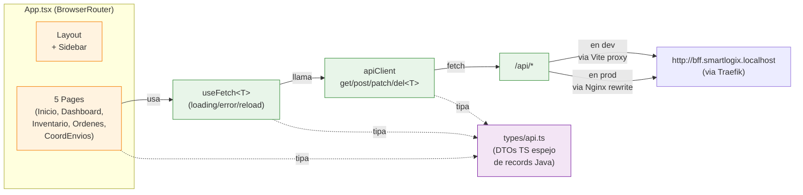

# SmartLogix Frontend

> SPA en **React 19 + TypeScript** para el operador logístico. Consume al BFF a través de un proxy Vite en desarrollo y de Nginx en producción.

← Volver a [README raíz del monorepo](../README.md) · Otros componentes: [BFF](../backend/bff/README.md) · [API Gateway](../backend/microservices/apigateway/README.md) · [ms-pedido](../backend/microservices/ms-pedido/README.md) · [ms-inventario](../backend/microservices/ms-inventario/README.md) · [ms-envio](../backend/microservices/ms-envio/README.md)

---

## Tabla de contenidos

1. [Resumen](#1-resumen)
2. [Stack](#2-stack)
3. [Arquitectura del frontend](#3-arquitectura-del-frontend)
4. [Flujo de datos con el BFF](#4-flujo-de-datos-con-el-bff)
5. [Páginas](#5-páginas)
6. [Cliente HTTP (`apiClient`) y hook `useFetch`](#6-cliente-http-apiclient-y-hook-usefetch)
7. [Estructura del proyecto](#7-estructura-del-proyecto)
8. [Cómo ejecutar](#8-cómo-ejecutar)
9. [Variables de entorno](#9-variables-de-entorno)
10. [Patrones aplicados](#10-patrones-aplicados)

---

## 1. Resumen

El frontend ofrece cinco pantallas (Inicio, Dashboard, Inventario, Órdenes, Coordinación de Envíos) y delega **toda** la lógica de orquestación al BFF. No habla directamente con los microservicios. Toda llamada HTTP pasa por un único `apiClient.ts` tipado contra los DTOs reales del backend.

## 2. Stack

| Tecnología | Uso |
|---|---|
| **React 19** | Framework de UI |
| **TypeScript 6** | Tipado de DTOs y hooks |
| **Vite 5** | Dev server con HMR y build de producción |
| **react-router-dom 7** | Routing client-side |
| **react-bootstrap 5** + Bootstrap 5 | Componentes UI |
| **Nginx** | Sirve `dist/` en producción (imagen Docker) |

## 3. Arquitectura del frontend



## 4. Flujo de datos con el BFF

```mermaid
sequenceDiagram
    autonumber
    participant P as Page (.tsx)
    participant H as useFetch&lt;T&gt;
    participant C as apiClient
    participant V as Vite proxy<br/>(:5173)
    participant B as BFF<br/>(via Traefik :80)

    P->>H: useFetch&lt;DashboardResponse&gt;('/dashboard')
    H->>H: setState(loading)
    H->>C: GET /api/dashboard<br/>(AbortController signal)
    C->>V: fetch('/api/dashboard')
    V->>B: rewrite → GET /dashboard<br/>Host: bff.smartlogix.localhost
    B-->>V: 200 JSON
    V-->>C: 200 JSON
    C-->>H: { status: 'ok', data }
    H-->>P: re-render con data
    Note over P,H: en unmount, controller.abort()<br/>cancela la request en vuelo
```

## 5. Páginas

| Ruta | Componente | Endpoints BFF que consume |
|---|---|---|
| `/` | `InicioPage` | `GET /dashboard`, `GET /inventario/productos` |
| `/dashboard` | `DashboardPage` | `GET /dashboard` |
| `/inventario` | `InventarioPage` | `GET /inventario/productos`, `GET /inventario/stock/bajo` |
| `/ordenes` | `OrdenesPage` | `GET /pedidos`, `GET /pedidos?estado=X` |
| `/envios` | `CoordEnviosPage` | `GET /envios` |

Cada página usa el hook `useFetch<T>(path)` que devuelve un *discriminated union* `{ status: 'loading' } | { status: 'ok', data } | { status: 'error', message }` y un `reload()`.

## 6. Cliente HTTP (`apiClient`) y hook `useFetch`

**`src/client/apiClient.ts`** — un solo módulo, métodos `get/post/patch/del<T>`:

- `AbortController` con timeout 8 s (BFF usa 5 s contra MS, dejamos margen).
- `ApiError` tipado con `status`, `problem: ProblemDetail | null`, `body`.
- Si la respuesta es `application/problem+json` (RFC 7807), se parsea como `ProblemDetail`.
- Base URL via `import.meta.env.VITE_API_BASE`, default `/api` (compatible con dev + prod).

**`src/client/useFetch.ts`** — hook reutilizable:

- Re-fetch automático cuando cambia el `path` (útil para filtros con query params).
- Cancela la request en vuelo en `unmount` o cuando cambia el path.
- `reload()` para refrescos manuales (botón ↻ en cada página).

**`src/types/api.ts`** — tipos TS que espejan los `record` Java de los DTOs del backend (`Pedido`, `Producto`, `Stock`, `Envio`, `DashboardResponse`, etc.). Si el backend agrega un campo, este archivo es el único lugar a tocar.

## 7. Estructura del proyecto

```
frontend/
├── index.html
├── package.json
├── tsconfig.json
├── vite.config.js              # server.proxy /api/* → BFF (con Host header)
├── nginx.conf                  # config del Nginx que sirve dist/ en prod
├── Dockerfile                  # multi-stage: vite build → nginx alpine
└── src/
    ├── main.tsx                # entry
    ├── App.tsx                 # BrowserRouter + 5 rutas
    ├── vite-env.d.ts           # tipos de import.meta.env
    ├── client/
    │   ├── apiClient.ts        # fetch tipado + ApiError
    │   └── useFetch.ts         # hook generico de GET
    ├── types/
    │   └── api.ts              # DTOs (espejo de records Java)
    ├── components/
    │   ├── Layout.tsx          # shell con <Outlet/>
    │   └── Sidebar.tsx
    └── pages/
        ├── InicioPage.tsx
        ├── DashboardPage.tsx
        ├── InventarioPage.tsx
        ├── OrdenesPage.tsx
        └── CoordEnviosPage.tsx
```

## 8. Cómo ejecutar

### Dev local (recomendado para desarrollo)

```bash
cd frontend
npm install
npm run dev          # http://localhost:5173 con HMR
```

El proxy de Vite (declarado en `vite.config.js`) redirige `/api/*` a `http://bff.smartlogix.localhost` enviando el `Host` header correcto para que Traefik enrute al BFF. **Pre-requisito**: el stack Docker corriendo (`docker compose up -d` desde la raíz del monorepo).

### Producción (vía Docker)

```bash
docker compose up -d frontend        # desde la raíz del monorepo
# disponible en http://app.smartlogix.localhost
```

El `Dockerfile` hace `vite build` y copia `dist/` al contenedor Nginx.

### Build local (sin Docker)

```bash
npm run build        # genera dist/
npm run preview      # sirve dist/ en :4173
```

## 9. Variables de entorno

| Variable | Default | Uso |
|---|---|---|
| `VITE_API_BASE` | `/api` | URL base usada por `apiClient`. Si el frontend está en el mismo origen del BFF (vía Nginx), `/api` funciona. Si quieres pegarle al BFF directo desde otro origen, ponlo a `http://bff.smartlogix.localhost` y configura CORS en el BFF |
| `VITE_BFF_TARGET` | `http://127.0.0.1:80` | Target del proxy de Vite en dev. Apuntamos a 127.0.0.1 porque Node.js no resuelve `*.localhost` igual que los browsers; el `Host` header sí va con `bff.smartlogix.localhost` para que Traefik enrute |
| `VITE_BFF_HOST` | `bff.smartlogix.localhost` | Host header que se envía al proxear |

Archivo de referencia: [`.env.example`](.env.example).

## 10. Patrones aplicados

- **SPA con routing client-side** (BrowserRouter + Outlet)
- **BFF-first**: el frontend no conoce los MS, sólo el BFF (single source of API truth)
- **DTOs tipados extremo a extremo**: los tipos TS espejan los records Java; tipado fuerte desde `apiClient` hasta `Page.tsx`
- **Hook abstracción de loading/error/reload** (`useFetch<T>`): elimina boilerplate `useEffect`+`useState` en cada página
- **Discriminated union para el estado de fetch**: `{ status: 'loading' } | { status: 'ok', data } | { status: 'error', message }` — el compilador obliga a manejar los tres casos
- **AbortController para cancelar requests obsoletas**: evita fugas de estado cuando el usuario navega rápido entre páginas
- **Multi-stage Docker build**: imagen final mínima sirviendo estáticos con Nginx
